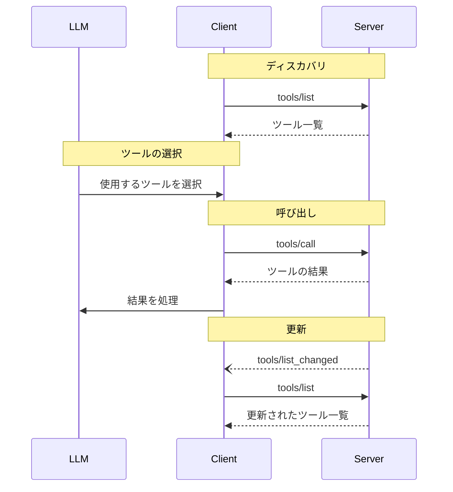

<Info>**プロトコル改訂**: 2024-11-05</Info>

Model Context Protocol（MCP）は、サーバーが言語モデルから呼び出せるツールを公開できるようにします。ツールによって、モデルはデータベースの照会、APIの呼び出し、計算の実行などを通じて外部システムとやり取りできます。各ツールは一意の名前で識別され、スキーマを記述するメタデータを含みます。

<div id="user-interaction-model">
  ## ユーザーインタラクションモデル
</div>

MCP におけるツールは**モデル制御**を前提に設計されており、言語モデルが文脈理解とユーザーのプロンプトに基づいて自動的にツールを検出・呼び出せます。

ただし、実装はニーズに合った任意のインターフェースパターンでツールを公開して構いません。プロトコル自体は特定のユーザーインタラクションモデルを義務付けていません。

<Warning>
  トラスト＆セーフティおよびセキュリティの観点から、ツール呼び出しを拒否できる権限を持つ人間が常に関与している**べき**です。

  アプリケーションは**次を満たすべきです**:

  * どのツールが AI モデルに公開されているかを明確に示す UI を提供する
  * ツールが呼び出された際に明確な視覚的インジケーターを表示する
  * 人間が関与していることを確実にするため、操作時にユーザーへ確認のプロンプトを提示する
</Warning>

<div id="capabilities">
  ## 機能
</div>

ツールをサポートするサーバーは、`tools` 機能を宣言することが**必須**です:

```json
{
  "capabilities": {
    "tools": {
      "listChanged": true
    }
  }
}
```

`listChanged` は、利用可能なツール一覧が変更された際にサーバーが通知を送信するかどうかを示します。

<div id="protocol-messages">
  ## プロトコルのメッセージ
</div>

<div id="listing-tools">
  ### ツールの一覧取得
</div>

利用可能なツールを見つけるために、クライアントは `tools/list` リクエストを送信します。この操作は
[ページネーション](/ja/specification/2024-11-05/server/utilities/pagination)に対応しています。

**リクエスト:**

```json
{
  "jsonrpc": "2.0",
  "id": 1,
  "method": "tools/list",
  "params": {
    "cursor": "optional-cursor-value"
  }
}
```

**レスポンス:**

```json
{
  "jsonrpc": "2.0",
  "id": 1,
  "result": {
    "tools": [
      {
        "name": "get_weather",
        "description": "指定した場所の現在の天気情報を取得します",
        "inputSchema": {
          "type": "object",
          "properties": {
            "location": {
              "type": "string",
              "description": "市区町村名または郵便番号"
            }
          },
          "required": ["location"]
        }
      }
    ],
    "nextCursor": "next-page-cursor"
  }
}
```

<div id="calling-tools">
  ### ツールの呼び出し
</div>

ツールを実行するには、クライアントが `tools/call` リクエストを送信します:

**リクエスト:**

```json
{
  "jsonrpc": "2.0",
  "id": 2,
  "method": "tools/call",
  "params": {
    "name": "get_weather",
    "arguments": {
      "location": "New York"
    }
  }
}
```

**レスポンス:**

```json
{
  "jsonrpc": "2.0",
  "id": 2,
  "result": {
    "content": [
      {
        "type": "text",
        "text": "Current weather in New York:\nTemperature: 72°F\nConditions: Partly cloudy"
      }
    ],
    "isError": false
  }
}
```

<div id="list-changed-notification">
  ### リスト変更通知
</div>

利用可能なツールのリストが変更された場合、`listChanged`
ケイパビリティを宣言したサーバーは通知を送信する **べきです**:

```json
{
  "jsonrpc": "2.0",
  "method": "notifications/tools/list_changed"
}
```

<div id="message-flow">
  ## メッセージフロー
</div>



<div id="data-types">
  ## データ型
</div>

<div id="tool">
  ### ツール
</div>

ツール定義には次が含まれます:

* `name`: ツールの一意の識別子
* `description`: 機能のわかりやすい説明
* `inputSchema`: 期待されるパラメータを定義する JSON Schema

<div id="tool-result">
  ### ツール結果
</div>

ツールの結果には、種類の異なる複数のコンテンツ項目が含まれる場合があります。

<div id="text-content">
  #### テキストコンテンツ
</div>

```json
{
  "type": "text",
  "text": "ツールの結果のテキスト"
}
```

<div id="image-content">
  #### 画像コンテンツ
</div>

```json
{
  "type": "image",
  "data": "base64-encoded-data",
  "mimeType": "image/png"
}
```

<div id="embedded-resources">
  #### 埋め込みリソース
</div>

[リソース](/ja/specification/2024-11-05/server/resources) は、
追加のコンテキストやデータを提供する目的で埋め込むことが **できます**。その場合、クライアントが後から購読したり再取得したりできる URI の背後に配置されます。

```json
{
  "type": "resource",
  "resource": {
    "uri": "resource://example",
    "mimeType": "text/plain",
    "text": "Resource content"
  }
}
```

<div id="error-handling">
  ## エラー処理
</div>

ツールは次の2つのエラー報告メカニズムを使用します：

1. **プロトコルエラー**: 次のような問題に対する標準のJSON-RPCエラー
   * 不明なツール
   * 無効な引数
   * サーバーエラー

2. **ツール実行エラー**: ツールの結果で `isError: true` として報告
   * APIの失敗
   * 無効な入力データ
   * ビジネスロジックエラー

プロトコルエラーの例:

```json
{
  "jsonrpc": "2.0",
  "id": 3,
  "error": {
    "code": -32602,
    "message": "Unknown tool: invalid_tool_name"
  }
}
```

ツール実行エラーの例:

```json
{
  "jsonrpc": "2.0",
  "id": 4,
  "result": {
    "content": [
      {
        "type": "text",
        "text": "Failed to fetch weather data: API rate limit exceeded"
      }
    ],
    "isError": true
  }
}
```

<div id="security-considerations">
  ## セキュリティに関する考慮事項
</div>

1. サーバーは**必須**:
   * すべてのツール入力を検証する
   * 適切なアクセス制御を実装する
   * ツールの呼び出しにレート制限を設ける
   * ツールの出力を無害化（サニタイズ）する

2. クライアントは**推奨**:
   * 機微な操作についてユーザーの確認を求める
   * 悪意のある、または偶発的なデータ流出を避けるため、サーバーを呼び出す前にツール入力をユーザーに提示する
   * ツールの結果をLLMに渡す前に検証する
   * ツール呼び出しにタイムアウトを実装する
   * 監査目的でツールの利用状況を記録する