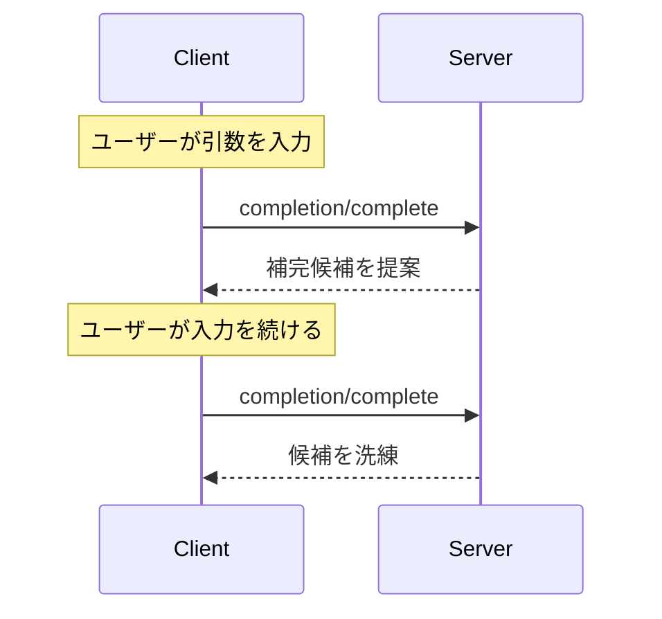

<Info>**プロトコル改訂**: 2024-11-05</Info>

Model Context Protocol（MCP）は、サーバーがプロンプトやリソースURIに対する
引数の補完候補を提示するための標準化された手段を提供します。これにより、
ユーザーが引数値を入力する際に文脈に応じた提案を受け取れる、IDEのような
リッチな体験が可能になります。

<div id="user-interaction-model">
  ## ユーザーインタラクションモデル
</div>

MCP における補完は、IDE のコード補完に類似した対話的なユーザー体験をサポートするように設計されています。

たとえば、アプリケーションは、ユーザーの入力に合わせてドロップダウンやポップアップメニューで補完候補を表示し、利用可能なオプションからの絞り込みや選択を可能にできます。

ただし、実装はニーズに合った任意のインターフェースパターンで補完を提供して構いません。プロトコル自体は特定のユーザーインタラクションモデルを必須とはしていません。

<div id="protocol-messages">
  ## プロトコル・メッセージ
</div>

<div id="requesting-completions">
  ### 補完のリクエスト
</div>

補完候補を取得するには、クライアントは参照タイプで何を補完するかを指定して `completion/complete` リクエストを送信します。

**リクエスト:**

```json
{
  "jsonrpc": "2.0",
  "id": 1,
  "method": "completion/complete",
  "params": {
    "ref": {
      "type": "ref/prompt",
      "name": "code_review"
    },
    "argument": {
      "name": "language",
      "value": "py"
    }
  }
}
```

**レスポンス:**

```json
{
  "jsonrpc": "2.0",
  "id": 1,
  "result": {
    "completion": {
      "values": ["python", "pytorch", "pyside"],
      "total": 10,
      "hasMore": true
    }
  }
}
```

<div id="reference-types">
  ### 参照タイプ
</div>

このプロトコルは、2種類の補完参照をサポートします：

| 種類           | 説明                         | 例                                                 |
| -------------- | ---------------------------- | -------------------------------------------------- |
| `ref/prompt`   | プロンプトを名前で参照する   | `{"type": "ref/prompt", "name": "code_review"}`    |
| `ref/resource` | リソースのURIを参照する      | `{"type": "ref/resource", "uri": "file:///{path}"}` |

<div id="completion-results">
  ### 補完結果
</div>

サーバーは関連度で並べ替えられた補完値の配列を返します。内容は次のとおりです:

- 応答あたり最大100件
- 利用可能な一致件数の総計（任意）
- 追加の結果があるかどうかを示すブール値

<div id="message-flow">
  ## メッセージフロー
</div>



<div id="data-types">
  ## データ型
</div>

<div id="completerequest">
  ### CompleteRequest
</div>

- `ref`: `PromptReference` または `ResourceReference`
- `argument`: 以下を含むオブジェクト:
  - `name`: 引数名
  - `value`: 現在の値

<div id="completeresult">
  ### CompleteResult
</div>

- `completion`: 以下を含むオブジェクト：
  - `values`: 候補の配列（最大 100）
  - `total`: 総件数（任意）
  - `hasMore`: 追加結果があるかどうかのフラグ

<div id="implementation-considerations">
  ## 実装上の考慮事項
</div>

1. サーバーは**推奨**:
   - 関連度順に候補を返す
   - 適宜ファジー一致を実装する
   - 補完リクエストにレート制限を設ける
   - すべての入力を検証する

2. クライアントは**推奨**:
   - 急な連続補完リクエストをデバウンスする
   - 適宜補完結果をキャッシュする
   - 結果の欠落や部分的な結果を適切に処理する

<div id="security">
  ## セキュリティ
</div>

実装は次を満たさなければなりません（MUST）:

- すべての補完入力を検証する
- 適切なレート制限を実装する
- 機密性の高い提案へのアクセスを制御する
- 補完に起因する情報漏えいを防止する