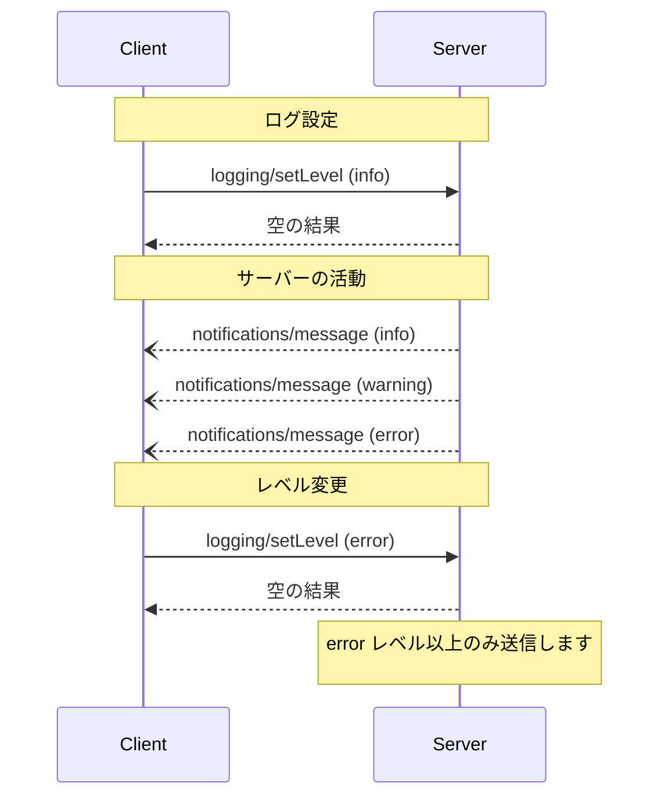

<Info>**プロトコル改訂**: 2024-11-05</Info>

Model Context Protocol（MCP）は、サーバーがクライアントへ構造化されたログメッセージを送信するための標準化された手段を提供します。クライアントは最小ログレベルを設定してログの冗長度を制御でき、サーバーは重大度レベル、任意のロガー名、そして任意のJSONでシリアライズ可能なデータを含む通知を送信します。

<div id="user-interaction-model">
  ## ユーザーインタラクションモデル
</div>

実装は、ニーズに合った任意のインターフェースパターンでログを公開して構いません。プロトコル自体は、特定のユーザーインタラクションモデルを要求しません。

<div id="capabilities">
  ## 機能
</div>

ログメッセージ通知を送出するサーバーは、`logging` 機能を宣言しなければ**なりません**:

```json
{
  "capabilities": {
    "logging": {}
  }
}
```

<div id="log-levels">
  ## ログレベル
</div>

このプロトコルは、[RFC 5424](https://datatracker.ietf.org/doc/html/rfc5424#section-6.2.1) で規定された標準の syslog の重大度レベルに従います。

| レベル     | 説明                             | 代表的な使用例               |
| ---------- | -------------------------------- | ---------------------------- |
| debug      | 詳細なデバッグ情報               | 関数の入口/出口ポイント      |
| info       | 一般的な情報メッセージ           | 処理の進行状況の更新         |
| notice     | 通常だが重要なイベント           | 設定変更                     |
| warning    | 警告状態                         | 非推奨機能の使用             |
| error      | エラー状態                       | 処理の失敗                   |
| critical   | 致命的な状態                     | システムコンポーネントの故障 |
| alert      | 直ちに対応が必要                 | データ破損の検出             |
| emergency  | システムが使用不能               | システム全体の障害           |

<div id="protocol-messages">
  ## プロトコル・メッセージ
</div>

<div id="setting-log-level">
  ### ログレベルの設定
</div>

最小ログレベルを設定するには、クライアントは `logging/setLevel` リクエストを送信してもよい（MAY）:

**リクエスト:**

```json
{
  "jsonrpc": "2.0",
  "id": 1,
  "method": "logging/setLevel",
  "params": {
    "level": "info"
  }
}
```

<div id="log-message-notifications">
  ### ログメッセージ通知
</div>

サーバーは `notifications/message` 通知を用いてログメッセージを送信します：

```json
{
  "jsonrpc": "2.0",
  "method": "notifications/message",
  "params": {
    "level": "error",
    "logger": "database",
    "data": {
      "error": "Connection failed",
      "details": {
        "host": "localhost",
        "port": 5432
      }
    }
  }
}
```

<div id="message-flow">
  ## メッセージフロー
</div>



<div id="error-handling">
  ## エラーハンドリング
</div>

サーバーは、一般的な失敗ケースに対して標準のJSON-RPCエラーを返すことが望ましい（SHOULD）:

- ログレベルが無効: `-32602`（無効なパラメータ）
- 設定エラー: `-32603`（内部エラー）

<div id="implementation-considerations">
  ## 実装に関する考慮事項
</div>

1. サーバーは**推奨**:
   - ログメッセージにレート制限をかける
   - data フィールドに関連するコンテキストを含める
   - 一貫したロガー名を使用する
   - 機密情報を削除する

2. クライアントは**任意**:
   - UI にログメッセージを表示する
   - ログのフィルタリングや検索を実装する
   - 重大度を視覚的に示す
   - ログメッセージを永続化する

<div id="security">
  ## セキュリティ
</div>

1. ログメッセージには次を含めてはならない（MUST NOT）:
   - 資格情報やシークレット
   - 個人を特定できる情報
   - 攻撃に悪用されうる内部システムの詳細

2. 実装は次を行うべきである（SHOULD）:
   - メッセージのレート制限
   - すべてのデータフィールドの検証
   - ログへのアクセス制御
   - 機微情報の監視