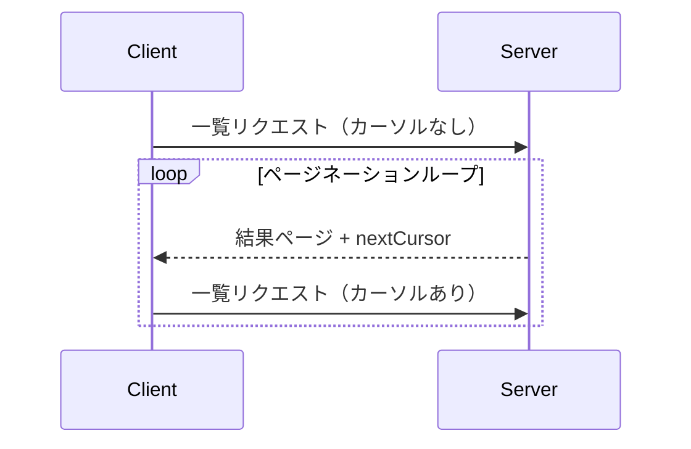

<Info>**プロトコル改訂**: 2024-11-05</Info>

Model Context Protocol（MCP）は、大きな結果セットを返す可能性のあるリスト操作に対して、ページネーションをサポートします。ページネーションにより、サーバーは結果を一度にすべて返すのではなく、より小さな単位に分けて返せます。

ページネーションは、インターネット経由で外部サービスに接続する場合に特に重要ですが、大規模なデータセットによるパフォーマンス問題を避けるため、ローカルな統合でも有用です。

<div id="pagination-model">
  ## ページネーションモデル
</div>

MCP のページネーションは、ページ番号方式ではなく、不透明なカーソルベースの手法を採用します。

- **カーソル**は結果セット内の位置を表す、不透明な文字列トークンです
- **ページサイズ**はサーバーによって決定され、クライアントは固定のページサイズを想定しては**なりません**

<div id="response-format">
  ## レスポンス形式
</div>

ページネーションは、サーバーが次の内容を含む**レスポンス**を送信したタイミングで開始されます:

- 現在ページの結果
- さらに結果がある場合の、任意の `nextCursor` フィールド

```json
{
  "jsonrpc": "2.0",
  "id": "123",
  "result": {
    "resources": [...],
    "nextCursor": "eyJwYWdlIjogM30="
  }
}
```

<div id="request-format">
  ## リクエスト形式
</div>

カーソルを受け取った後、クライアントはそのカーソルを含むリクエストを送信してページネーションを続行できます。

```json
{
  "jsonrpc": "2.0",
  "method": "resources/list",
  "params": {
    "cursor": "eyJwYWdlIjogMn0="
  }
}
```

<div id="pagination-flow">
  ## ページネーションのフロー
</div>



<div id="operations-supporting-pagination">
  ## ページネーション対応のオペレーション
</div>

次の MCP のオペレーションはページネーションに対応しています:

- `resources/list` - 利用可能なリソースの一覧
- `resources/templates/list` - リソーステンプレートの一覧
- `prompts/list` - 利用可能なプロンプトの一覧
- `tools/list` - 利用可能なツールの一覧

<div id="implementation-guidelines">
  ## 実装ガイドライン
</div>

1. サーバーは**推奨**:
   - 安定したカーソルを提供すること
   - 無効なカーソルを穏当に処理すること

2. クライアントは**推奨**:
   - `nextCursor` が存在しない場合は結果の終端として扱うこと
   - ページネーションあり/なしの両方のフローをサポートすること

3. クライアントはカーソルを不透明トークンとして扱うことを**必須**とする:
   - カーソルの形式について前提を置かないこと
   - カーソルの解析や変更を試みないこと
   - セッションをまたいでカーソルを保持（永続化）しないこと

<div id="error-handling">
  ## エラーハンドリング
</div>

無効なカーソルは、コード -32602（無効なパラメータ）のエラーを返すべきです（SHOULD）。