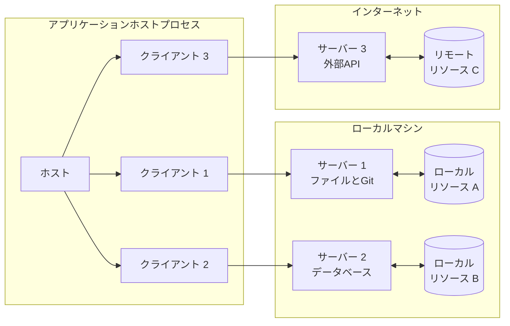
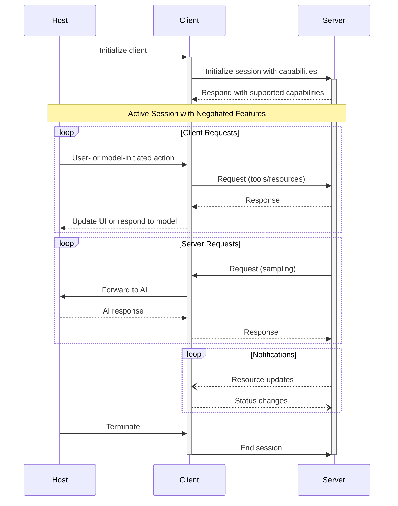

Model Context Protocol（MCP）は、各ホストが複数のクライアントインスタンスを起動できる、クライアント—ホスト—サーバー型のアーキテクチャに従います。このアーキテクチャにより、明確なセキュリティ境界を保ち、関心の分離を維持しながら、アプリケーション間でAI機能を統合できます。JSON-RPC 2.0を基盤とするMCPは、クライアントとサーバー間のコンテキスト交換とサンプリングの調整に特化した、ステートフルなセッションプロトコルを提供します。

  ## コアコンポーネント

  ### ホスト

ホストプロセスはコンテナ兼コーディネーターとして機能します:

* 複数のクライアントインスタンスを作成・管理する
* クライアントの接続権限とライフサイクルを制御する
* セキュリティポリシーと同意要件を適用する
* ユーザーの認可に関する判断を処理する
* AI/LLM 連携およびサンプリングを調整する
* クライアント間のコンテキスト集約を管理する

  ### クライアント

各クライアントはホストによって作成され、独立したサーバー接続を維持します。

* サーバーごとにステートフルなセッションを1つ確立
* プロトコルのネゴシエーションと機能のハンドシェイクを処理
* プロトコルメッセージを双方向にルーティング
* サブスクリプションと通知を管理
* サーバー間のセキュリティ境界を維持

ホストアプリケーションは複数のクライアントを作成・管理し、各クライアントは特定のサーバーと1対1の関係を持ちます。

  ### サーバー

サーバーは特化したコンテキストと機能を提供します:

* MCPのプリミティブを通じてリソース、ツール、プロンプトを公開する
* 明確に絞られた責務で独立して動作する
* クライアントインターフェースを介してサンプリングを要求する
* セキュリティ上の制約を順守する必要がある
* ローカルプロセスとしてもリモートサービスとしても動作できる

  ## 設計原則

MCP は、そのアーキテクチャと実装に影響を与えるいくつかの重要な設計原則に基づいて構築されています。

1. **サーバーは極めて簡単に構築できるべき**
   * ホストアプリケーションが複雑なオーケストレーションを担う
   * サーバーは明確に定義された特定の機能に専念する
   * シンプルなインターフェースで実装の負荷を最小化
   * 明確な分離により保守しやすいコードを実現

2. **サーバーは高い合成性を備えるべき**
   * 各サーバーは独立してフォーカスした機能を提供する
   * 複数のサーバーをシームレスに組み合わせられる
   * 共通のプロトコルにより相互運用性を実現
   * モジュール設計が拡張性を支える

3. **サーバーは会話全体を読めず、他のサーバーを「覗き見」できてはならない**
   * サーバーは必要最小限のコンテキスト情報のみ受け取る
   * 会話履歴全体はホスト側に留まる
   * 各サーバー接続は分離を維持する
   * サーバー間のやり取りはホストが制御する
   * ホストプロセスがセキュリティ境界を強制する

4. **機能はサーバーとクライアントに段階的に追加できる**
   * コアプロトコルは最小限の必須機能を提供する
   * 追加機能は必要に応じて合意の上で拡張できる
   * サーバーとクライアントは独立して進化する
   * プロトコルは将来の拡張性を見据えて設計されている
   * 後方互換性が維持される

  ## 機能ネゴシエーション

Model Context Protocol（MCP）は、初期化時にクライアントとサーバーがサポートする機能を明示的に宣言する、能力（ケイパビリティ）ベースのネゴシエーション方式を採用しています。宣言された能力は、セッション中に利用できるプロトコルの機能やプリミティブを決定します。

* サーバーは、リソースの購読、ツール対応、プロンプトのテンプレートなどの能力を宣言します
* クライアントは、サンプリング対応や通知ハンドリングなどの能力を宣言します
* 両者はセッション全体を通じて、宣言した能力を尊重しなければなりません
* 追加の能力は、プロトコルの拡張を通じて交渉できます

各能力は、セッション中に利用できる特定のプロトコル機能を有効化します。例えば:

* 実装された[サーバーの機能](/ja/specification/2025-03-26/server)は、サーバーの能力として広告（アドバタイズ）されている必要があります
* リソース購読の通知を送信するには、サーバーが購読対応を宣言している必要があります
* ツールの呼び出しには、サーバーがツール能力を宣言している必要があります
* [サンプリング](/ja/specification/2025-03-26/client)には、クライアントが自身の能力でサポートを宣言している必要があります

この能力ネゴシエーションにより、プロトコルの拡張性を維持しつつ、クライアントとサーバーはサポートされる機能について明確に合意できます。