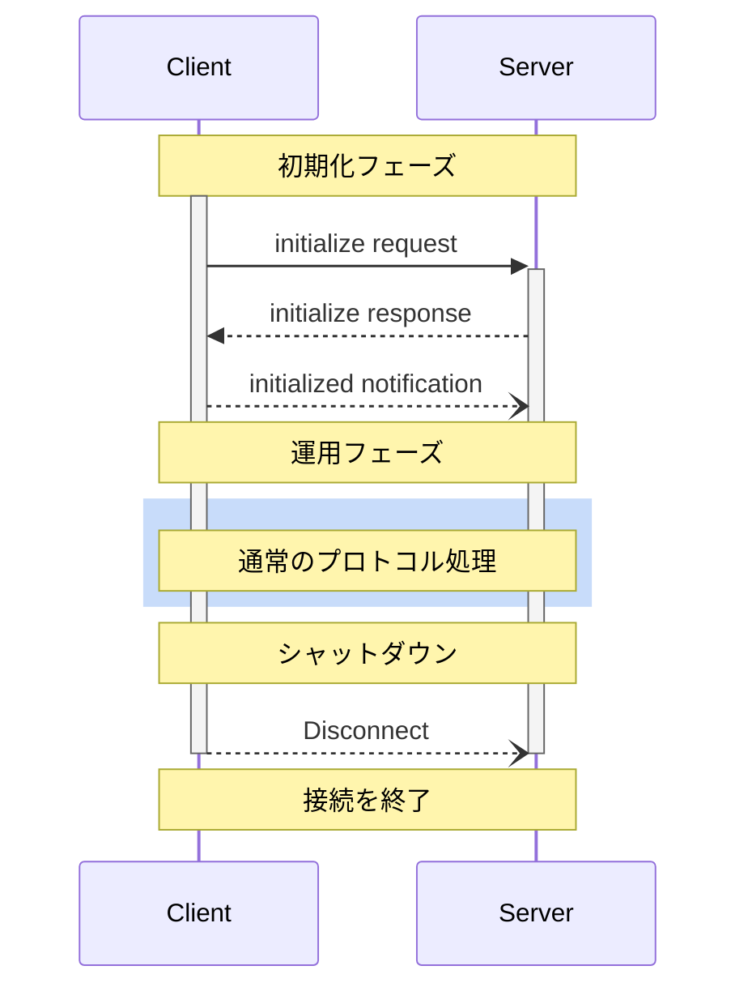

<Info>**プロトコル改訂**: 2025-03-26</Info>

Model Context Protocol（MCP）は、クライアントとサーバーの接続に対して厳密なライフサイクルを定義し、適切な機能交渉と状態管理を確保します。

1. **初期化**: 機能交渉とプロトコルバージョンの合意
2. **運用**: 通常のプロトコル通信
3. **シャットダウン**: 接続の適切な終了



<div id="lifecycle-phases">
  ## ライフサイクルフェーズ
</div>

<div id="initialization">
  ### 初期化
</div>

初期化フェーズは、クライアントとサーバーの最初のやり取りでなければなりません（MUST）。
このフェーズでは、クライアントとサーバーは次を行います:

* プロトコルバージョンの互換性を確立する
* 機能を交換・調整する
* 実装の詳細を共有する

クライアントは、次を含む `initialize` リクエストを送信してこのフェーズを開始しなければなりません（MUST）:

* サポートするプロトコルバージョン
* クライアントの機能
* クライアント実装情報

```json
{
  "jsonrpc": "2.0",
  "id": 1,
  "method": "initialize",
  "params": {
    "protocolVersion": "2025-03-26",
    "capabilities": {
      "roots": {
        "listChanged": true
      },
      "sampling": {}
    },
    "clientInfo": {
      "name": "ExampleClient",
      "version": "1.0.0"
    }
  }
}
```

`initialize` リクエストは JSON-RPC の
[バッチ](https://www.jsonrpc.org/specification#batch)に含めてはなりません（MUST NOT）。初期化が完了するまで他のリクエストや通知は実行できないためです。これは、JSON-RPC のバッチを明示的にサポートしない以前のプロトコルバージョンとの後方互換性も確保します。

サーバーは自らの機能と情報で応答しなければなりません（MUST）:

```json
{
  "jsonrpc": "2.0",
  "id": 1,
  "result": {
    "protocolVersion": "2025-03-26",
    "capabilities": {
      "logging": {},
      "prompts": {
        "listChanged": true
      },
      "resources": {
        "subscribe": true,
        "listChanged": true
      },
      "tools": {
        "listChanged": true
      }
    },
    "serverInfo": {
      "name": "ExampleServer",
      "version": "1.0.0"
    },
    "instructions": "Optional instructions for the client"
  }
}
```

初期化が成功した後、クライアントは通常の操作を開始する準備が整ったことを示すために `initialized` 通知を送信しなければなりません（MUST）:

```json
{
  "jsonrpc": "2.0",
  "method": "notifications/initialized"
}
```

* クライアントは、サーバーが `initialize` リクエストに応答する前に
  [ping](/ja/specification/2025-03-26/basic/utilities/ping) 以外のリクエストを送信すべきではありません（SHOULD NOT）。
* サーバーは、`initialized` 通知を受信する前に
  [ping](/ja/specification/2025-03-26/basic/utilities/ping) および
  [logging](/ja/specification/2025-03-26/server/utilities/logging) 以外のリクエストを送信すべきではありません（SHOULD NOT）。

<div id="version-negotiation">
  #### バージョンネゴシエーション
</div>

`initialize` リクエストでは、クライアントはサポートしているプロトコルバージョンを送信する**必要があります**。
これはクライアントがサポートする&#95;最新&#95;バージョンであることが**望ましい**です。

サーバーが要求されたプロトコルバージョンをサポートしている場合は、同じバージョンで応答する**必要があります**。
それ以外の場合は、サーバーがサポートしている別のプロトコルバージョンで応答する**必要があります**。この場合、そのバージョンはサーバーがサポートする&#95;最新&#95;バージョンであることが**望ましい**です。

クライアントがサーバーの応答に含まれるバージョンをサポートしていない場合は、切断することが**望ましい**です。

<div id="capability-negotiation">
  #### 機能ネゴシエーション
</div>

クライアントとサーバーの機能によって、セッション中に利用可能な任意のプロトコル機能が決まります。

主な機能は次のとおりです:

| カテゴリ | 機能           | 説明                                                                                      |
| -------- | -------------- | ----------------------------------------------------------------------------------------- |
| クライアント | `roots`        | ファイルシステムの[ルーツ](/ja/specification/2025-03-26/client/roots)を提供する機能             |
| クライアント | `sampling`     | LLMの[サンプリング](/ja/specification/2025-03-26/client/sampling)リクエストに対応               |
| クライアント | `experimental` | 標準外の実験的機能への対応状況を記述                                                       |
| サーバー   | `prompts`      | [プロンプトテンプレート](/ja/specification/2025-03-26/server/prompts)を提供                     |
| サーバー   | `resources`    | 読み取り可能な[リソース](/ja/specification/2025-03-26/server/resources)を提供                   |
| サーバー   | `tools`        | 呼び出し可能な[ツール](/ja/specification/2025-03-26/server/tools)を公開                         |
| サーバー   | `logging`      | 構造化された[ログメッセージ](/ja/specification/2025-03-26/server/utilities/logging)を出力       |
| サーバー   | `completions`  | 引数の[自動補完](/ja/specification/2025-03-26/server/utilities/completion)に対応                |
| サーバー   | `experimental` | 標準外の実験的機能への対応状況を記述                                                       |

機能オブジェクトは、次のようなサブ機能を記述できます:

* `listChanged`: リスト変更通知（プロンプト、リソース、ツール）に対応
* `subscribe`: 個別アイテムの変更購読に対応（リソースのみ）

<div id="operation">
  ### 運用
</div>

運用フェーズでは、クライアントとサーバーは合意済みの機能に基づいてメッセージを交換します。

双方は次を満たすべきです（SHOULD）:

* 合意されたプロトコルバージョンを遵守する
* 正常に合意された機能のみを使用する

<div id="shutdown">
  ### シャットダウン
</div>

シャットダウン段階では、一方（通常はクライアント）がプロトコル接続を適切に終了します。特定のシャットダウン用メッセージは定義されていません。代わりに、基盤となるトランスポート機構を用いて接続の終了を通知してください。

<div id="stdio">
  #### stdio
</div>

stdioの[トランスポート](/ja/specification/2025-03-26/basic/transports)では、クライアントは次の手順でシャットダウンを開始することが望ましい（SHOULD）:

1. まず、子プロセス（サーバー）への入力ストリームを閉じる
2. サーバーが終了するのを待つ。妥当な時間内に終了しない場合は `SIGTERM` を送る
3. `SIGTERM` の後も妥当な時間内に終了しない場合は `SIGKILL` を送る

サーバーは、クライアントへの出力ストリームを閉じて終了することで、シャットダウンを開始してもよい（MAY）。

<div id="http">
  #### HTTP
</div>

HTTPの[トランスポート](/ja/specification/2025-03-26/basic/transports)では、シャットダウンは関連するHTTP接続を閉じることで示されます。

<div id="timeouts">
  ## タイムアウト
</div>

実装は、ハングした接続やリソースの枯渇を防ぐため、送信するすべてのリクエストに対してタイムアウトを設定するべきである（SHOULD）。リクエストがタイムアウト期間内に成功またはエラーのレスポンスを受け取らなかった場合、送信者は当該リクエストに対して[cancellation notification](/ja/specification/2025-03-26/basic/utilities/cancellation)を発行し、応答待ちを中止するべきである（SHOULD）。

SDKやその他のミドルウェアは、これらのタイムアウトをリクエスト単位で設定可能にするべきである（SHOULD）。

実装は、当該リクエストに対応する[progress notification](/ja/specification/2025-03-26/basic/utilities/progress)を受信した際、作業が実際に進行していることを示すために、タイムアウトのカウントをリセットしてもよい（MAY）。ただし、誤動作するクライアントやサーバーの影響を抑えるため、進捗通知の有無にかかわらず、常に最大タイムアウトを適用するべきである（SHOULD）。

<div id="error-handling">
  ## エラー処理
</div>

実装は次のエラーケースに対処できるようにしておくことが望ましい（SHOULD）:

* プロトコルバージョンの不一致
* 必須機能のネゴシエーション失敗
* リクエストの[タイムアウト](#timeouts)

初期化エラーの例:

```json
{
  "jsonrpc": "2.0",
  "id": 1,
  "error": {
    "code": -32602,
    "message": "Unsupported protocol version",
    "data": {
      "supported": ["2024-11-05"],
      "requested": "1.0.0"
    }
  }
}
```