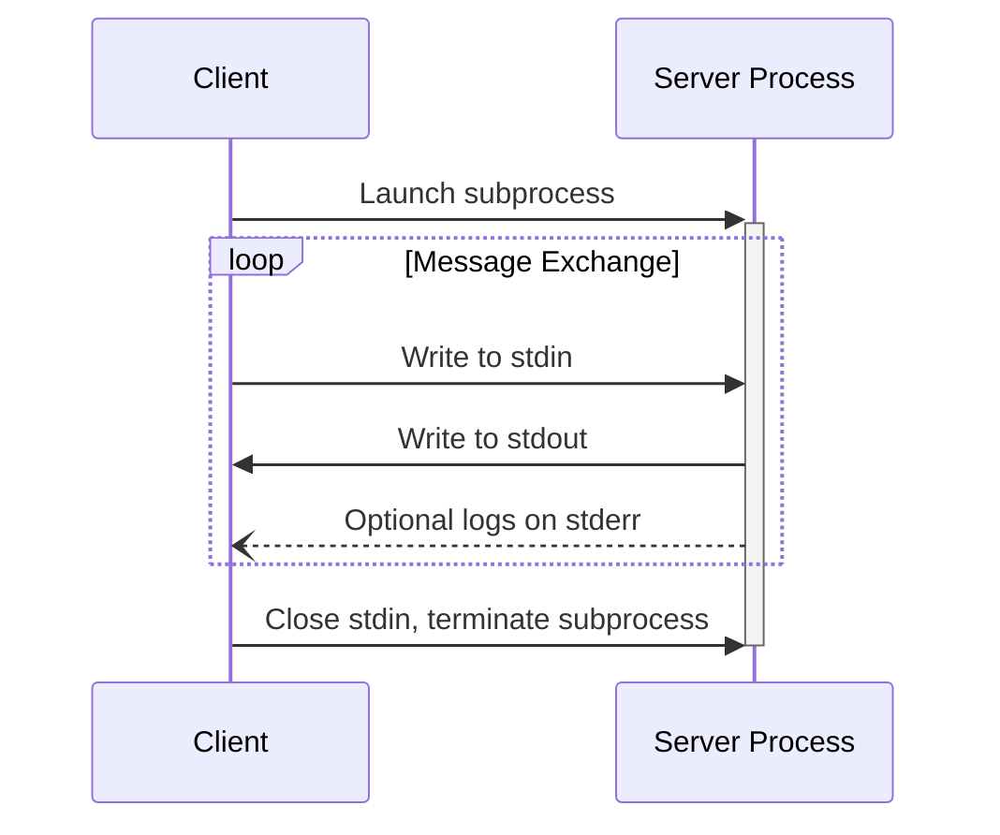
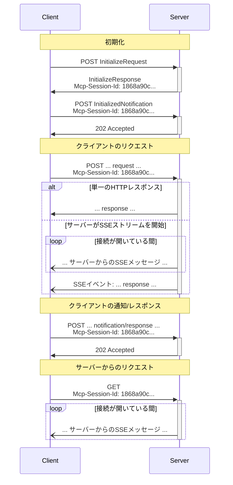

<Info>**プロトコル改訂**: 2025-03-26</Info>

MCPはメッセージのエンコードにJSON-RPCを使用します。JSON-RPCメッセージはUTF-8でエンコードされていることが**必須**です。

このプロトコルでは現在、クライアント—サーバー間通信のために2つの標準的なトランスポート機構を定義しています。

1. [stdio](#stdio) — 標準入力と標準出力による通信
2. [ストリーム対応HTTP](#streamable-http)

クライアントは可能な限りstdioをサポートすることが**望ましい**です。

また、クライアントとサーバーがプラグイン方式で
[カスタムトランスポート](#custom-transports)を実装することも可能です。

  ## stdio

**stdio** トランスポートでは:

* クライアントは MCPサーバー をサブプロセスとして起動します。
* サーバーは標準入力（`stdin`）から JSON-RPC メッセージを読み取り、標準出力（`stdout`）に
  メッセージを送信します。
* メッセージは JSON-RPC のリクエスト、通知、レスポンス、または 1 件以上のリクエスト
  や通知を含む JSON-RPC の
  [バッチ](https://www.jsonrpc.org/specification#batch) のいずれかです。
* メッセージは改行で区切られ、埋め込みの改行を含めてはなりません（**MUST NOT**）。
* サーバーはログ目的で標準エラー（`stderr`）に UTF-8 文字列を書き込んでもかまいません（**MAY**）。
  クライアントはこのログを取得、転送、または無視してもかまいません（**MAY**）。
* サーバーは有効な MCP メッセージ以外を `stdout` に書き込んではなりません（**MUST NOT**）。
* クライアントは有効な MCP メッセージ以外をサーバーの `stdin` に書き込んではなりません（**MUST NOT**）。

  ## ストリーム対応HTTP

<Info>
  これは、プロトコルバージョン 2024-11-05 の [HTTP+SSE
  トランスポート](/ja/specification/2024-11-05/basic/transports#http-with-sse) を置き換えるものです。以下の [後方互換性](#backwards-compatibility)
  ガイドを参照してください。
</Info>

**ストリーム対応HTTP** トランスポートでは、サーバーは複数のクライアント接続を処理できる独立したプロセスとして動作します。このトランスポートは HTTP の POST および GET リクエストを使用します。
サーバーは任意で
[Server-Sent Events](https://en.wikipedia.org/wiki/Server-sent_events)（SSE）を用いて複数のサーバーメッセージをストリーミングできます。これにより、基本的な MCPサーバーだけでなく、ストリーミングやサーバーからクライアントへの通知・リクエストをサポートする、より高機能なサーバーも利用可能になります。

サーバーは、POST と GET の両方のメソッドをサポートする単一の HTTP エンドポイントパス（以下、**MCPエンドポイント**）を提供する **必要があります（MUST）**。例えば、`https://example.com/mcp` のような URL です。

  #### セキュリティ警告

ストリーム対応HTTPトランスポートを実装する際は、以下を必ず遵守してください。

1. すべての受信接続で `Origin` ヘッダーを検証し、DNSリバインディング攻撃を防ぐこと（サーバーは MUST）
2. ローカルで実行する場合は、全ネットワークインターフェイス（0.0.0.0）ではなく localhost（127.0.0.1）のみにバインドすること（サーバーは SHOULD）
3. すべての接続に対して適切な認証を実装すること（サーバーは SHOULD）

これらの対策がない場合、攻撃者がDNSリバインディングを悪用し、リモートのウェブサイトからローカルのMCPサーバーに対話的にアクセスできてしまう可能性があります。

  ### サーバーへのメッセージ送信

クライアントから送信されるすべてのJSON-RPCメッセージは、MCPエンドポイントへの新規HTTP POSTリクエストでなければなりません。

1. クライアントは、MCPエンドポイントにJSON-RPCメッセージを送信する際、HTTP POSTを使用しなければなりません。
2. クライアントは、`Accept`ヘッダーに`application/json`と`text/event-stream`の両方をサポートするコンテンツタイプとして含めなければなりません。
3. POSTリクエストのボディは、次のいずれかでなければなりません:
   * 単一のJSON-RPCの_リクエスト_、*通知*、または_レスポンス_
   * 1つ以上の_リクエストおよび/または通知_を[バッチ](https://www.jsonrpc.org/specification#batch)した配列
   * 1つ以上の_レスポンス_を[バッチ](https://www.jsonrpc.org/specification#batch)した配列
4. 入力がJSON-RPCの_レスポンス_または_通知_（任意個数）のみで構成される場合:
   * サーバーが入力を受け入れる場合、サーバーはボディなしでHTTPステータスコード202 Acceptedを返さなければなりません。
   * サーバーが入力を受け入れられない場合、HTTPエラーステータスコード（例: 400 Bad Request）を返さなければなりません。HTTPレスポンスボディは、`id`を持たないJSON-RPCの_エラーレスポンス_を含んでもかまいません。
5. 入力にJSON-RPCの_リクエスト_が1件以上含まれる場合、サーバーはSSEストリームを開始する`Content-Type: text/event-stream`、または1つのJSONオブジェクトを返す`Content-Type: application/json`のいずれかを返さなければなりません。クライアントは両方のケースをサポートしなければなりません。
6. サーバーがSSEストリームを開始する場合:
   * SSEストリームには、POSTボディで送信された各JSON-RPC _リクエスト_につき最終的に1つのJSON-RPC _レスポンス_を含めることが望まれます。これらの_レスポンス_は[バッチ](https://www.jsonrpc.org/specification#batch)されてもかまいません。
   * サーバーは、JSON-RPC _レスポンス_を送信する前に、JSON-RPCの_リクエスト_および_通知_を送信してもかまいません。これらのメッセージは、起点となったクライアントの_リクエスト_に関連していることが望まれます。これらの_リクエスト_および_通知_は[バッチ](https://www.jsonrpc.org/specification#batch)されてもかまいません。
   * [セッション](#session-management)が期限切れにならない限り、受信した各JSON-RPC _リクエスト_につき1つのJSON-RPC _レスポンス_を送信する前にSSEストリームを閉じるべきではありません。
   * すべてのJSON-RPC _レスポンス_の送信後、サーバーはSSEストリームを閉じることが望まれます。
   * 切断はいつでも（例: ネットワーク状況により）発生しうるため、次のとおりです:
     * 切断を、クライアントがリクエストをキャンセルしたものと解釈すべきではありません。
     * キャンセルするには、クライアントは明示的にMCPの`CancelledNotification`を送信することが望まれます。
     * 切断によるメッセージ損失を避けるため、サーバーはストリームを[再開可能](#resumability-and-redelivery)にしてもかまいません。

  ### サーバーからのメッセージを受信する

1. クライアントは MCP エンドポイントに対して HTTP GET を発行してもよい（MAY）。これは SSE ストリームを開くために使用でき、クライアントが先に HTTP POST でデータを送信しなくても、サーバーからクライアントへ通信できる。
2. クライアントは、`text/event-stream` をサポートするコンテンツタイプとして列挙した `Accept` ヘッダーを含めなければならない（MUST）。
3. サーバーは、この HTTP GET に対し `Content-Type: text/event-stream` を返すか、そうでなければ HTTP 405 Method Not Allowed を返し、このエンドポイントでは SSE ストリームを提供していないことを示さなければならない（MUST）。
4. サーバーが SSE ストリームを開始する場合:
   * サーバーはストリーム上で JSON-RPC の request および notification を送信してもよい（MAY）。これらの request および notification は[バッチ](https://www.jsonrpc.org/specification#batch)にしてもよい（MAY）。
   * これらのメッセージは、クライアントからの同時進行中の JSON-RPC request とは無関係であるべきである（SHOULD）。
   * サーバーは、以前のクライアントリクエストに関連付けられたストリームを[再開](#resumability-and-redelivery)する場合を除き、ストリーム上で JSON-RPC の response を送信してはならない（MUST NOT）。
   * サーバーは、いつでも SSE ストリームを閉じてもよい（MAY）。
   * クライアントは、いつでも SSE ストリームを閉じてもよい（MAY）。

  ### 複数接続

1. クライアントは、複数のサーバー送信イベント（SSE）ストリームに同時に接続したままでいても構いません（**MAY**）。
2. サーバーは、各 JSON-RPC 2.0 メッセージを接続中のストリームのうちいずれか1つにのみ送信しなければなりません（**MUST**）。つまり、同一メッセージを複数のストリームにブロードキャストしてはなりません（**MUST NOT**）。
   * メッセージ損失のリスクは、ストリームを[再開可能](#resumability-and-redelivery)にすることで軽減できる場合があります（**MAY**）。

  ### 再開性と再配信

切断された接続の再開や、通常なら失われうるメッセージの再配信をサポートするために:

1. サーバーは、[SSE標準](https://html.spec.whatwg.org/multipage/server-sent-events.html#event-stream-interpretation)に記載のとおり、SSEイベントに `id` フィールドを付与してもよい（MAY）。
   * 付与する場合、そのIDは、その[セッション](#session-management)内のすべてのストリーム—またはセッション管理を使用していない場合はその特定のクライアントとのすべてのストリーム—にわたってグローバルに一意でなければならない（MUST）。
2. クライアントが切断後に再開したい場合、MCPエンドポイントに対してHTTP GETを発行し、受信した最後のイベントIDを示すために[`Last-Event-ID`](https://html.spec.whatwg.org/multipage/server-sent-events.html#the-last-event-id-header)ヘッダーを含めるべきである（SHOULD）。
   * サーバーは、このヘッダーを使用して、最後のイベントIDの後に送信されるはずだったメッセージを、_切断されたストリーム上で_再生し、その時点からストリームを再開してもよい（MAY）。
   * サーバーは、別のストリームで配信されるはずだったメッセージを再生してはならない（MUST NOT）。

言い換えると、これらのイベントIDは、特定のストリーム内でのカーソルとして機能するよう、サーバーによって_ストリームごと_に割り当てられるべきである。

  ### セッション管理

MCPの「セッション」は、クライアントとサーバー間の論理的に関連するやり取りで構成され、[初期化フェーズ](/ja/specification/2025-03-26/basic/lifecycle)から始まります。ステートフルなセッションを確立したいサーバーをサポートするために:

1. ストリーム対応HTTPトランスポートを使用するサーバーは、初期化時に、`InitializeResult` を含むHTTPレスポンスの `Mcp-Session-Id` ヘッダーにセッションIDを含めることで、セッションIDを割り当ててもよい（**MAY**）。
   * セッションIDは、グローバルに一意で暗号学的に安全であるべき（例: 安全に生成されたUUID、JWT、または暗号学的ハッシュ）（**SHOULD**）。
   * セッションIDは、可視ASCII文字（0x21〜0x7Eの範囲）のみを含まなければならない（**MUST**）。
2. 初期化時にサーバーから `Mcp-Session-Id` が返された場合、ストリーム対応HTTPトランスポートを使用するクライアントは、その後のすべてのHTTPリクエストの `Mcp-Session-Id` ヘッダーにそれを含めなければならない（**MUST**）。
   * セッションIDを必要とするサーバーは、（初期化以外で）`Mcp-Session-Id` ヘッダーのないリクエストに対して HTTP 400 Bad Request で応答するべき（**SHOULD**）。
3. サーバーは任意の時点でセッションを終了してもよく、その後はそのセッションIDを含むリクエストに対して HTTP 404 Not Found で応答しなければならない（**MUST**）。
4. クライアントが、`Mcp-Session-Id` を含むリクエストに対する応答として HTTP 404 を受け取った場合、セッションIDを付けずに新しい `InitializeRequest` を送信して新しいセッションを開始しなければならない（**MUST**）。
5. 特定のセッションが不要になったクライアント（例: ユーザーがクライアントアプリケーションを離れる場合）は、セッションを明示的に終了するために、`Mcp-Session-Id` ヘッダーを付けて MCP エンドポイントに HTTP DELETE を送信するべき（**SHOULD**）。
   * サーバーは、このリクエストに対して HTTP 405 Method Not Allowed で応答し、クライアントによるセッション終了を許可しないことを示してもよい（**MAY**）。

  ### シーケンス図

  ### 下位互換性

クライアントとサーバーは、非推奨となった[HTTP+SSE
トランスポート](/ja/specification/2024-11-05/basic/transports#http-with-sse)（プロトコルバージョン 2024-11-05 由来）との下位互換性を次のように維持できます。

古いクライアントをサポートしたい**サーバー**は、次を行うべきです:

* 新しいストリーム対応HTTPトランスポート用に定義された「MCPエンドポイント」と並行して、旧トランスポートの SSE エンドポイントと POST エンドポイントの両方を引き続きホストする。
  * 旧 POST エンドポイントと新しい MCP エンドポイントを統合することも可能だが、不要な複雑さを招くおそれがある。

古いサーバーをサポートしたい**クライアント**は、次を行うべきです:

1. ユーザーから MCP サーバーの URL を受け取り、それが旧トランスポートまたは新トランスポートのいずれを用いるサーバーであっても受け付ける。
2. 上記で定義した `Accept` ヘッダーを付与して、`InitializeRequest` をサーバーの URL に対して POST してみる:
   * 成功した場合、クライアントはそのサーバーが新しいストリーム対応HTTPトランスポートをサポートしているとみなせる。
   * HTTP 4xx ステータスコード（例: 405 Method Not Allowed、404 Not Found）で失敗した場合:
     * サーバーの URL に対して GET リクエストを発行し、SSE ストリームが開かれ、最初のイベントとして `endpoint` イベントが返ってくることを期待する。
     * `endpoint` イベントが到着したら、そのサーバーは旧 HTTP+SSE トランスポートで動作しているとみなし、以降の通信はそのトランスポートを使用する。

  ## カスタムトランスポート

クライアントとサーバーは、固有の要件に合わせて追加のカスタムトランスポート機構を実装してもかまいません（MAY）。このプロトコルはトランスポート非依存であり、双方向のメッセージ交換をサポートする任意の通信チャネル上で実装できます。

カスタムトランスポートをサポートする実装者は、MCPで定義されたJSON-RPCのメッセージ形式とライフサイクル要件を保持することが必須です（MUST）。相互運用性を高めるため、カスタムトランスポートは、特有の接続確立方法とメッセージ交換パターンを文書化することが望まれます（SHOULD）。