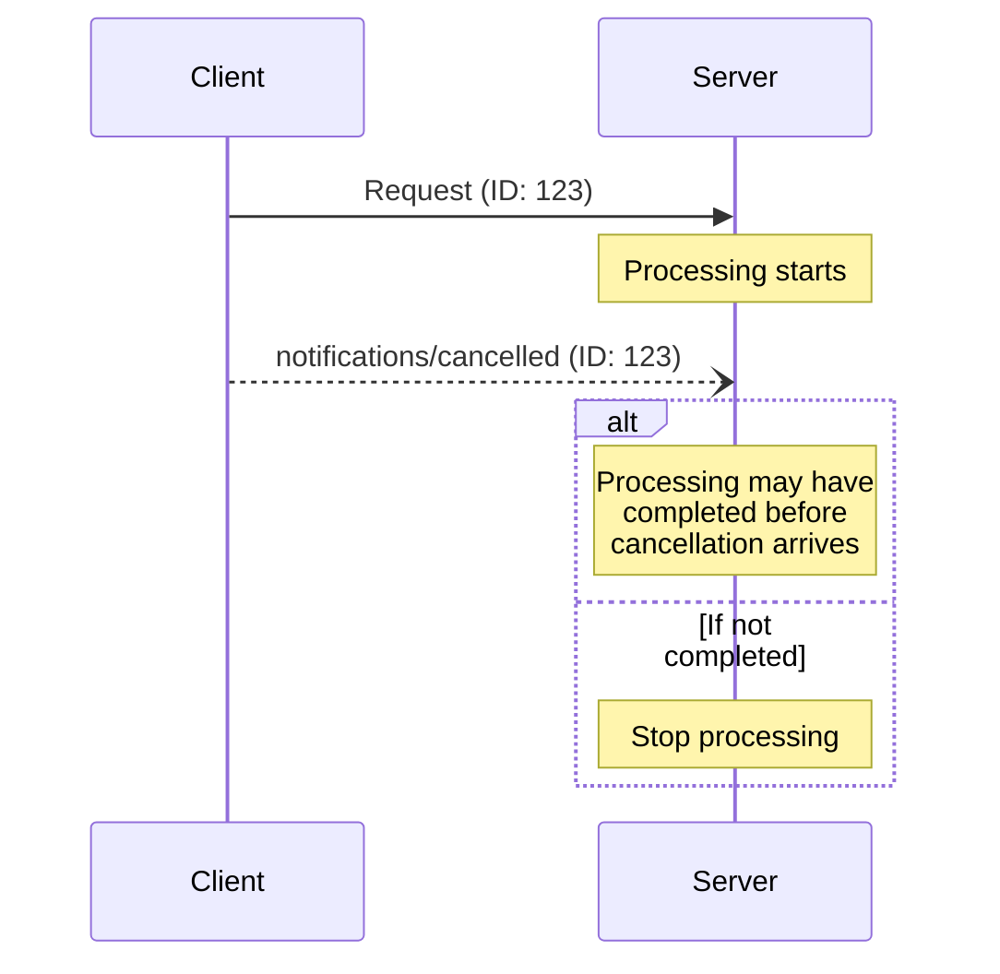

<Info>**プロトコル改訂**: 2025-03-26</Info>

Model Context Protocol（MCP）は、通知メッセージによって進行中のリクエストを任意でキャンセルすることをサポートします。どちらの当事者も、以前に送信されたリクエストを終了すべきであることを示すキャンセル通知を送信できます。

<div id="cancellation-flow">
  ## キャンセルフロー
</div>

いずれかの当事者が進行中のリクエストをキャンセルする場合は、次の内容を含む `notifications/cancelled`
通知を送信します:

- キャンセル対象のリクエストID
- ログ記録や表示に利用できる任意の理由文字列

```json
{
  "jsonrpc": "2.0",
  "method": "notifications/cancelled",
  "params": {
    "requestId": "123",
    "reason": "User requested cancellation"
  }
}
```

<div id="behavior-requirements">
  ## 動作要件
</div>

1. キャンセル通知は、次の条件を満たす要求のみを参照する**必要があります**:
   - 同一方向で以前に発行されたこと
   - まだ進行中であると見なされること
2. `initialize` リクエストは、クライアントがキャンセルしては**なりません**
3. キャンセル通知の受信者は、次を行うことが**推奨されます**:
   - キャンセルされたリクエストの処理を停止する
   - 関連するリソースを解放する
   - キャンセルされたリクエストに対してレスポンスを送信しない
4. 受信者は、次の場合はキャンセル通知を無視しても**かまいません**:
   - 参照されているリクエストが不明である
   - 処理がすでに完了している
   - リクエストをキャンセルできない
5. キャンセル通知の送信者は、その後に到着する当該リクエストへのいかなるレスポンスも無視することが**推奨されます**

<div id="timing-considerations">
  ## タイミングに関する考慮事項
</div>

ネットワーク遅延により、キャンセル通知がリクエスト処理の完了後、場合によってはすでにレスポンス送信後に届くことがあります。

双方はこれらのレースコンディションを適切に扱うことが**必須**です:



<div id="implementation-notes">
  ## 実装に関する注意事項
</div>

- デバッグのため、双方はキャンセル理由を記録することが望ましい（SHOULD）
- アプリケーションのUIは、キャンセル要求中であることを示すべきである（SHOULD）

<div id="error-handling">
  ## エラーハンドリング
</div>

無効なキャンセル通知は無視するべき（SHOULD）です：

- 不明なリクエストID
- すでに完了したリクエスト
- 形式不正の通知

これは、非同期通信におけるレースコンディションを許容しつつ、通知の「送ったら忘れる（fire and forget）」という性質を維持するためです。