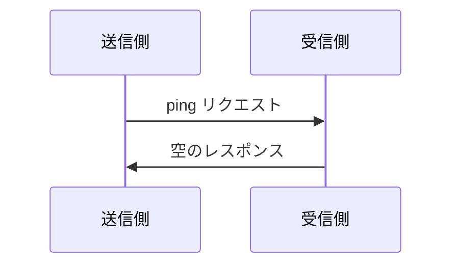

<Info>**プロトコル改訂**: 2025-03-26</Info>

Model Context Protocol（MCP）には、双方が相手側の応答性と接続の生存を確認できる任意の ping メカニズムが含まれています。

<div id="overview">
  ## 概要
</div>

ping 機能はシンプルなリクエスト／レスポンスのパターンで実装されています。クライアントでもサーバーでも、`ping` リクエストを送信して ping を開始できます。

<div id="message-format">
  ## メッセージ形式
</div>

ping リクエストは、パラメータを持たない標準的な JSON-RPC リクエストです：

```json
{
  "jsonrpc": "2.0",
  "id": "123",
  "method": "ping"
}
```

<div id="behavior-requirements">
  ## 動作要件
</div>

1. 受信側は、空のレスポンスで速やかに応答することが**必須**です:

```json
{
  "jsonrpc": "2.0",
  "id": "123",
  "result": {}
}
```

2. 合理的なタイムアウト期間内に応答がない場合、送信側は次の対応を行っても**よい**（**MAY**）:
   - 接続が陳腐化したと見なす
   - 接続を終了する
   - 再接続手順を試みる

<div id="usage-patterns">
  ## 利用パターン
</div>



<div id="implementation-considerations">
  ## 実装に関する考慮事項
</div>

- 実装は接続の健全性を確認するため、定期的に ping を送信することが推奨される
- ping の頻度は設定可能であることが推奨される
- タイムアウトはネットワーク環境に応じて適切に設定することが推奨される
- ネットワークのオーバーヘッドを抑えるため、過度な ping の送信は避けることが推奨される

<div id="error-handling">
  ## エラーハンドリング
</div>

- タイムアウトは接続失敗として扱うべきです（SHOULD）
- 複数回の ping 失敗で接続をリセットしてもよい場合があります（MAY）
- 実装は診断のために ping 失敗をログに記録すべきです（SHOULD）