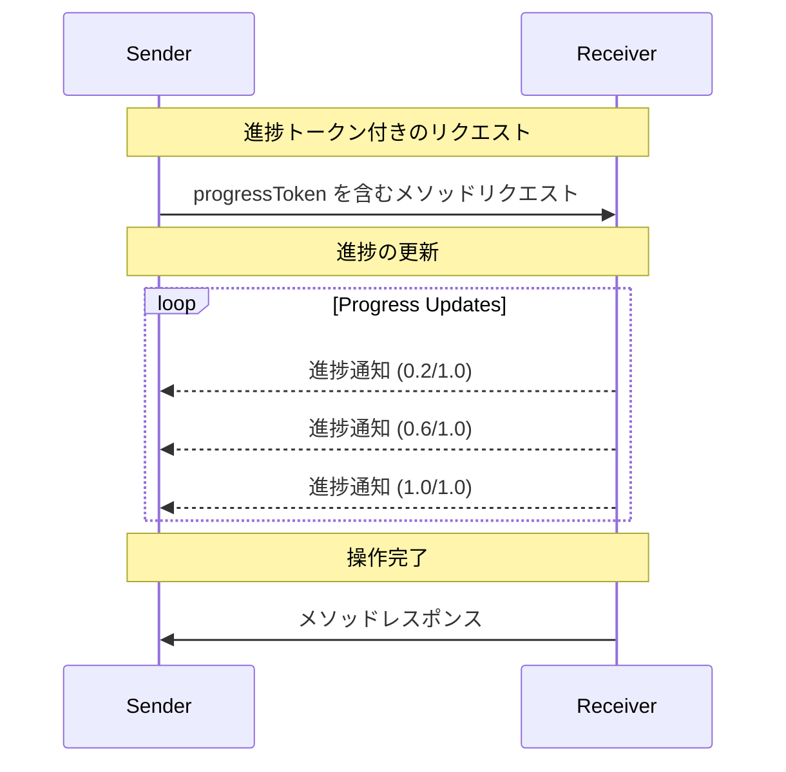

<Info>**プロトコル改訂**: 2025-03-26</Info>

Model Context Protocol（MCP）は、通知メッセージを用いて、長時間実行される
オペレーションの進捗を任意で追跡できます。どちらの側からでも進捗通知を送信して、
オペレーションのステータスに関する更新を提供できます。

<div id="progress-flow">
  ## 進捗フロー
</div>

ある当事者がリクエストの進捗更新を「受け取り」たい場合、リクエストのメタデータに
`progressToken` を含めます。

- 進捗トークンは文字列または整数値であることが**必須**です
- 進捗トークンは送信者が任意の方法で選択できますが、すべてのアクティブなリクエスト間で一意であることが**必須**です。

```json
{
  "jsonrpc": "2.0",
  "id": 1,
  "method": "some_method",
  "params": {
    "_meta": {
      "progressToken": "abc123"
    }
  }
}
```

受信者は、その後、次を含む進捗通知を送信しても**かまいません**:

- 元の進捗トークン
- 現時点までの進捗値
- 任意の「total」値
- 任意の「message」値

```json
{
  "jsonrpc": "2.0",
  "method": "notifications/progress",
  "params": {
    "progressToken": "abc123",
    "progress": 50,
    "total": 100,
    "message": "Reticulating splines..."
  }
}
```

- `total` が不明であっても、`progress` の値は通知のたびに増加することが**必須**です。
- `progress` および `total` の値は浮動小数点であっても**かまいません**。
- `message` フィールドは、人間が読める関連する進捗情報を提供することが**推奨**されます。

<div id="behavior-requirements">
  ## 動作要件
</div>

1. 進捗通知は、次のトークンのみを参照しなければなりません（MUST）:
   - アクティブなリクエストで提供されたもの
   - 進行中の操作に関連付けられているもの

2. 進捗リクエストの受信者は、次のことを行ってもかまいません（MAY）:
   - 進捗通知を一切送信しないと判断する
   - 適切と判断した任意の頻度で通知を送信する
   - 不明な場合は total の値を省略する



<div id="implementation-notes">
  ## 実装に関する注意事項
</div>

- 送信側と受信側は、アクティブな進行状況トークンを追跡することが**望まれます**
- 双方は、フラッディングを防ぐためにレート制限を実装することが**望まれます**
- 進行状況通知は、完了後に停止することが**必須です**