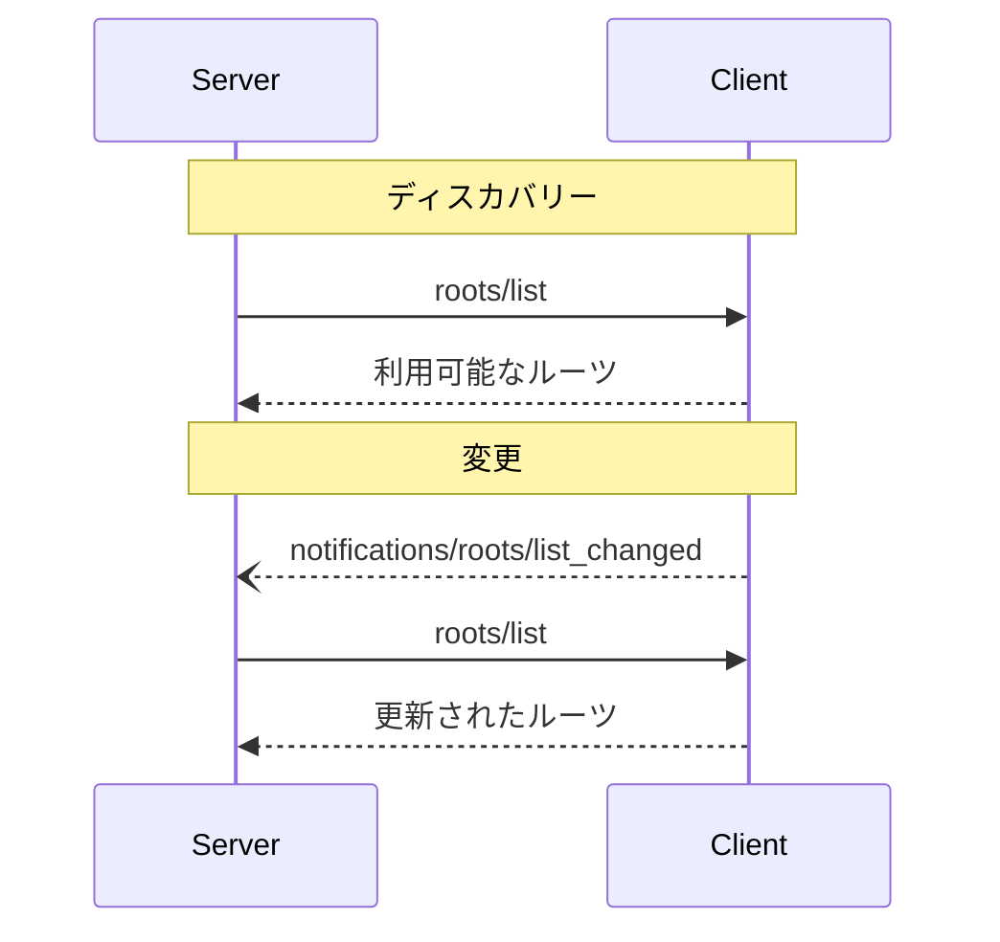

<Info>**プロトコル改訂**: 2025-03-26</Info>

Model Context Protocol（MCP）は、クライアントがファイルシステムの「ルーツ」をサーバーに公開するための標準化された方法を提供します。ルーツは、サーバーがファイルシステム内で操作できる範囲の境界を定義し、どのディレクトリやファイルにアクセスできるかを把握できるようにします。サーバーは、対応クライアントからルーツ一覧を要求でき、一覧が変更された際には通知を受け取れます。

<div id="user-interaction-model">
  ## ユーザーインタラクションモデル
</div>

MCPにおけるルーツは、通常、ワークスペースやプロジェクトの設定インターフェースを通じて公開されます。

たとえば、実装ではワークスペース／プロジェクトのピッカーを用意し、サーバーがアクセスすべきディレクトリやファイルをユーザーが選択できるようにできます。これは、バージョン管理システムやプロジェクトファイルに基づく自動ワークスペース検出と組み合わせられます。

ただし、実装はニーズに合った任意のインターフェースパターンでルーツを公開して構いません。プロトコル自体は、特定のユーザーインタラクションモデルを要求していません。

<div id="capabilities">
  ## 機能
</div>

ルーツをサポートするクライアントは、[初期化](/ja/specification/2025-03-26/basic/lifecycle#initialization)時に `roots` 機能を宣言することが**必須**です:

```json
{
  "capabilities": {
    "roots": {
      "listChanged": true
    }
  }
}
```

`listChanged` は、ルーツの一覧が変更された際にクライアントが通知を送出するかどうかを示します。

<div id="protocol-messages">
  ## プロトコルメッセージ
</div>

<div id="listing-roots">
  ### ルーツの一覧
</div>

ルーツを取得するには、サーバーは `roots/list` リクエストを送信します。

**リクエスト:**

```json
{
  "jsonrpc": "2.0",
  "id": 1,
  "method": "roots/list"
}
```

**レスポンス:**

```json
{
  "jsonrpc": "2.0",
  "id": 1,
  "result": {
    "roots": [
      {
        "uri": "file:///home/user/projects/myproject",
        "name": "My Project"
      }
    ]
  }
}
```

<div id="root-list-changes">
  ### ルーツ一覧の変更
</div>

ルーツが変更された場合、`listChanged` をサポートするクライアントは通知を送信しなければなりません（MUST）:

```json
{
  "jsonrpc": "2.0",
  "method": "notifications/roots/list_changed"
}
```

<div id="message-flow">
  ## メッセージフロー
</div>



<div id="data-types">
  ## データ型
</div>

<div id="root">
  ### ルーツ
</div>

ルーツ定義には次が含まれます:

* `uri`: ルーツの一意の識別子。現在の仕様では、これは `file://` URIであることが**必須**です。
* `name`: 表示用の任意の人間可読な名称。

さまざまなユースケース向けのルーツ例:

<div id="project-directory">
  #### プロジェクトディレクトリ
</div>

```json
{
  "uri": "file:///home/user/projects/myproject",
  "name": "My Project"
}
```

<div id="multiple-repositories">
  #### 複数のリポジトリ
</div>

```json
[
  {
    "uri": "file:///home/user/repos/frontend",
    "name": "フロントエンドリポジトリ"
  },
  {
    "uri": "file:///home/user/repos/backend",
    "name": "バックエンドリポジトリ"
  }
]
```

<div id="error-handling">
  ## エラー処理
</div>

クライアントは、一般的な失敗ケースに対して標準のJSON-RPCエラーを返すべきです（SHOULD）:

* クライアントがルーツをサポートしていない場合: `-32601`（Method not found）
* 内部エラー: `-32603`

エラー例:

```json
{
  "jsonrpc": "2.0",
  "id": 1,
  "error": {
    "code": -32601,
    "message": "Roots not supported",
    "data": {
      "reason": "Client does not have roots capability"
    }
  }
}
```

<div id="security-considerations">
  ## セキュリティに関する考慮事項
</div>

1. クライアントは**必須**:
   * 適切な権限を付与したルーツのみを公開すること
   * パストラバーサルを防ぐため、すべてのルーツURIを検証すること
   * 適切なアクセス制御を実装すること
   * ルーツの到達性を監視すること

2. サーバーは**推奨**:
   * ルーツが利用不能になった場合に適切に処理すること
   * 操作時にはルーツの境界を遵守すること
   * 提供されたルーツに対してすべてのパスを検証すること

<div id="implementation-guidelines">
  ## 実装ガイドライン
</div>

1. クライアントは**推奨**:
   * サーバーにルーツを公開する前にユーザーの同意を得る
   * ルーツ管理のための分かりやすいユーザーインターフェースを提供する
   * 公開前にルーツへのアクセス可否を検証する
   * ルーツの変更を監視する

2. サーバーは**推奨**:
   * 使用前にルーツ機能のサポート有無を確認する
   * ルーツ一覧の変更に適切に対処する
   * 操作時にルーツの境界を順守する
   * ルーツ情報を適切にキャッシュする