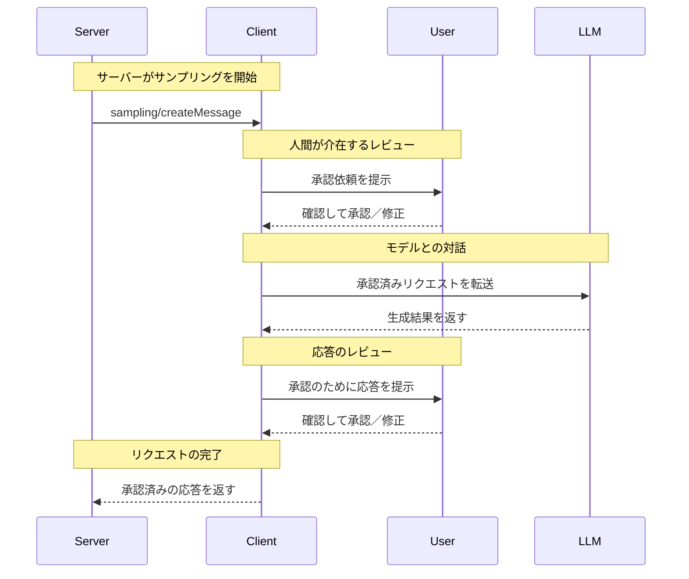

<Info>**Protocol Revision**: 2025-03-26</Info>

Model Context Protocol（MCP）は、サーバーがクライアント経由で言語モデルに対してLLMのサンプリング（「completions」または「generations」）を要求できる標準化された方法を提供します。このフローにより、クライアントはモデルへのアクセス、選択、権限を管理しつつ、サーバーはAIの機能を活用できます。サーバー側のAPIキーは不要です。サーバーはテキスト、音声、または画像ベースのインタラクションを要求でき、必要に応じてプロンプトにMCPサーバー由来のコンテキストを含めることができます。

<div id="user-interaction-model">
  ## ユーザーインタラクションモデル
</div>

MCPにおけるサンプリングは、他のMCPサーバー機能の内部でLLM呼び出しを *ネスト* して実行できるようにすることで、サーバーがエージェント的な挙動を実装できるようにします。

各実装は、ニーズに合った任意のインターフェースパターンでサンプリングを提供して構いません。プロトコル自体は特定のユーザーインタラクションモデルを規定しません。

<Warning>
  トラスト＆セーフティおよびセキュリティの観点から、サンプリング要求を拒否できる権限を持つ人間が常に介在している **べきです（SHOULD）**。

  アプリケーションは **次を満たすべきです（SHOULD）**:

  * サンプリング要求を直感的かつ容易にレビューできるUIを提供する
  * 送信前にプロンプトを閲覧・編集できるようにする
  * 配信前に生成結果をレビュー用に提示する
</Warning>

<div id="capabilities">
  ## 機能
</div>

サンプリングをサポートするクライアントは、[初期化](/ja/specification/2025-03-26/basic/lifecycle#initialization)時に `sampling` 機能を宣言しなければなりません。

```json
{
  "capabilities": {
    "sampling": {}
  }
}
```

<div id="protocol-messages">
  ## プロトコル・メッセージ
</div>

<div id="creating-messages">
  ### メッセージの作成
</div>

言語モデルによる生成をリクエストするために、サーバーは `sampling/createMessage` リクエストを送信します。

**リクエスト:**

```json
{
  "jsonrpc": "2.0",
  "id": 1,
  "method": "sampling/createMessage",
  "params": {
    "messages": [
      {
        "role": "user",
        "content": {
          "type": "text",
          "text": "What is the capital of France?"
        }
      }
    ],
    "modelPreferences": {
      "hints": [
        {
          "name": "claude-3-sonnet"
        }
      ],
      "intelligencePriority": 0.8,
      "speedPriority": 0.5
    },
    "systemPrompt": "You are a helpful assistant.",
    "maxTokens": 100
  }
}
```

**レスポンス:**

```json
{
  "jsonrpc": "2.0",
  "id": 1,
  "result": {
    "role": "assistant",
    "content": {
      "type": "text",
      "text": "The capital of France is Paris."
    },
    "model": "claude-3-sonnet-20240307",
    "stopReason": "endTurn"
  }
}
```

<div id="message-flow">
  ## メッセージフロー
</div>



<div id="data-types">
  ## データ型
</div>

<div id="messages">
  ### メッセージ
</div>

サンプリングのメッセージには、次の内容を含めることができます。

<div id="text-content">
  #### テキスト内容
</div>

```json
{
  "type": "text",
  "text": "The message content"
}
```

<div id="image-content">
  #### 画像コンテンツ
</div>

```json
{
  "type": "image",
  "data": "base64-encoded-image-data",
  "mimeType": "image/jpeg"
}
```

<div id="audio-content">
  #### 音声データ
</div>

```json
{
  "type": "audio",
  "data": "base64-encoded-audio-data",
  "mimeType": "audio/wav"
}
```

<div id="model-preferences">
  ### モデルの優先設定
</div>

MCP におけるモデル選択は、サーバーとクライアントが異なる AI プロバイダーを利用し、提供モデルも異なり得るため、慎重な抽象化が必要です。クライアントがそのモデルにアクセスできない場合や、別プロバイダーの同等モデルを使いたい場合があるため、サーバーは単に特定のモデル名を指定して要求することはできません。

この課題に対処するため、MCP では抽象的な機能要件の優先度に、任意のモデルヒントを組み合わせた優先設定システムを実装しています。

<div id="capability-priorities">
  #### 機能の優先度
</div>

サーバーは、正規化された3つの優先度（0〜1）でニーズを示します:

* `costPriority`: コスト削減の重視度。値が高いほど、より安価なモデルを優先します。
* `speedPriority`: 低レイテンシの重視度。値が高いほど、より高速なモデルを優先します。
* `intelligencePriority`: 先進的な能力の重視度。値が高いほど、
  より高機能なモデルを優先します。

<div id="model-hints">
  #### モデルヒント
</div>

優先度は特性に基づくモデル選択に役立ちますが、`hints` によりサーバーは
特定のモデルやモデルファミリーを提案できます。

* ヒントは、モデル名に柔軟に一致する部分文字列として扱われます
* 複数のヒントは、優先度の高い順に評価されます
* クライアントは、異なるプロバイダーの同等モデルにヒントをマッピングしてもよい（MAY）
* ヒントはあくまで助言であり、最終的なモデル選択はクライアントが行います

例:

```json
{
  "hints": [
    { "name": "claude-3-sonnet" }, // Sonnetクラスのモデルを優先
    { "name": "claude" } // 任意のClaudeモデルにフォールバック
  ],
  "costPriority": 0.3, // コストの重要度は低い
  "speedPriority": 0.8, // スピードの重要度は非常に高い
  "intelligencePriority": 0.5 // 要求能力は中程度
}
```

クライアントはこれらの優先度を考慮して、利用可能な選択肢から適切なモデルを選択します。例えば、クライアントがClaudeモデルにアクセスできずにGeminiを利用できる場合、類似する能力に基づいてsonnetのヒントを `gemini-1.5-pro` にマッピングすることがあります。

<div id="error-handling">
  ## エラーハンドリング
</div>

クライアントは一般的な失敗ケースに対してエラーを返すべきです（SHOULD）。

エラー例:

```json
{
  "jsonrpc": "2.0",
  "id": 1,
  "error": {
    "code": -1,
    "message": "User rejected sampling request"
  }
}
```

<div id="security-considerations">
  ## セキュリティに関する考慮事項
</div>

1. クライアントはユーザー承認の制御を実装すべきである（SHOULD）
2. 両者はメッセージ内容を検証すべきである（SHOULD）
3. クライアントはモデルの嗜好に関するヒントを尊重すべきである（SHOULD）
4. クライアントはレート制限を実装すべきである（SHOULD）
5. 両者は機微なデータを適切に取り扱わなければならない（MUST）