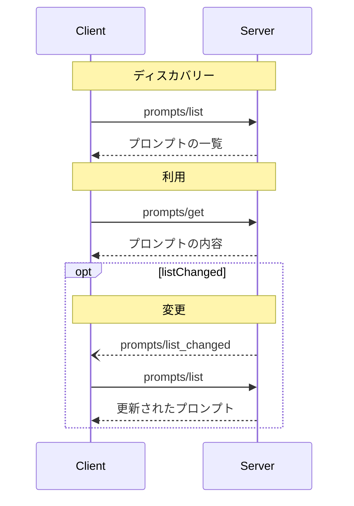

<Info>**プロトコル改訂**: 2025-03-26</Info>

Model Context Protocol（MCP）は、サーバーがクライアントに対してプロンプト
テンプレートを公開するための標準的な方法を提供します。プロンプトにより、サーバーは構造化されたメッセージや
言語モデルとの対話に用いる指示を提供できます。クライアントは利用可能な
プロンプトを検出し、その内容を取得して、引数を指定してカスタマイズできます。

<div id="user-interaction-model">
  ## ユーザーインタラクションモデル
</div>

プロンプトはユーザーが制御できるように設計されています。サーバーからクライアントに公開され、ユーザーが明示的に選択して利用できることを意図しています。

一般的に、プロンプトはユーザーインターフェースにおけるユーザー起点のコマンドで起動され、ユーザーが利用可能なプロンプトを自然に見つけて実行できるようにします。

たとえば、スラッシュコマンドとして:


なお、実装者は自らのニーズに合った任意のインターフェースパターンでプロンプトを公開できます。プロトコル自体は特定のユーザーインタラクションモデルを義務付けていません。

<div id="capabilities">
  ## 機能
</div>

プロンプトをサポートするサーバーは、[初期化](/ja/specification/2025-03-26/basic/lifecycle#initialization)時に `prompts` 機能を宣言することが**必須です**:

```json
{
  "capabilities": {
    "prompts": {
      "listChanged": true
    }
  }
}
```

`listChanged` は、利用可能なプロンプトの一覧が変更された際に、サーバーが通知を発行するかどうかを示します。

<div id="protocol-messages">
  ## プロトコル・メッセージ
</div>

<div id="listing-prompts">
  ### プロンプトの一覧取得
</div>

利用可能なプロンプトを取得するには、クライアントは `prompts/list` リクエストを送信します。この操作は[ページネーション](/ja/specification/2025-03-26/server/utilities/pagination)に対応しています。

**リクエスト:**

```json
{
  "jsonrpc": "2.0",
  "id": 1,
  "method": "prompts/list",
  "params": {
    "cursor": "optional-cursor-value"
  }
}
```

**レスポンス:**

```json
{
  "jsonrpc": "2.0",
  "id": 1,
  "result": {
    "prompts": [
      {
        "name": "code_review",
        "description": "LLM にコード品質の分析と改善案の提案を依頼します",
        "arguments": [
          {
            "name": "code",
            "description": "レビュー対象のコード",
            "required": true
          }
        ]
      }
    ],
    "nextCursor": "next-page-cursor"
  }
}
```

<div id="getting-a-prompt">
  ### プロンプトの取得
</div>

特定のプロンプトを取得するには、クライアントは `prompts/get` リクエストを送信します。引数は [補完 API](/ja/specification/2025-03-26/server/utilities/completion)で自動補完できます。

**リクエスト:**

```json
{
  "jsonrpc": "2.0",
  "id": 2,
  "method": "prompts/get",
  "params": {
    "name": "code_review",
    "arguments": {
      "code": "def hello():\n    print('world')"
    }
  }
}
```

**レスポンス:**

```json
{
  "jsonrpc": "2.0",
  "id": 2,
  "result": {
    "description": "コードレビュー用プロンプト",
    "messages": [
      {
        "role": "user",
        "content": {
          "type": "text",
          "text": "この Python コードをレビューしてください:\ndef hello():\n    print('world')"
        }
      }
    ]
  }
}
```

<div id="list-changed-notification">
  ### リスト変更の通知
</div>

利用可能なプロンプトの一覧が変更された場合、`listChanged`
機能を宣言したサーバーは通知を送信する**べきです**。

```json
{
  "jsonrpc": "2.0",
  "method": "notifications/prompts/list_changed"
}
```

<div id="message-flow">
  ## メッセージフロー
</div>



<div id="data-types">
  ## データ型
</div>

<div id="prompt">
  ### プロンプト
</div>

プロンプト定義には次が含まれます:

* `name`: プロンプトの一意の識別子
* `description`: 任意の、人間が読める説明
* `arguments`: カスタマイズ用の任意の引数リスト

<div id="promptmessage">
  ### プロンプトメッセージ
</div>

プロンプト内のメッセージには次を含められます:

* `role`: 話し手を示すための「user」または「assistant」のいずれか
* `content`: 次のいずれかのコンテンツタイプ

<div id="text-content">
  #### テキストコンテンツ
</div>

テキストコンテンツはプレーンテキストのメッセージを表します。

```json
{
  "type": "text",
  "text": "The text content of the message"
}
```

これは自然言語でのやり取りで最も一般的に使用されるコンテンツタイプです。

<div id="image-content">
  #### 画像コンテンツ
</div>

画像コンテンツを使用すると、メッセージに視覚情報を含められます：

```json
{
  "type": "image",
  "data": "base64-encoded-image-data",
  "mimeType": "image/png"
}
```

画像データは必ず base64 でエンコードされ、かつ有効な MIME タイプを含める必要があります。これにより、視覚的なコンテキストが重要なマルチモーダルなやり取りが可能になります。

<div id="audio-content">
  #### 音声コンテンツ
</div>

音声コンテンツを使うと、メッセージに音声情報を含められます。

```json
{
  "type": "audio",
  "data": "base64-encoded-audio-data",
  "mimeType": "audio/wav"
}
```

音声データは必ずbase64でエンコードし、有効なMIMEタイプを指定する必要があります。これにより、音声の文脈が重要なマルチモーダルなやり取りが可能になります。

<div id="embedded-resources">
  #### 埋め込みリソース
</div>

埋め込みリソースを使用すると、メッセージ内でサーバー側のリソースを直接参照できます：

```json
{
  "type": "resource",
  "resource": {
    "uri": "resource://example",
    "mimeType": "text/plain",
    "text": "Resource content"
  }
}
```

リソースにはテキストまたはバイナリ（blob）データのいずれかを含めることができ、かつ**必須**項目は次のとおりです：

* 有効なリソースURI
* 適切なMIMEタイプ
* テキストコンテンツまたはbase64エンコードのblobデータのいずれか

埋め込みリソースにより、プロンプトはドキュメント、コードサンプル、その他の参考資料といったサーバー管理のコンテンツを、会話の流れに直接シームレスに取り込めます。

<div id="error-handling">
  ## エラーハンドリング
</div>

サーバーは、一般的な失敗ケースに対して標準のJSON-RPCエラーを返すことが望ましい（SHOULD）:

* 無効なプロンプト名: `-32602`（Invalid params）
* 必須引数が不足: `-32602`（Invalid params）
* 内部エラー: `-32603`（Internal error）

<div id="implementation-considerations">
  ## 実装に関する考慮事項
</div>

1. サーバーは処理の前にプロンプトの引数を検証することが望ましい（SHOULD）
2. クライアントは大量のプロンプト一覧に対してページネーションを扱うことが望ましい（SHOULD）
3. 両者は機能のネゴシエーションを尊重することが望ましい（SHOULD）

<div id="security">
  ## セキュリティ
</div>

実装は、インジェクション攻撃やリソースへの不正アクセスを防ぐため、すべてのプロンプトの入力および出力を厳密に検証しなければなりません。