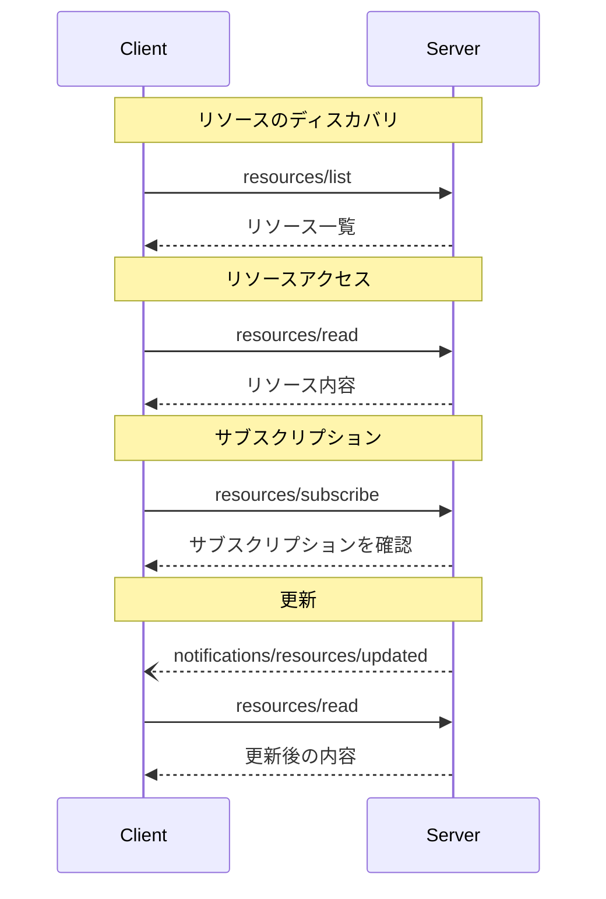

<Info>**プロトコル改訂**: 2025-03-26</Info>

Model Context Protocol（MCP）は、サーバーがクライアントへリソースを公開するための標準化された手段を提供します。リソースにより、サーバーはファイル、データベースのスキーマ、アプリケーション固有の情報など、言語モデルにコンテキストを与えるデータを共有できます。各リソースは
[URI](https://datatracker.ietf.org/doc/html/rfc3986)
によって一意に識別されます。

<div id="user-interaction-model">
  ## ユーザーインタラクションモデル
</div>

MCPにおけるリソースは、ホストアプリケーションがニーズに応じてコンテキストの取り込み方を決定する、**アプリケーション主導**で設計されています。

たとえば、アプリケーションは次のことができます:

* ツリーやリストビューなどのUI要素でリソースを提示し、明示的に選択できるようにする
* 利用可能なリソースをユーザーが検索・フィルタできるようにする
* ヒューリスティクスやAIモデルの選択に基づいてコンテキストを自動的に含める


ただし、実装はニーズに合った任意のインターフェースパターンでリソースを提示してかまいません。プロトコル自体は特定のユーザーインタラクションモデルを規定していません。

<div id="capabilities">
  ## 機能
</div>

リソースをサポートするサーバーは、`resources` 機能を宣言することが**必須**です。

```json
{
  "capabilities": {
    "resources": {
      "subscribe": true,
      "listChanged": true
    }
  }
}
```

この機能は次の2つのオプション機能をサポートします。

* `subscribe`: クライアントが個々のリソースの変更通知を購読できるかどうか。
* `listChanged`: 利用可能なリソース一覧が変更された際に、サーバーが通知を送信するかどうか。

`subscribe` と `listChanged` はどちらもオプションです。サーバーは、両方とも未対応、どちらか一方のみ対応、または両方対応のいずれでもかまいません。

```json
{
  "capabilities": {
    "resources": {} // Neither feature supported
  }
}
```

```json
{
  "capabilities": {
    "resources": {
      "subscribe": true // Only subscriptions supported
    }
  }
}
```

```json
{
  "capabilities": {
    "resources": {
      "listChanged": true // Only list change notifications supported
    }
  }
}
```

<div id="protocol-messages">
  ## プロトコル・メッセージ
</div>

<div id="listing-resources">
  ### リソースの一覧取得
</div>

利用可能なリソースを参照するには、クライアントは `resources/list` リクエストを送信します。この操作は[ページネーション](/ja/specification/2025-03-26/server/utilities/pagination)に対応しています。

**リクエスト:**

```json
{
  "jsonrpc": "2.0",
  "id": 1,
  "method": "resources/list",
  "params": {
    "cursor": "optional-cursor-value"
  }
}
```

**レスポンス:**

```json
{
  "jsonrpc": "2.0",
  "id": 1,
  "result": {
    "resources": [
      {
        "uri": "file:///project/src/main.rs",
        "name": "main.rs",
        "description": "アプリケーションのエントリポイント",
        "mimeType": "text/x-rust"
      }
    ],
    "nextCursor": "next-page-cursor"
  }
}
```

<div id="reading-resources">
  ### リソースの読み取り
</div>

リソースの内容を取得するには、クライアントは `resources/read` リクエストを送信します。

**リクエスト:**

```json
{
  "jsonrpc": "2.0",
  "id": 2,
  "method": "resources/read",
  "params": {
    "uri": "file:///project/src/main.rs"
  }
}
```

**レスポンス:**

```json
{
  "jsonrpc": "2.0",
  "id": 2,
  "result": {
    "contents": [
      {
        "uri": "file:///project/src/main.rs",
        "mimeType": "text/x-rust",
        "text": "fn main() {\n    println!(\"Hello world!\");\n}"
      }
    ]
  }
}
```

<div id="resource-templates">
  ### リソーステンプレート
</div>

リソーステンプレートにより、サーバーは
[URIテンプレート](https://datatracker.ietf.org/doc/html/rfc6570) を使用してパラメータ化されたリソースを公開できます。引数は
[completion API](/ja/specification/2025-03-26/server/utilities/completion) で自動補完できます。

**リクエスト:**

```json
{
  "jsonrpc": "2.0",
  "id": 3,
  "method": "resources/templates/list"
}
```

**レスポンス:**

```json
{
  "jsonrpc": "2.0",
  "id": 3,
  "result": {
    "resourceTemplates": [
      {
        "uriTemplate": "file:///{path}",
        "name": "Project Files",
        "description": "Access files in the project directory",
        "mimeType": "application/octet-stream"
      }
    ]
  }
}
```

<div id="list-changed-notification">
  ### リスト変更通知
</div>

利用可能なリソースのリストが変更された場合、`listChanged`
機能を宣言しているサーバーは通知を送信することが**推奨されます**:

```json
{
  "jsonrpc": "2.0",
  "method": "notifications/resources/list_changed"
}
```

<div id="subscriptions">
  ### サブスクリプション
</div>

このプロトコルは、リソース変更に対する任意のサブスクリプションをサポートします。クライアントは特定のリソースをサブスクライブし、変更があった際に通知を受け取れます。

**サブスクライブリクエスト:**

```json
{
  "jsonrpc": "2.0",
  "id": 4,
  "method": "resources/subscribe",
  "params": {
    "uri": "file:///project/src/main.rs"
  }
}
```

**更新通知:**

```json
{
  "jsonrpc": "2.0",
  "method": "notifications/resources/updated",
  "params": {
    "uri": "file:///project/src/main.rs"
  }
}
```

<div id="message-flow">
  ## メッセージフロー
</div>



<div id="data-types">
  ## データ型
</div>

<div id="resource">
  ### リソース
</div>

リソース定義には次が含まれます：

* `uri`: リソースの一意の識別子
* `name`: 人間が読める名前
* `description`: 任意の説明
* `mimeType`: 任意のMIMEタイプ
* `size`: 任意のサイズ（バイト単位）

<div id="resource-contents">
  ### リソースの内容
</div>

リソースには、テキストデータまたはバイナリデータのいずれかを含められます。

<div id="text-content">
  #### テキスト内容
</div>

```json
{
  "uri": "file:///example.txt",
  "mimeType": "text/plain",
  "text": "Resource content"
}
```

<div id="binary-content">
  #### バイナリコンテンツ
</div>

```json
{
  "uri": "file:///example.png",
  "mimeType": "image/png",
  "blob": "base64-encoded-data"
}
```

<div id="common-uri-schemes">
  ## 一般的なURIスキーム
</div>

このプロトコルは、いくつかの標準的なURIスキームを定義しています。この一覧は網羅的ではありません。実装は、追加の独自URIスキームを自由に使用できます。

<div id="https">
  ### https://
</div>

ウェブ上で利用可能なリソースを表すために使用します。

サーバーは、クライアントがウェブからそのリソースを自力で取得・読み込みできる場合に限って、このスキームを使用するべきです（SHOULD）。つまり、MCPサーバー経由でリソースを読む必要がない場合です。

それ以外の用途では、たとえサーバー自身がインターネット経由でリソースの内容をダウンロードする場合であっても、別のURIスキームを使用するか、カスタムスキームを定義することを優先するべきです（SHOULD）。

<div id="file">
  ### file://
</div>

ファイルシステムのように振る舞うリソースを識別するために使用されます。ただし、そのリソースが実際の物理的なファイルシステムに対応している必要はありません。

MCPサーバーは、標準的なMIMEタイプがない（ディレクトリなどの）非正規ファイルを表すために、`inode/directory` のような
[XDG MIME type](https://specifications.freedesktop.org/shared-mime-info-spec/0.14/ar01s02.html#id-1.3.14)
で file:// リソースを識別してもよい（MAY）とします。

<div id="git">
  ### git://
</div>

Git バージョン管理との統合。

<div id="error-handling">
  ## エラーハンドリング
</div>

サーバーは、一般的な失敗ケースに対して標準のJSON-RPCエラーを返すことが望まれます（SHOULD）:

* リソースが見つからない: `-32002`
* 内部エラー: `-32603`

エラーの例:

```json
{
  "jsonrpc": "2.0",
  "id": 5,
  "error": {
    "code": -32002,
    "message": "Resource not found",
    "data": {
      "uri": "file:///nonexistent.txt"
    }
  }
}
```

<div id="security-considerations">
  ## セキュリティ上の考慮事項
</div>

1. サーバーはすべてのリソースURIを検証することが**必須**です
2. 機微なリソースにはアクセス制御を実装することが**推奨**されます
3. バイナリデータは適切にエンコードすることが**必須**です
4. 操作の前にリソースの権限を確認することが**推奨**されます