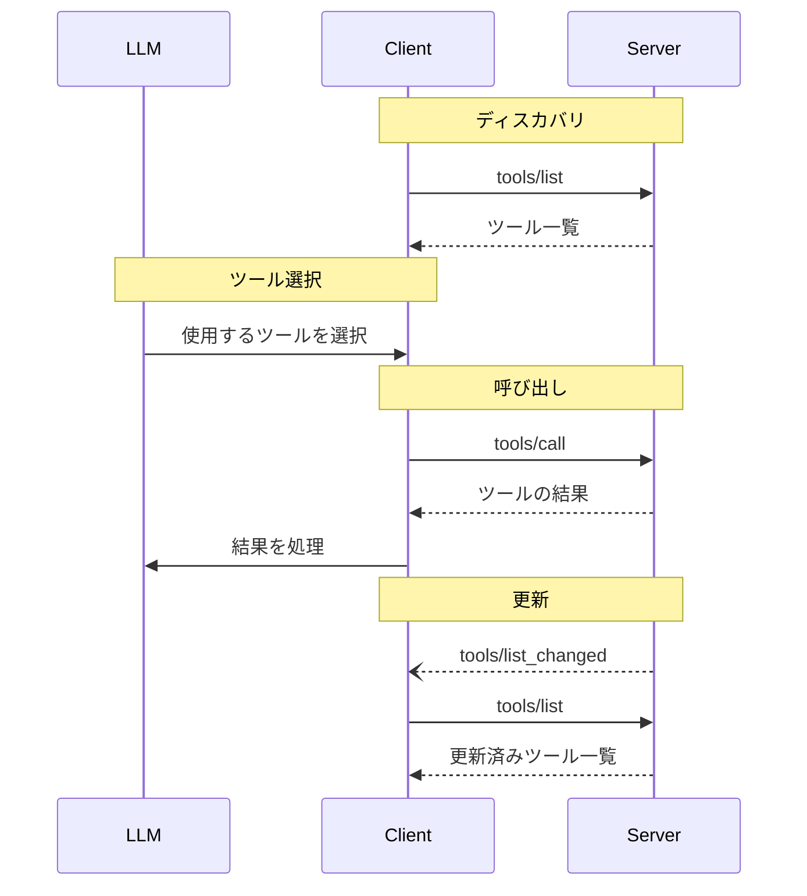

<Info>**プロトコル改訂**: 2025-03-26</Info>

Model Context Protocol（MCP）は、サーバーが言語モデルから呼び出せるツールを公開できるようにします。ツールにより、モデルはデータベースのクエリ実行、API の呼び出し、計算処理などを通じて外部システムとやり取りできます。各ツールは一意の名前で識別され、そのスキーマを記述するメタデータを含みます。

<div id="user-interaction-model">
  ## ユーザーインタラクションモデル
</div>

MCP のツールは、言語モデルが文脈理解とユーザーのプロンプトに基づいて
自動的にツールを発見・呼び出せるように、基本的に「モデル主導」で設計されています。

ただし、実装はニーズに合った任意のインターフェースパターンで
ツールを提供して構いません—プロトコル自体は特定のユーザー
インタラクションモデルを義務付けていません。

<Warning>
  トラスト＆セーフティおよびセキュリティの観点から、ツール呼び出しを拒否できる
  人間が常に関与しているべきです（SHOULD）。

  アプリケーションは次を満たすべきです（SHOULD）:

  * どのツールが AI モデルに公開されているかを明確に示す UI を提供する
  * ツールが呼び出された際に明確な視覚的インジケーターを表示する
  * 人間が関与していることを確保するため、操作の際にはユーザーに確認プロンプトを提示する
</Warning>

<div id="capabilities">
  ## 機能
</div>

ツールをサポートするサーバーは、`tools` 機能を宣言することが**必須**です。

```json
{
  "capabilities": {
    "tools": {
      "listChanged": true
    }
  }
}
```

`listChanged` は、利用可能なツールの一覧が変更された際に、サーバーが通知を送信するかどうかを示します。

<div id="protocol-messages">
  ## プロトコルメッセージ
</div>

<div id="listing-tools">
  ### ツールの一覧取得
</div>

利用可能なツールを検出するには、クライアントは `tools/list` リクエストを送信します。この操作は
[ページネーション](/ja/specification/2025-03-26/server/utilities/pagination)をサポートします。

**リクエスト:**

```json
{
  "jsonrpc": "2.0",
  "id": 1,
  "method": "tools/list",
  "params": {
    "cursor": "optional-cursor-value"
  }
}
```

**レスポンス:**

```json
{
  "jsonrpc": "2.0",
  "id": 1,
  "result": {
    "tools": [
      {
        "name": "get_weather",
        "description": "指定した場所の現在の天気情報を取得する",
        "inputSchema": {
          "type": "object",
          "properties": {
            "location": {
              "type": "string",
              "description": "市区町村名または郵便番号"
            }
          },
          "required": ["location"]
        }
      }
    ],
    "nextCursor": "next-page-cursor"
  }
}
```

<div id="calling-tools">
  ### ツールの呼び出し
</div>

ツールを実行するには、クライアントは `tools/call` リクエストを送信します。

**リクエスト:**

```json
{
  "jsonrpc": "2.0",
  "id": 2,
  "method": "tools/call",
  "params": {
    "name": "get_weather",
    "arguments": {
      "location": "New York"
    }
  }
}
```

**レスポンス:**

```json
{
  "jsonrpc": "2.0",
  "id": 2,
  "result": {
    "content": [
      {
        "type": "text",
        "text": "ニューヨークの現在の天気:\n気温: 72°F\n状況: 晴れ時々曇り"
      }
    ],
    "isError": false
  }
}
```

<div id="list-changed-notification">
  ### リスト変更通知
</div>

利用可能なツールの一覧が変更された場合、`listChanged`
ケイパビリティを宣言しているサーバーは通知を送信するべきです（**SHOULD**）:

```json
{
  "jsonrpc": "2.0",
  "method": "notifications/tools/list_changed"
}
```

<div id="message-flow">
  ## メッセージフロー
</div>



<div id="data-types">
  ## データ型
</div>

<div id="tool">
  ### ツール
</div>

ツール定義には次が含まれます:

* `name`: ツールの一意の識別子
* `description`: 機能の人間が判読できる説明
* `inputSchema`: 期待されるパラメータを定義する JSON Schema
* `annotations`: ツールの動作を記述する任意のプロパティ

<Warning>
  トラスト＆セーフティおよびセキュリティの観点から、信頼できるサーバー由来でない限り、
  クライアントはツールのアノテーションを信頼しないものとして扱うことが**必須**です。
</Warning>

<div id="tool-result">
  ### ツールの結果
</div>

ツールの結果には、種類の異なる複数のコンテンツ項目を含めることがあります：

<div id="text-content">
  #### テキストコンテンツ
</div>

```json
{
  "type": "text",
  "text": "ツールの結果テキスト"
}
```

<div id="image-content">
  #### 画像コンテンツ
</div>

```json
{
  "type": "image",
  "data": "base64-encoded-data",
  "mimeType": "image/png"
}
```

<div id="audio-content">
  #### 音声コンテンツ
</div>

```json
{
  "type": "audio",
  "data": "base64-encoded-audio-data",
  "mimeType": "audio/wav"
}
```

<div id="embedded-resources">
  #### 埋め込みリソース
</div>

[リソース](/ja/specification/2025-03-26/server/resources) は、追加のコンテキストやデータを提供する目的で、後でクライアントが購読したり再取得したりできる URI の背後に埋め込むことが**できます（MAY）**:

```json
{
  "type": "resource",
  "resource": {
    "uri": "resource://example",
    "mimeType": "text/plain",
    "text": "Resource content"
  }
}
```

<div id="error-handling">
  ## エラー処理
</div>

ツールは2つのエラー報告メカニズムを使用します:

1. **プロトコルエラー**: 次のような問題に対する標準のJSON-RPCエラー:
   * 不明なツール
   * 無効な引数
   * サーバーエラー

2. **ツール実行エラー**: ツールの結果で `isError: true` として報告されるもの:
   * APIの失敗
   * 無効な入力データ
   * ビジネスロジックエラー

プロトコルエラーの例:

```json
{
  "jsonrpc": "2.0",
  "id": 3,
  "error": {
    "code": -32602,
    "message": "Unknown tool: invalid_tool_name"
  }
}
```

ツール実行エラーの例:

```json
{
  "jsonrpc": "2.0",
  "id": 4,
  "result": {
    "content": [
      {
        "type": "text",
        "text": "Failed to fetch weather data: API rate limit exceeded"
      }
    ],
    "isError": true
  }
}
```

<div id="security-considerations">
  ## セキュリティに関する考慮事項
</div>

1. サーバーは**必須**:
   * すべてのツール入力を検証する
   * 適切なアクセス制御を実装する
   * ツール呼び出しをレート制限する
   * ツール出力をサニタイズする

2. クライアントは**推奨**:
   * 機微な操作ではユーザーの確認を促す
   * 悪意または誤操作によるデータ流出を防ぐため、サーバーに呼び出す前にツール入力をユーザーに提示する
   * LLM に渡す前にツールの結果を検証する
   * ツール呼び出しにタイムアウトを設定する
   * 監査目的でツールの使用を記録する