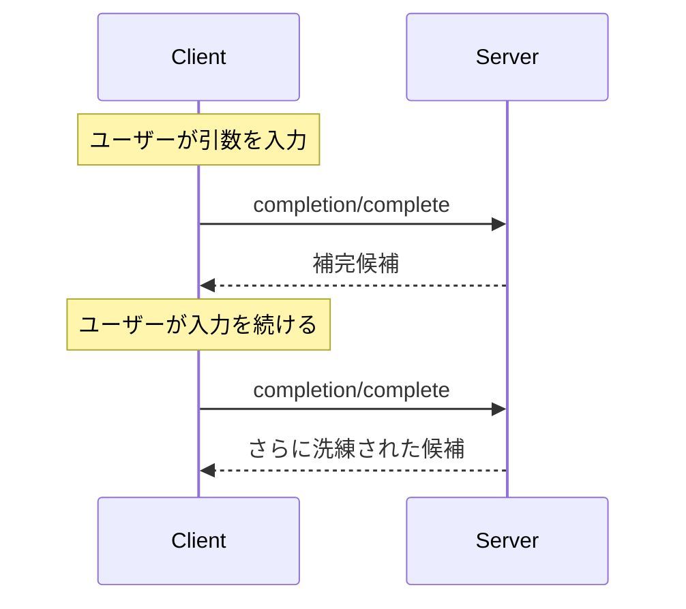

<Info>**プロトコル改訂**: 2025-03-26</Info>

Model Context Protocol（MCP）は、サーバーがプロンプトやリソースURIに対する
引数の自動補完候補を提供するための標準化された手段を提供します。これにより、
ユーザーが引数値を入力する際に文脈に応じた候補が提示される、IDEのようにリッチな体験が可能になります。

<div id="user-interaction-model">
  ## ユーザーインタラクションモデル
</div>

MCP における補完は、IDE のコード補完に似たインタラクティブなユーザー体験をサポートするよう設計されています。

たとえば、ユーザーの入力に応じてドロップダウンやポップアップメニューで補完候補を表示し、利用可能なオプションを絞り込んで選択できるようにすることがあります。

ただし、実装はニーズに合った任意のインターフェースパターンで補完を提供できます。プロトコル自体は特定のユーザーインタラクションモデルを要求していません。

<div id="capabilities">
  ## 機能
</div>

補完をサポートするサーバーは、`completions` 機能を宣言しなければ**なりません**:

```json
{
  "capabilities": {
    "completions": {}
  }
}
```

<div id="protocol-messages">
  ## プロトコルメッセージ
</div>

<div id="requesting-completions">
  ### 補完のリクエスト
</div>

補完候補を取得するには、クライアントは参照タイプで何を補完するかを指定して `completion/complete` リクエストを送信します。

**リクエスト:**

```json
{
  "jsonrpc": "2.0",
  "id": 1,
  "method": "completion/complete",
  "params": {
    "ref": {
      "type": "ref/prompt",
      "name": "code_review"
    },
    "argument": {
      "name": "language",
      "value": "py"
    }
  }
}
```

**レスポンス:**

```json
{
  "jsonrpc": "2.0",
  "id": 1,
  "result": {
    "completion": {
      "values": ["python", "pytorch", "pyside"],
      "total": 10,
      "hasMore": true
    }
  }
}
```

<div id="reference-types">
  ### 参照タイプ
</div>

このプロトコルは2種類の補完参照をサポートします：

| タイプ         | 説明                         | 例                                                 |
| -------------- | ---------------------------- | -------------------------------------------------- |
| `ref/prompt`   | プロンプトを名前で参照       | `{"type": "ref/prompt", "name": "code_review"}`     |
| `ref/resource` | リソースのURIを参照          | `{"type": "ref/resource", "uri": "file:///{path}"}` |

<div id="completion-results">
  ### 完了結果
</div>

サーバーは関連度で並べ替えた完了値の配列を返します。内容は次のとおりです:

- 応答あたり最大100件
- 利用可能な一致の総数（任意）
- 追加の結果があるかどうかを示すブール値

<div id="message-flow">
  ## メッセージフロー
</div>



<div id="data-types">
  ## データ型
</div>

<div id="completerequest">
  ### CompleteRequest
</div>

- `ref`: `PromptReference` または `ResourceReference`
- `argument`: 次を含むオブジェクト:
  - `name`: 引数名
  - `value`: 現在の値

<div id="completeresult">
  ### CompleteResult
</div>

- `completion`: 次を含むオブジェクト：
  - `values`: 候補の配列（最大100件）
  - `total`: 省略可能な一致件数の合計
  - `hasMore`: 追加の結果があるかどうかを示すフラグ

<div id="error-handling">
  ## エラー処理
</div>

サーバーは、一般的な失敗ケースに対して標準のJSON-RPCエラーを返すべきです（SHOULD）:

- メソッドが見つからない: `-32601`（機能がサポートされていない）
- 無効なプロンプト名: `-32602`（無効なパラメータ）
- 必須引数の不足: `-32602`（無効なパラメータ）
- 内部エラー: `-32603`（内部エラー）

<div id="implementation-considerations">
  ## 実装時の考慮事項
</div>

1. サーバーは**推奨**:
   - 関連度順に並べた候補を返す
   - 適切な場合はファジーマッチングを実装する
   - 補完リクエストにレート制限を適用する
   - すべての入力を検証する

2. クライアントは**推奨**:
   - 短時間に連続する補完リクエストをデバウンスする
   - 適切な場合は補完結果をキャッシュする
   - 欠落または不完全な結果を適切に処理する

<div id="security">
  ## セキュリティ
</div>

実装は必ず次を満たすこと:

- すべての補完入力を検証する
- 適切なレート制限を実装する
- 機微な提案へのアクセスを制御する
- 補完に起因する情報漏えいを防止する