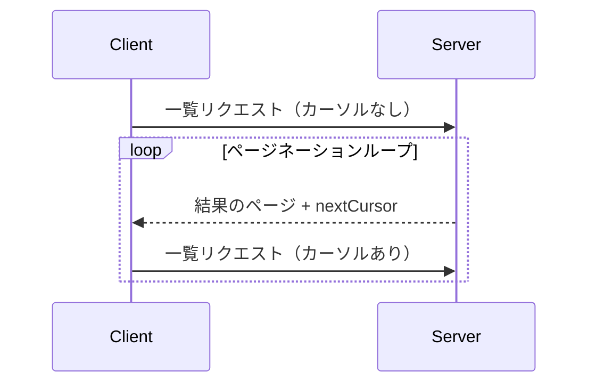

<Info>**プロトコル改訂**: 2025-03-26</Info>

Model Context Protocol（MCP）は、大きな結果セットを返しうる一覧系の操作に対してページネーションをサポートします。ページネーションにより、サーバーは結果を一度にすべて返すのではなく、より小さな単位に分割して段階的に返せます。

ページネーションはインターネット経由で外部サービスに接続する場合に特に重要ですが、大規模なデータセットによるパフォーマンス問題を避けるうえで、ローカル統合においても有用です。

<div id="pagination-model">
  ## ページネーションモデル
</div>

MCPにおけるページネーションは、番号付きページではなく、不透明なカーソルベースの手法を採用します。

- **カーソル**は、結果セット内の位置を表す不透明な文字列トークンです
- **ページサイズ**はサーバーが決定し、クライアントは固定のページサイズを前提にしては**なりません**

<div id="response-format">
  ## レスポンス形式
</div>

ページネーションは、サーバーが次を含む**レスポンス**を送信した時点で開始されます：

- 結果の現在ページ
- さらに結果がある場合に含まれる任意の `nextCursor` フィールド

```json
{
  "jsonrpc": "2.0",
  "id": "123",
  "result": {
    "resources": [...],
    "nextCursor": "eyJwYWdlIjogM30="
  }
}
```

<div id="request-format">
  ## リクエスト形式
</div>

カーソルを受け取った後、クライアントはそのカーソルを含めたリクエストを送信することで、ページネーションを継続できます。

```json
{
  "jsonrpc": "2.0",
  "method": "resources/list",
  "params": {
    "cursor": "eyJwYWdlIjogMn0="
  }
}
```

<div id="pagination-flow">
  ## ページネーションの流れ
</div>



<div id="operations-supporting-pagination">
  ## ページネーションをサポートするオペレーション
</div>

次のMCPのオペレーションはページネーションに対応しています:

- `resources/list` - 利用可能なリソースの一覧
- `resources/templates/list` - リソースのテンプレート一覧
- `prompts/list` - 利用可能なプロンプトの一覧
- `tools/list` - 利用可能なツールの一覧

<div id="implementation-guidelines">
  ## 実装ガイドライン
</div>

1. サーバーは**推奨**:
   - 安定したカーソルを提供すること
   - 無効なカーソルを適切に処理すること

2. クライアントは**推奨**:
   - `nextCursor` が存在しない場合は結果の終端として扱うこと
   - ページネーションあり/なしの両方のフローをサポートすること

3. クライアントはカーソルを不透明なトークンとして**必須**で扱うこと:
   - カーソルの形式について仮定しないこと
   - カーソルを解析したり変更しようとしないこと
   - セッション間でカーソルを永続化しないこと

<div id="error-handling">
  ## エラー処理
</div>

無効なカーソルは、コード -32602（無効なパラメータ）のエラーになるべきです（SHOULD）。