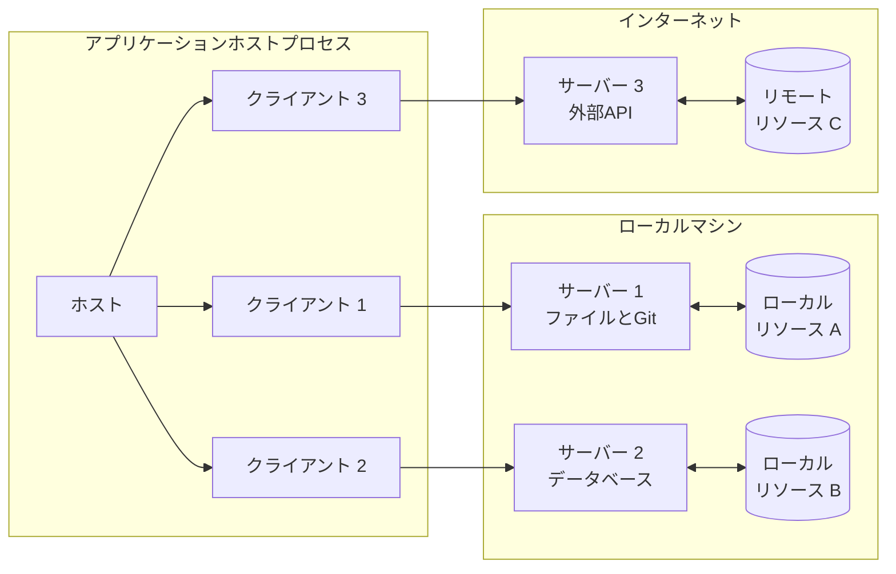
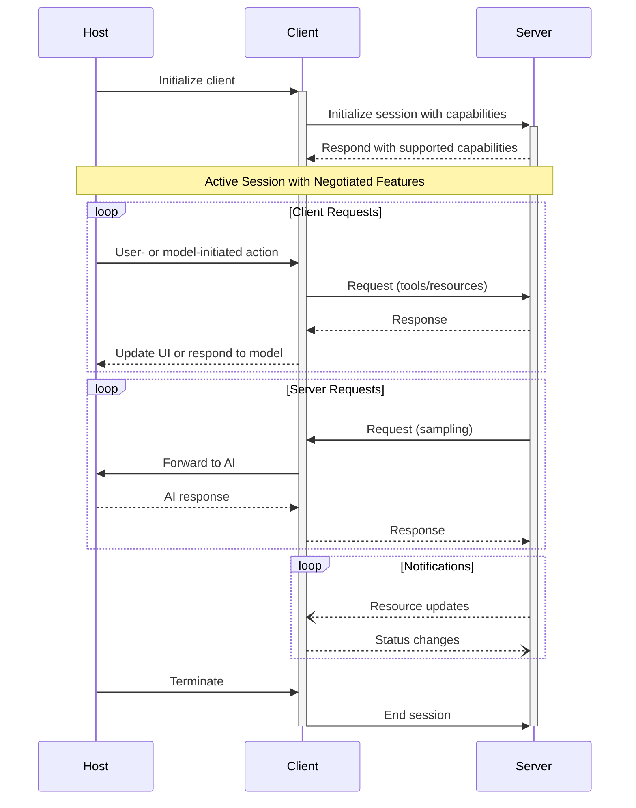

Model Context Protocol（MCP）はクライアント—ホスト—サーバーのアーキテクチャを採用しており、各MCPホストは複数のMCPクライアントインスタンスを実行できます。このアーキテクチャにより、明確なセキュリティ境界を保ちつつ関心事を分離し、ユーザーはアプリケーション間でAI機能を統合できます。JSON-RPC 2.0を基盤とするMCPは、クライアントとサーバー間のコンテキスト共有とサンプリングの調整に焦点を当てた状態保持型のセッションプロトコルを提供します。

  ## コアコンポーネント

  ### ホスト

ホストプロセスはコンテナ兼コーディネーターとして機能します:

* 複数のクライアントインスタンスを作成・管理する
* クライアントの接続権限とライフサイクルを制御する
* セキュリティポリシーと同意要件を適用する
* ユーザーの認可に関する判断を処理する
* AI/LLM 連携とサンプリングを調整する
* クライアント間でのコンテキスト集約を管理する

  ### クライアント

各クライアントはホストによって生成され、サーバーごとに分離された接続を維持します:

* サーバーごとに1つのステートフルなセッションを確立
* プロトコルのネゴシエーションと機能のやり取りを処理
* プロトコルメッセージを双方向にルーティング
* 購読（サブスクリプション）と通知を管理
* サーバー間のセキュリティ境界を維持

ホストアプリケーションは複数のクライアントを作成・管理し、各クライアントは特定のサーバーと1対1の関係を持ちます。

  ### サーバー

サーバーは特化したコンテキストと機能を提供します:

* MCPのプリミティブを通じてリソース、ツール、プロンプトを公開する
* 責務を絞って独立して動作する
* クライアントインターフェースを介してサンプリングをリクエストする
* セキュリティ制約を順守する必要がある
* ローカルプロセスまたはリモートサービスとして動作できる

  ## 設計原則

MCPは、そのアーキテクチャと実装に影響を与える複数の重要な設計原則に基づいて構築されています。

1. **サーバーは非常に簡単に構築できるべき**
   * ホストアプリケーションが複雑なオーケストレーションの責務を担う
   * サーバーは明確に定義された特定の機能に集中する
   * シンプルなインターフェースで実装の負担を最小化する
   * 明確な分離により保守しやすいコードを実現する

2. **サーバーは高い合成可能性を持つべき**
   * 各サーバーは単体で焦点の定まった機能を提供する
   * 複数のサーバーをシームレスに組み合わせられる
   * 共通のプロトコルにより相互運用性を実現する
   * モジュール設計が拡張性を支える

3. **サーバーは会話全体を読めたり、他のサーバーを「覗き見」できるべきではない**
   * サーバーは必要最小限のコンテキスト情報のみ受け取る
   * 会話の全履歴はホスト側に留まる
   * 各サーバー接続は分離を維持する
   * サーバー間の相互作用はホストによって制御される
   * ホストプロセスがセキュリティ境界を強制する

4. **機能はサーバーとクライアントに段階的に追加できる**
   * コアプロトコルは最小限の必須機能を提供する
   * 追加の機能は必要に応じて交渉できる
   * サーバーとクライアントは独立して進化する
   * 将来の拡張性を見据えたプロトコル設計
   * 後方互換性は維持される

  ## 機能ネゴシエーション

Model Context Protocol（MCP）は、初期化時にクライアントとサーバーがサポートする機能を明示的に宣言する、機能ベースのネゴシエーション方式を採用しています。宣言された機能は、セッション中に利用可能なプロトコルの機能やプリミティブを決定します。

* サーバーは、リソースのサブスクリプション、ツールのサポート、プロンプトのテンプレートなどの機能を宣言する
* クライアントは、サンプリングのサポートや通知の処理などの機能を宣言する
* 両者はセッション全体を通して宣言された機能を遵守しなければならない
* 追加の機能は、プロトコル拡張を通じて交渉できる

各機能は、セッション中に使用できる特定のプロトコル機能を有効化します。例えば:

* 実装済みの[サーバー機能](/ja/specification/2025-06-18/server)は、サーバーの機能宣言で広告（アドバタイズ）されていなければならない
* リソースのサブスクリプション通知を送出するには、サーバーがサブスクリプション対応を宣言している必要がある
* ツールの呼び出しには、サーバーがツール機能を宣言している必要がある
* [サンプリング](/ja/specification/2025-06-18/client)には、クライアントが機能宣言でサポートを明示している必要がある

この機能ネゴシエーションにより、プロトコルの拡張性を維持しつつ、クライアントとサーバーはサポートされる機能について明確な共通理解を持てます。