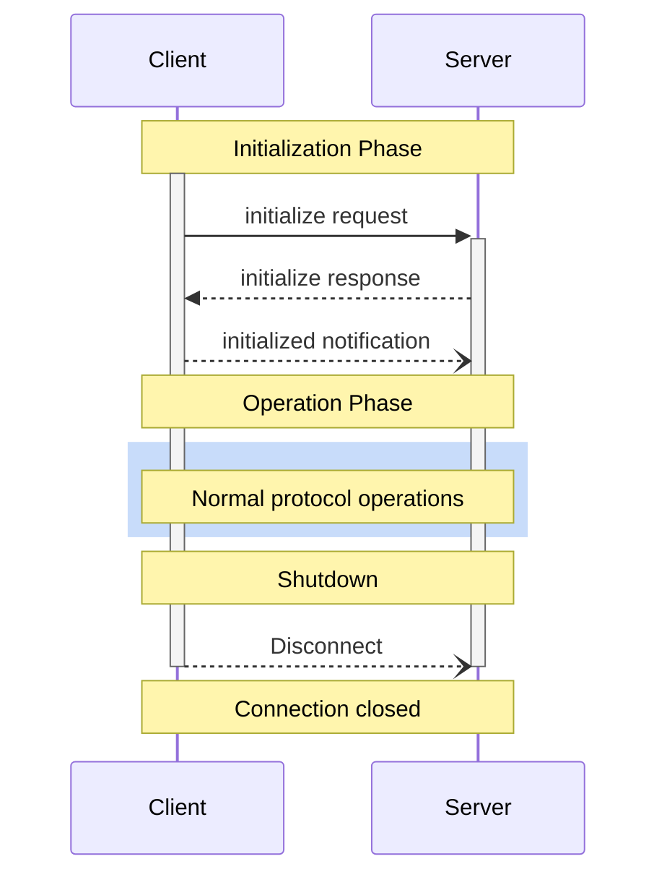

<div id="enable-section-numbers" />

<Info>**プロトコル改訂**: 2025-06-18</Info>

Model Context Protocol（MCP）は、クライアントとサーバー間の接続に対して厳密なライフサイクルを定義し、適切な機能のネゴシエーションと状態管理を確保します。

1. **初期化**: 機能のネゴシエーションとプロトコルバージョンの合意
2. **運用**: 通常のプロトコル通信
3. **シャットダウン**: 接続のグレースフルな終了



<div id="lifecycle-phases">
  ## ライフサイクルフェーズ
</div>

<div id="initialization">
  ### 初期化
</div>

初期化フェーズは、クライアントとサーバーの最初のやり取りでなければなりません（MUST）。
このフェーズでは、クライアントとサーバーは次を行います:

* プロトコルバージョンの互換性を確立する
* 機能を交換・ネゴシエートする
* 実装の詳細を共有する

クライアントは、以下を含む `initialize` リクエストを送信して、このフェーズを開始しなければなりません（MUST）:

* サポートするプロトコルバージョン
* クライアントの機能
* クライアント実装情報

```json
{
  "jsonrpc": "2.0",
  "id": 1,
  "method": "initialize",
  "params": {
    "protocolVersion": "2024-11-05",
    "capabilities": {
      "roots": {
        "listChanged": true
      },
      "sampling": {},
      "elicitation": {}
    },
    "clientInfo": {
      "name": "ExampleClient",
      "title": "Example Client Display Name",
      "version": "1.0.0"
    }
  }
}
```

サーバーは、自身の機能および情報で応答しなければなりません（MUST）:

```json
{
  "jsonrpc": "2.0",
  "id": 1,
  "result": {
    "protocolVersion": "2024-11-05",
    "capabilities": {
      "logging": {},
      "prompts": {
        "listChanged": true
      },
      "resources": {
        "subscribe": true,
        "listChanged": true
      },
      "tools": {
        "listChanged": true
      }
    },
    "serverInfo": {
      "name": "ExampleServer",
      "title": "Example Server Display Name",
      "version": "1.0.0"
    },
    "instructions": "Optional instructions for the client"
  }
}
```

初期化が成功した後、クライアントは通常の運用を開始できる状態であることを示すために、`initialized` 通知を送信しなければなりません（MUST）:

```json
{
  "jsonrpc": "2.0",
  "method": "notifications/initialized"
}
```

* クライアントは、サーバーが `initialize` リクエストに応答する前に、
  [pings](/ja/specification/2025-06-18/basic/utilities/ping) 以外のリクエストを送信すべきではありません（SHOULD NOT）。
* サーバーは、`initialized` 通知を受信する前に、
  [pings](/ja/specification/2025-06-18/basic/utilities/ping) および
  [logging](/ja/specification/2025-06-18/server/utilities/logging) 以外のリクエストを送信すべきではありません（SHOULD NOT）。

<div id="version-negotiation">
  #### バージョンネゴシエーション
</div>

`initialize` リクエストでは、クライアントは自分がサポートするプロトコルバージョンを送信することが**必須**です。
これはクライアントがサポートする&#95;最新&#95;バージョンであることが**望まれます**。

サーバーが要求されたプロトコルバージョンをサポートしている場合は、同じバージョンで応答することが**必須**です。
サポートしていない場合は、サーバーがサポートする別のプロトコルバージョンで応答することが**必須**です。
この場合、そのバージョンはサーバーがサポートする&#95;最新&#95;バージョンであることが**望まれます**。

クライアントがサーバーの応答に含まれるバージョンをサポートしていない場合は、切断することが**望まれます**。

<Note>
  HTTP を使用する場合、クライアントは以降のすべての MCPサーバー へのリクエストに `MCP-Protocol-Version: <protocol-version>` HTTP ヘッダーを含めることが**必須**です。
  詳細は [トランスポートにおけるプロトコルバージョンヘッダーのセクション](/ja/specification/2025-06-18/basic/transports#protocol-version-header) を参照してください。
</Note>

<div id="capability-negotiation">
  #### 機能ネゴシエーション
</div>

クライアントとサーバーの機能によって、セッション中に利用できるオプションのプロトコル機能が決まります。

主な機能は次のとおりです:

| カテゴリ | 機能           | 説明                                                                                     |
| -------- | -------------- | ---------------------------------------------------------------------------------------- |
| クライアント | `roots`        | ファイルシステムの[ルーツ](/ja/specification/2025-06-18/client/roots)を提供する機能             |
| クライアント | `sampling`     | LLMによる[サンプリング](/ja/specification/2025-06-18/client/sampling)要求のサポート              |
| クライアント | `elicitation`  | サーバーからの[エリシテーション](/ja/specification/2025-06-18/client/elicitation)要求のサポート   |
| クライアント | `experimental` | 非標準の実験的機能への対応状況を示す                                                        |
| サーバー   | `prompts`      | [プロンプト](/ja/specification/2025-06-18/server/prompts)テンプレートを提供                      |
| サーバー   | `resources`    | 読み取り可能な[リソース](/ja/specification/2025-06-18/server/resources)を提供                    |
| サーバー   | `tools`        | 呼び出し可能な[ツール](/ja/specification/2025-06-18/server/tools)を提供                          |
| サーバー   | `logging`      | 構造化された[ログメッセージ](/ja/specification/2025-06-18/server/utilities/logging)を出力        |
| サーバー   | `completions`  | 引数の[補完](/ja/specification/2025-06-18/server/utilities/completion)をサポート                 |
| サーバー   | `experimental` | 非標準の実験的機能への対応状況を示す                                                        |

機能オブジェクトは、次のようなサブ機能を記述できます:

* `listChanged`: リスト変更通知（プロンプト、リソース、ツール）のサポート
* `subscribe`: 個別アイテムの変更（リソースのみ）への購読のサポート

<div id="operation">
  ### 運用
</div>

運用フェーズでは、クライアントとサーバーは、合意済みの機能に従ってメッセージをやり取りします。

双方は次を満たさなければなりません（MUST）:

* 合意したプロトコルバージョンを遵守する
* 正常に合意された機能のみを使用する

<div id="shutdown">
  ### シャットダウン
</div>

シャットダウン段階では、一方（通常はクライアント）がプロトコル接続を正常に終了します。特定のシャットダウン用メッセージは定義されていません。代わりに、基盤となるトランスポート機構を用いて接続終了を示すべきです。

<div id="stdio">
  #### stdio
</div>

stdioの[トランスポート](/ja/specification/2025-06-18/basic/transports)では、クライアントは次の手順でシャットダウンを開始することが**望ましい（SHOULD）**。

1. まず、子プロセス（サーバー）への入力ストリームを閉じる
2. サーバーの終了を待つ。妥当な時間内に終了しない場合は `SIGTERM` を送信する
3. `SIGTERM` 後も妥当な時間内に終了しない場合は `SIGKILL` を送信する

サーバーは、クライアントへの出力ストリームを閉じて終了することで、シャットダウンを開始**してよい（MAY）**。

<div id="http">
  #### HTTP
</div>

HTTPの[トランスポート](/ja/specification/2025-06-18/basic/transports)では、シャットダウンは関連するHTTP接続を閉じることで示されます。

<div id="timeouts">
  ## タイムアウト
</div>

実装は、ハングした接続やリソース枯渇を防ぐため、送信するすべてのリクエストに対してタイムアウトを設定するべきである（SHOULD）。タイムアウト期間内に成功またはエラー応答が得られない場合、送信者は当該リクエストに対して[キャンセル通知](/ja/specification/2025-06-18/basic/utilities/cancellation)を発行し、応答の待機を中止するべきである（SHOULD）。

SDKやその他のミドルウェアは、これらのタイムアウトをリクエスト単位で設定可能にするべきである（SHOULD）。

実装は、当該リクエストに対応する[進捗通知](/ja/specification/2025-06-18/basic/utilities/progress)を受信した場合、実際に処理が行われていることを示すため、タイムアウトのカウントをリセットしてもよい（MAY）。ただし、問題のあるクライアントまたはサーバーの影響を抑えるため、進捗通知の有無にかかわらず、常に最大タイムアウトを適用するべきである（SHOULD）。

<div id="error-handling">
  ## エラー処理
</div>

実装は次のエラーケースを処理できるよう備えるべき（SHOULD）です：

* プロトコルバージョンの不一致
* 必須機能のネゴシエーション失敗
* リクエストの[タイムアウト](#timeouts)

初期化エラーの例:

```json
{
  "jsonrpc": "2.0",
  "id": 1,
  "error": {
    "code": -32602,
    "message": "Unsupported protocol version",
    "data": {
      "supported": ["2024-11-05"],
      "requested": "1.0.0"
    }
  }
}
```