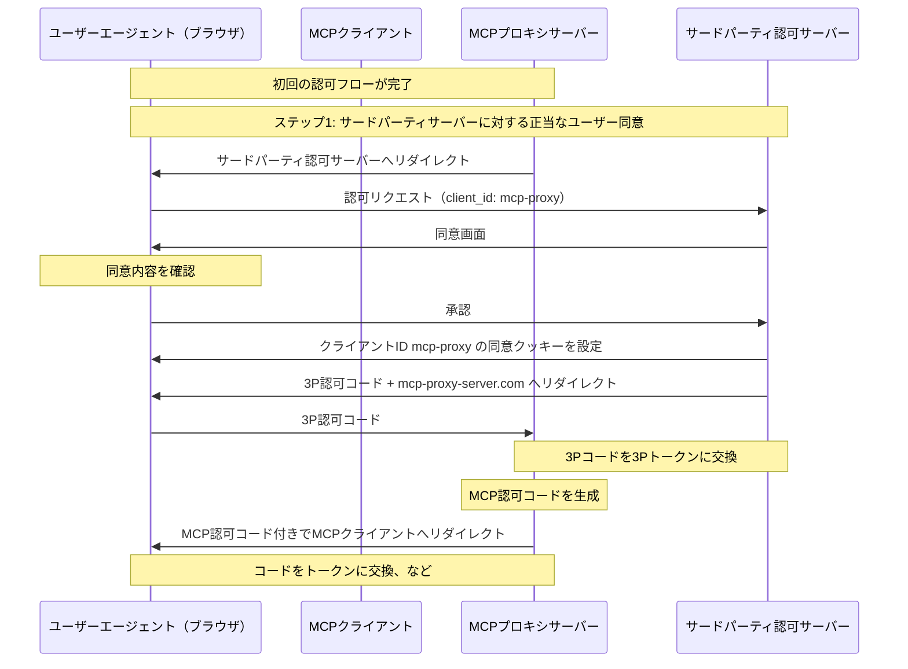
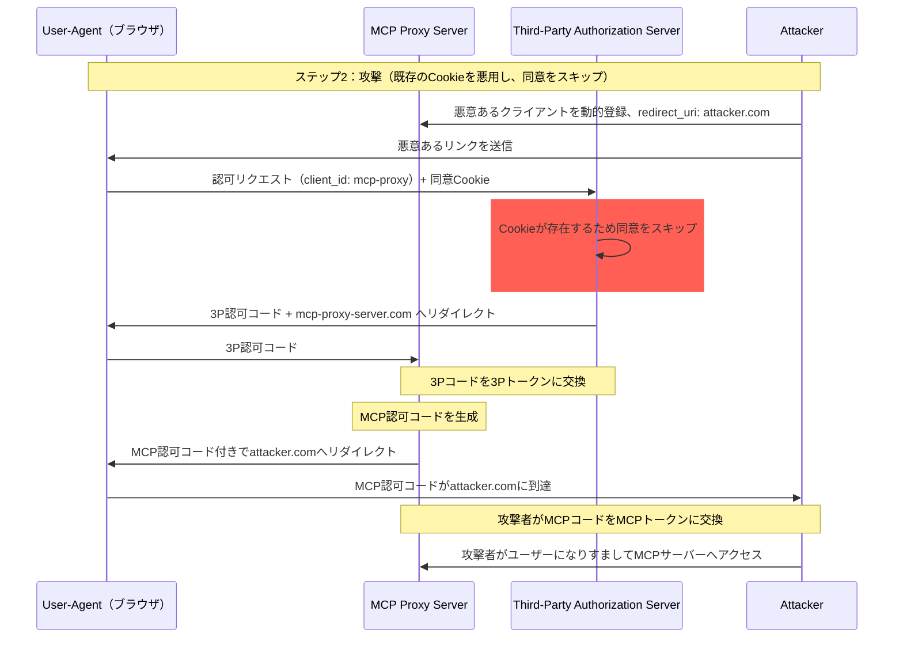
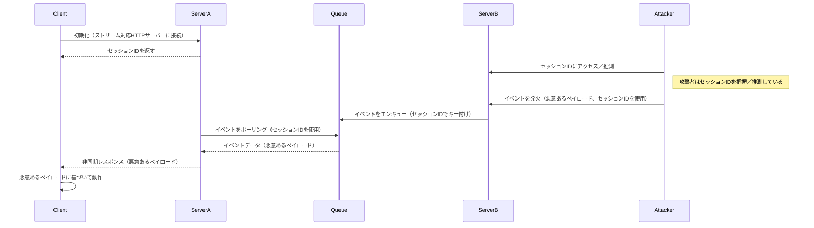
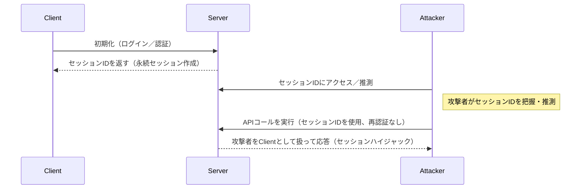

  ## はじめに

  ### 目的と範囲

本ドキュメントは、Model Context Protocol（MCP）のセキュリティに関する考慮事項を示し、MCP認可仕様を補完するものです。MCPの実装に特有のセキュリティリスク、攻撃手法、ベストプラクティスを明確にします。

本ドキュメントの主な読者は、MCPの認可フローを実装する開発者、MCPサーバーの運用者、MCPベースのシステムを評価するセキュリティ担当者です。本ドキュメントは、MCP認可仕様および[OAuth 2.0のセキュリティ・ベストプラクティス](https://datatracker.ietf.org/doc/html/rfc9700)と併せて読むことを推奨します。

  ## 攻撃と対策

このセクションでは、MCPの実装に対する攻撃手法を詳述し、想定される対策を示します。

  ### 混乱した副官問題

攻撃者は、他のリソースサーバーへのプロキシとして動作するMCPサーバーを悪用し、「[混乱した副官](https://en.wikipedia.org/wiki/Confused_deputy_problem)」の脆弱性を引き起こす可能性があります。

  #### 用語

**MCPプロキシサーバー**
: MCPクライアントをサードパーティAPIに接続し、処理を委任しつつ、サードパーティAPIサーバーに対して単一のOAuthクライアントとして振る舞いながらMCPの機能を提供するMCPサーバー。

**サードパーティ認可サーバー**
: サードパーティAPIを保護する認可サーバー。Dynamic Client Registration（DCR）をサポートしない場合があり、その場合、MCPプロキシはすべてのリクエストで静的クライアントIDを使用する必要がある。

**サードパーティAPI**
: 実際のAPI機能を提供する保護されたリソースサーバー。このAPIへのアクセスには、サードパーティ認可サーバーが発行するトークンが必要。

**静的クライアントID**
: MCPプロキシサーバーがサードパーティ認可サーバーと通信する際に使用する固定のOAuth 2.0クライアント識別子。このクライアントIDは、サードパーティAPIに対してクライアントとして振る舞うMCPサーバーを指す。どのMCPクライアントがリクエストを開始したかにかかわらず、MCPサーバーとサードパーティAPI間のすべてのやり取りで同一の値となる。

  #### アーキテクチャと攻撃経路

  ##### 通常のOAuthプロキシの利用（ユーザー同意を維持）

  ##### 悪意あるOAuthプロキシの悪用（ユーザー同意をスキップ）

  #### 攻撃の説明

MCPプロキシサーバーが、Dynamic Client Registration（DCR）をサポートしないサードパーティの
認可サーバーに対して静的なクライアントIDで認証する場合、次の
攻撃が成立し得ます。

1. ユーザーはMCPプロキシサーバー経由で通常どおり認証し、サードパーティAPIにアクセスする
2. このフローの途中で、サードパーティの認可サーバーはユーザーエージェントに、静的クライアントIDへの同意を示すクッキーを設定する
3. 攻撃者はその後、細工した認可リクエスト（悪意あるリダイレクトURIと、新たに動的登録したクライアントIDを含む）を埋め込んだ悪意のあるリンクをユーザーに送る
4. ユーザーがリンクをクリックすると、ブラウザには以前の正当なリクエストで設定された同意クッキーが依然として残っている
5. サードパーティの認可サーバーはクッキーを検出し、同意画面をスキップする
6. MCPの認可コードは（動的クライアント登録時に指定された細工済みのredirect&#95;uri）に従い攻撃者のサーバーへリダイレクトされる
7. 攻撃者は盗まれた認可コードを用いて、ユーザーの明示的な承認なしにMCPサーバー向けのアクセストークンに交換する
8. 攻撃者は、侵害されたユーザーとしてサードパーティAPIにアクセスできるようになる

  #### 緩和策

静的なクライアントIDを使用するMCPプロキシサーバーは、サードパーティの認可サーバーへの転送前に（追加の同意が求められる場合があります）、動的に登録された各クライアントごとにユーザーの同意を取得しなければなりません。

  ### トークンパススルー

「トークンパススルー」とはアンチパターンで、MCPサーバーがMCPクライアントから受け取ったトークンについて、それらが「MCPサーバー向け」に正しく発行されたものかを検証せず、そのまま下流のAPIへ渡してしまうことを指します。

  #### リスク

トークンのパススルーは、[認可仕様](/ja/specification/2025-06-18/basic/authorization)で明示的に禁止されています。これは次のような数多くのセキュリティリスクを招くためです。

* **セキュリティ制御の回避**
  * MCPサーバーや下流のAPIは、レート制限、リクエスト検証、トラフィック監視など、トークンのオーディエンスやその他の認証情報の制約に依存する重要なセキュリティ制御を実装している場合があります。クライアントが、MCPサーバーによる適切な検証やトークンが正しいサービス向けに発行されていることの確認なしに、下流APIでトークンを直接取得・使用できてしまうと、これらの制御を迂回できます。
* **アカウンタビリティと監査証跡の問題**
  * クライアントが上流で発行されたアクセストークンで呼び出す場合、そのトークンはMCPサーバーにとって不透明である可能性があり、MCPクライアントを特定・識別できなくなります。
  * 下流のリソースサーバーのログには、実際にトークンを転送しているMCPサーバーではなく、異なるソースや異なるアイデンティティからのリクエストとして記録される可能性があります。
  * これらの要因により、インシデント調査、統制、監査がより困難になります。
  * MCPサーバーがトークンのクレーム（例：ロール、権限、オーディエンス）やその他のメタデータを検証せずに通過させると、盗まれたトークンを持つ悪意のあるアクターが、そのサーバーをデータ流出のプロキシとして悪用できます。
* **トラスト境界の問題**
  * 下流のリソースサーバーは特定のエンティティに信頼を付与します。この信頼には、発信元やクライアントの行動パターンに関する前提が含まれる場合があります。このトラスト境界を壊すと、予期しない問題につながる可能性があります。
  * トークンが適切な検証なしに複数のサービスで受け入れられている場合、1つのサービスが侵害されると、攻撃者はそのトークンを使って他の接続されたサービスにもアクセスできてしまいます。
* **将来の互換性リスク**
  * たとえMCPサーバーが現時点では「純粋なプロキシ」であっても、将来的にセキュリティ制御を追加する必要が生じる可能性があります。適切なトークンのオーディエンス分離を最初から行うことで、セキュリティモデルの進化が容易になります。

  #### 緩和策

MCPサーバーは、当該MCPサーバー向けに明示的に発行されていないトークンを受け入れてはならない（MUST NOT）。

  ### セッションハイジャック

セッションハイジャックは、サーバーがクライアントに発行したセッションIDを、不正な第三者が取得して同じIDを用い、元のクライアントになりすまして権限のない操作を行う攻撃手法です。

  #### セッションハイジャックによるプロンプトインジェクション

  #### セッションハイジャックによるなりすまし

  #### 攻撃の説明

複数のステートフルなHTTPサーバーがMCPリクエストを処理する場合、次の攻撃ベクターが考えられます。

**セッション乗っ取りによるプロンプトインジェクション**

1. クライアントは**Server A**に接続し、セッションIDを受け取る。

2. 攻撃者が既存のセッションIDを入手し、そのセッションIDを用いて**Server B**に悪意のあるイベントを送信する。
   * サーバーが[再配送／再開可能なストリーム](/ja/specification/2025-06-18/basic/transports#resumability-and-redelivery)をサポートしている場合、レスポンスを受け取る前に意図的にリクエストを終了すると、サーバー送信イベントのGETリクエストを介して元のクライアントによって再開される可能性がある。
   * 特定のサーバーが、`notifications/tools/list_changed`のようなツール呼び出しの結果としてサーバー送信イベントを開始し、サーバーが提供するツールに影響を与え得る場合、クライアントは有効化に気づいていなかったツールを結果的に持つことになり得る。

3. **Server B**は（セッションIDに関連付けられた）イベントを共有キューにエンキューする。

4. **Server A**はセッションIDを用いてキューからイベントをポーリングし、悪意のあるペイロードを取得する。

5. **Server A**は悪意のあるペイロードを非同期または再開されたレスポンスとしてクライアントに送信する。

6. クライアントは悪意のあるペイロードを受け取り、それに基づいて動作し、侵害につながる可能性がある。

**セッション乗っ取りによるなりすまし**

1. MCPクライアントがMCPサーバーに対して認証し、永続的なセッションIDが作成される。
2. 攻撃者がそのセッションIDを入手する。
3. 攻撃者がそのセッションIDを用いてMCPサーバーへ呼び出しを行う。
4. MCPサーバーが追加の認可を確認せず、攻撃者を正当なユーザーとして扱い、許可されていないアクセスや操作を許容する。

  #### 緩和策

セッションハイジャックやイベントインジェクション攻撃を防ぐため、以下の緩和策を実装してください。

認可を実装するMCPサーバーは、受信するすべてのリクエストを検証しなければなりません（MUST）。
MCPサーバーは、認証にセッションを使用してはなりません（MUST NOT）。

MCPサーバーは、安全で非決定的なセッションIDを使用しなければなりません（MUST）。
生成するセッションID（例：UUID）は、安全な乱数生成器を用いることが望ましいです（SHOULD）。攻撃者に推測され得る予測可能または連番のセッション識別子は避けてください。セッションIDのローテーションや有効期限の設定もリスク低減に有効です。

MCPサーバーは、セッションIDをユーザー固有情報に結び付けるべきです（SHOULD）。
セッション関連データを保存・送信する際（例：キュー内）、認可済みユーザーに固有の情報（内部ユーザーIDなど）とセッションIDを組み合わせてください。キー形式は &quot;&lt;user&#95;id&gt;:&lt;session&#95;id&gt;&quot; のようにします。これにより、攻撃者がセッションIDを推測しても、ユーザーIDはユーザートークンから導出されクライアントからは提供されないため、他ユーザーへのなりすましはできません。

MCPサーバーは、必要に応じて追加の一意識別子を活用できます。