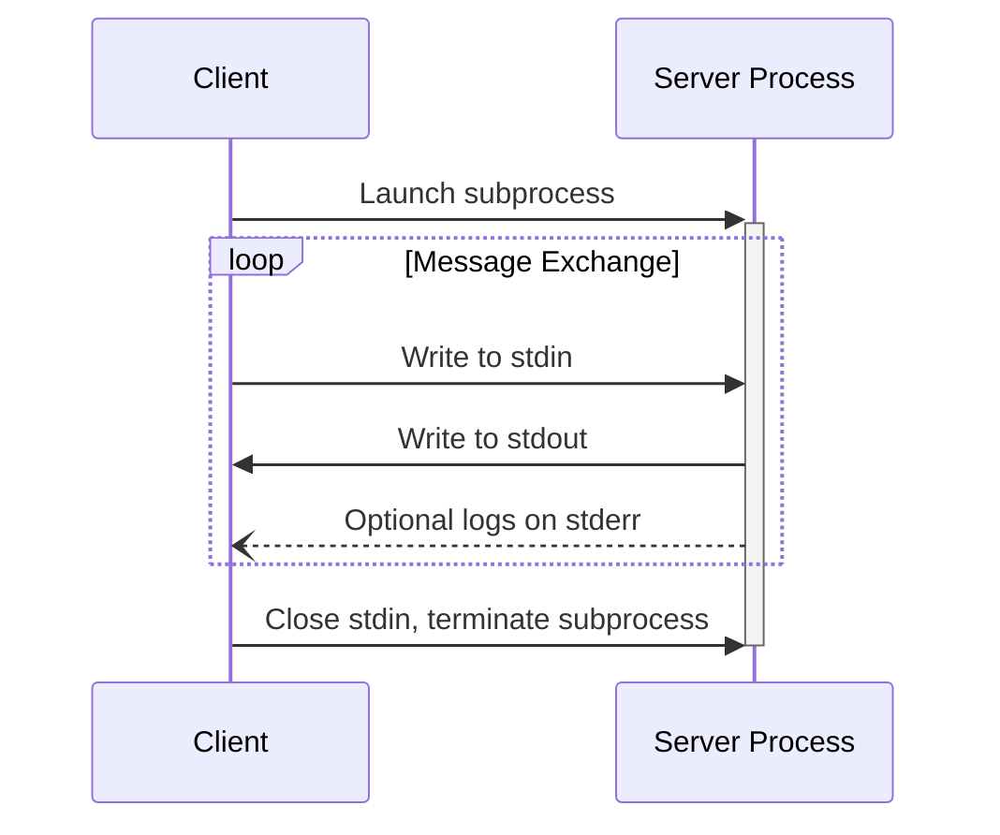
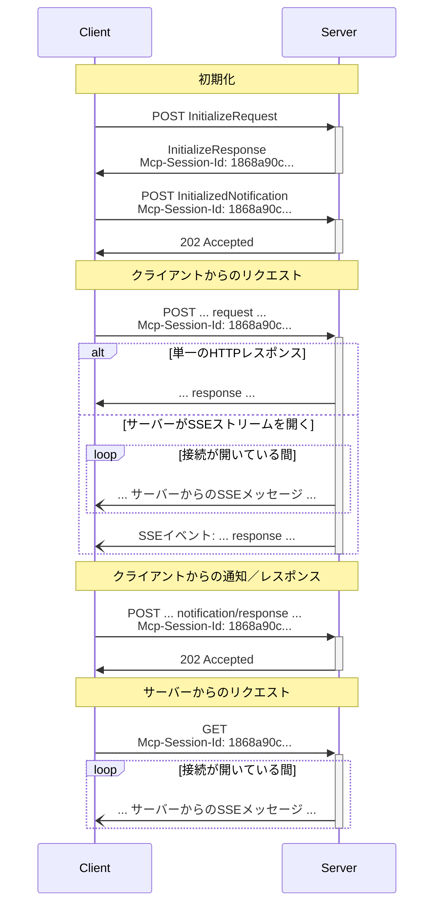

<Info>**プロトコル改訂**: 2025-06-18</Info>

MCPはメッセージのエンコードにJSON-RPCを使用します。JSON-RPCメッセージは**UTF-8**でエンコードされていなければ**なりません**。

このプロトコルは現在、クライアントとサーバー間の通信のために、2つの標準的なトランスポート方式を定義しています。

1. [stdio](#stdio)（標準入力および標準出力を用いた通信）
2. [ストリーム対応HTTP](#streamable-http)

クライアントは、可能な限りstdioを**サポートすることが望まれます**。

また、クライアントとサーバーがプラグイン可能な形で[カスタムトランスポート](#custom-transports)を実装することもできます。

  ## stdio

**stdio** トランスポートでは、次のとおりです。

* クライアントは MCPサーバー をサブプロセスとして起動します。
* サーバーは標準入力（`stdin`）から JSON-RPC メッセージを読み取り、標準出力（`stdout`）に
  メッセージを送信します。
* メッセージは個々の JSON-RPC のリクエスト、通知、またはレスポンスです。
* メッセージは改行で区切られ、埋め込みの改行を含んではいけません（**MUST NOT**）。
* サーバーはログ用途で標準エラー（`stderr`）に UTF-8 文字列を書き込んでもかまいません（**MAY**）。
  クライアントはこのログを取得、転送、または無視してもかまいません（**MAY**）。
* サーバーは有効な MCP メッセージ以外を `stdout` に書き込んではいけません（**MUST NOT**）。
* クライアントは有効な MCP メッセージ以外をサーバーの `stdin` に書き込んではいけません（**MUST NOT**）。

  ## ストリーム対応HTTP

<Info>
  これはプロトコルバージョン 2024-11-05 の [HTTP+SSE
  トランスポート](/ja/specification/2024-11-05/basic/transports#http-with-sse) を置き換えます。下記の [後方互換性](#backwards-compatibility)
  ガイドを参照してください。
</Info>

**ストリーム対応HTTP** トランスポートでは、サーバーは複数のクライアント接続を処理できる独立プロセスとして動作します。このトランスポートは HTTP の POST および GET リクエストを使用します。
サーバーは必要に応じて
[サーバー送信イベント（SSE）](https://en.wikipedia.org/wiki/Server-sent_events) を用いて複数のサーバーメッセージをストリーミングできます。これにより、基本的な MCPサーバーに加え、ストリーミングやサーバーからクライアントへの通知・リクエストをサポートする、より高機能なサーバーも実現できます。

サーバーは、POST と GET の両方のメソッドをサポートする単一の HTTP エンドポイントパス（以下、**MCPエンドポイント**）を提供することが **必須です（MUST）**。たとえば、`https://example.com/mcp` のような URL です。

  #### セキュリティ警告

ストリーム対応HTTPトランスポートを実装する際は、次に注意してください。

1. DNSリバインディング攻撃を防ぐため、すべての受信接続でサーバーは `Origin` ヘッダーを必ず検証すること
2. ローカルで実行する場合、すべてのネットワークインターフェース（0.0.0.0）ではなく、localhost（127.0.0.1）のみにバインドすることが望ましい
3. すべての接続に対して適切な認証を実装することが望ましい

これらの対策がない場合、攻撃者がDNSリバインディングを悪用し、リモートのウェブサイトからローカルのMCPサーバーとやり取りできてしまう可能性があります。

  ### サーバーへのメッセージ送信

クライアントから送信されるすべてのJSON-RPCメッセージは、MCPエンドポイントへの新規HTTP POSTリクエストであることが**必須**です。

1. クライアントは、MCPエンドポイントにJSON-RPCメッセージを送信する際、HTTP POSTを使用することが**必須**です。
2. クライアントは、`Accept`ヘッダーで、サポートするコンテンツタイプとして`application/json`と
   `text/event-stream`の両方を指定して含めることが**必須**です。
3. POSTリクエストの本文は、単一のJSON-RPCの_リクエスト_、*通知*、または_レスポンス_であることが**必須**です。
4. 入力がJSON-RPCの_レスポンス_または_通知_である場合:
   * サーバーが入力を受け付ける場合、本文なしでHTTPステータスコード202
     Acceptedを返すことが**必須**です。
   * サーバーが入力を受け付けられない場合、HTTPエラーステータスコード
     （例: 400 Bad Request）を返すことが**必須**です。HTTPレスポンス本文は、`id`を持たないJSON-RPCの_エラー
     レスポンス_であっても**構いません**。
5. 入力がJSON-RPCの_リクエスト_である場合、サーバーはSSEストリームを開始するために
   `Content-Type: text/event-stream`を返すか、単一のJSONオブジェクトを返すために
   `Content-Type: application/json`を返すことが**必須**です。クライアントはこれら両方のケースを
   サポートすることが**必須**です。
6. サーバーがSSEストリームを開始した場合:
   * SSEストリームには、POST本文で送信されたJSON-RPCの_リクエスト_に対するJSON-RPCの_レスポンス_が最終的に含まれることが**推奨**されます。
   * サーバーは、JSON-RPCの_レスポンス_を送信する前に、JSON-RPCの_リクエスト_や_通知_を送信しても**構いません**。これらのメッセージは、元のクライアントの
     _リクエスト_に関連していることが**推奨**されます。
   * 受信したJSON-RPCの_リクエスト_に対するJSON-RPCの_レスポンス_を送信する前に、[セッション](#session-management)
     が期限切れにならない限り、サーバーがSSEストリームを閉じるべきでは**ありません**。
   * JSON-RPCの_レスポンス_送信後は、サーバーがSSEストリームを閉じることが**推奨**されます。
   * 切断は（例: ネットワーク状況により）いつでも**発生し得ます**。
     したがって:
     * 切断を、クライアントがリクエストをキャンセルしたものとして解釈すべきでは**ありません**。
     * キャンセルする場合、クライアントはMCPの`CancelledNotification`を明示的に送信することが**推奨**されます。
     * 切断によるメッセージ損失を避けるために、サーバーはストリームを
       [再開可能](#resumability-and-redelivery)にしても**構いません**。

  ### サーバーからのメッセージの待ち受け

1. クライアントは、MCPエンドポイントに対してHTTP GETを発行してもよい（MAY）。これはSSEストリームを開くために使用でき、クライアントが先にHTTP POSTでデータを送信しなくても、サーバーがクライアントへ通信できるようにする。
2. クライアントは、サポートするコンテンツタイプとして`text/event-stream`を列挙した`Accept`ヘッダーを必ず（MUST）含めなければならない。
3. サーバーは、このHTTP GETに対して`Content-Type: text/event-stream`を返すか、またはHTTP 405 Method Not Allowedを返し、このエンドポイントでSSEストリームを提供していないことを示さなければならない（MUST）。
4. サーバーがSSEストリームを開始する場合:
   * サーバーは、そのストリーム上でJSON-RPCのリクエストおよび通知を送信してもよい（MAY）。
   * これらのメッセージは、クライアントからの同時進行中のJSON-RPCリクエストとは無関係であるべきである（SHOULD）。
   * サーバーは、以前のクライアントリクエストに関連付けられたストリームを[再開](#resumability-and-redelivery)する場合を除き、そのストリーム上でJSON-RPCのレスポンスを送ってはならない（MUST NOT）。
   * サーバーは、いつでもSSEストリームを閉じてもよい（MAY）。
   * クライアントは、いつでもSSEストリームを閉じてもよい（MAY）。

  ### 複数接続

1. クライアントは、複数のSSEストリームに同時に接続したままでいても**よい（MAY）**。
2. サーバーは、接続中のストリームのうち**いずれか1つ**に対してのみ、各JSON-RPCメッセージを送信**しなければならない（MUST）**。つまり、同一メッセージを複数のストリームにブロードキャストしては**ならない（MUST NOT）**。
   * メッセージ損失のリスクは、ストリームを[再開可能](#resumability-and-redelivery)にすることで**軽減してもよい（MAY）**。

  ### レジュームと再配信

切断された接続の再開や、本来なら失われる可能性のあるメッセージの再配信をサポートするために:

1. サーバーは、[SSE標準](https://html.spec.whatwg.org/multipage/server-sent-events.html#event-stream-interpretation)で説明されているとおり、SSEイベントに `id` フィールドを付与しても**よい（MAY）**。
   * 付与する場合、そのIDは、その[セッション](#session-management)内のすべてのストリーム—またはセッション管理を使用していない場合は当該クライアントとのすべてのストリーム—をまたいでグローバルに一意でなければ**ならない（MUST）**。
2. クライアントが切断後にレジュームしたい場合は、MCPエンドポイントに対してHTTP GETを発行し、受信した最後のイベントIDを示すために[`Last-Event-ID`](https://html.spec.whatwg.org/multipage/server-sent-events.html#the-last-event-id-header)ヘッダーを含める**べきである（SHOULD）**。
   * サーバーは、このヘッダーを用いて、最後のイベントIDの後に送信されていたはずのメッセージを_切断されたストリーム上で_再生し、その時点からストリームを再開しても**よい（MAY）**。
   * サーバーは、別のストリームで配信されるはずだったメッセージを再生しては**ならない（MUST NOT）**。

言い換えれば、これらのイベントIDは、特定のストリーム内でカーソルとして機能するように、サーバーによって_ストリームごと_に割り当てられるべきである。

  ### セッション管理

MCPの「セッション」は、[初期化フェーズ](/ja/specification/2025-06-18/basic/lifecycle)から始まる、クライアントとサーバー間の論理的に関連するやり取りで構成されます。ステートフルなセッションを確立したいサーバーをサポートするために:

1. ストリーム対応HTTPのトランスポートを使用するサーバーは、`InitializeResult` を含むHTTPレスポンスの `Mcp-Session-Id` ヘッダーにセッションIDを含めることで、初期化時にセッションIDを割り当てることができます（**MAY**）。
   * セッションIDは、グローバルに一意で暗号学的に安全であるべきです（**SHOULD**。例: 安全に生成されたUUID、JWT、または暗号ハッシュ）。
   * セッションIDには、可視ASCII文字（0x21〜0x7E）のみを含めなければなりません（**MUST**）。
2. 初期化時にサーバーから `Mcp-Session-Id` が返された場合、ストリーム対応HTTPのトランスポートを使用するクライアントは、その後のすべてのHTTPリクエストの `Mcp-Session-Id` ヘッダーにそれを含めなければなりません（**MUST**）。
   * セッションIDを必須とするサーバーは、（初期化以外で）`Mcp-Session-Id` ヘッダーを欠いたリクエストに対して、HTTP 400 Bad Request を返すべきです（**SHOULD**）。
3. サーバーはいつでもセッションを終了してもかまいません（**MAY**）。以後、そのセッションIDを含むリクエストには HTTP 404 Not Found で応答しなければなりません（**MUST**）。
4. クライアントが、`Mcp-Session-Id` を含むリクエストへの応答として HTTP 404 を受け取った場合、セッションIDを付与せずに新しい `InitializeRequest` を送信して、新しいセッションを開始しなければなりません（**MUST**）。
5. 特定のセッションが不要になったクライアント（例: ユーザーがクライアントアプリケーションを離れる場合）は、セッションを明示的に終了するために、`Mcp-Session-Id` ヘッダーを付与して MCP エンドポイントに HTTP DELETE を送信すべきです（**SHOULD**）。
   * サーバーは、このリクエストに対して HTTP 405 Method Not Allowed で応答し、クライアントによるセッション終了を許可していないことを示してもかまいません（**MAY**）。

  ### シーケンス図

  ### プロトコルバージョンヘッダー

HTTP を使用する場合、クライアントは以後のすべてのリクエストに `MCP-Protocol-Version: <protocol-version>` HTTP ヘッダーを必ず含める（MUST）必要があり、これにより MCPサーバーは MCP のプロトコルバージョンに基づいて応答できます。

例: `MCP-Protocol-Version: 2025-06-18`

クライアントが送信するプロトコルバージョンは、[初期化時にネゴシエートされたもの](/ja/specification/2025-06-18/basic/lifecycle#version-negotiation)であるべきです（SHOULD）。

後方互換性のため、サーバーが `MCP-Protocol-Version`
ヘッダーを受け取らず、バージョンを特定する他の手段（たとえば初期化時にネゴシエートされたプロトコルバージョンに依拠すること）もない場合、サーバーはプロトコルバージョン `2025-03-26` を前提とするべきです（SHOULD）。

サーバーが無効または未サポートの
`MCP-Protocol-Version` を含むリクエストを受け取った場合は、`400 Bad Request` で必ず応答しなければなりません（MUST）。

  ### 下位互換性

クライアントとサーバーは、非推奨となった[HTTP+SSE
トランスポート](/ja/specification/2024-11-05/basic/transports#http-with-sse)（プロトコルバージョン 2024-11-05）との下位互換性を次のように維持できます。

古いクライアントをサポートしたい**サーバー**は、次を行うべきです:

* ストリーム対応HTTPトランスポートで定義されている新しい「MCPエンドポイント」と並行して、旧トランスポートの SSE と POST の両エンドポイントを引き続きホストする。
  * 旧POSTエンドポイントと新しいMCPエンドポイントを統合することも可能だが、不要な複雑さを招くおそれがある。

古いサーバーをサポートしたい**クライアント**は、次を行うべきです:

1. ユーザーから MCPサーバーのURLを受け取り、それが旧トランスポートまたは新トランスポートを使用するサーバーを指す可能性を許容する。
2. 上記で定義した `Accept` ヘッダーを付けて、サーバーURLに `InitializeRequest` を POST することを試みる:
   * 成功した場合、クライアントは新しいストリーム対応HTTPトランスポートをサポートするサーバーだとみなせる。
   * HTTP 4xx ステータスコード（例: 405 Method Not Allowed、404 Not Found）で失敗した場合:
     * サーバーURLに対して GET リクエストを発行し、SSE ストリームが開かれ、最初のイベントとして `endpoint` イベントが返ることを期待する。
     * `endpoint` イベントが到着したら、そのサーバーは旧HTTP+SSEトランスポートで動作しているとみなせるため、以降の通信にはそのトランスポートを使用する。

  ## カスタムトランスポート

クライアントとサーバーは、特定のニーズに合わせて追加のカスタムトランスポート機構を実装してもかまいません。プロトコルはトランスポートに依存せず、双方向のメッセージ交換をサポートするあらゆる通信チャネル上で実装できます。

カスタムトランスポートをサポートする実装者は、MCPで定義されたJSON-RPCメッセージ形式とライフサイクル要件を確実に維持しなければなりません。相互運用性を高めるため、カスタムトランスポートは、接続確立手順およびメッセージ交換パターンの詳細を文書化することが望まれます。