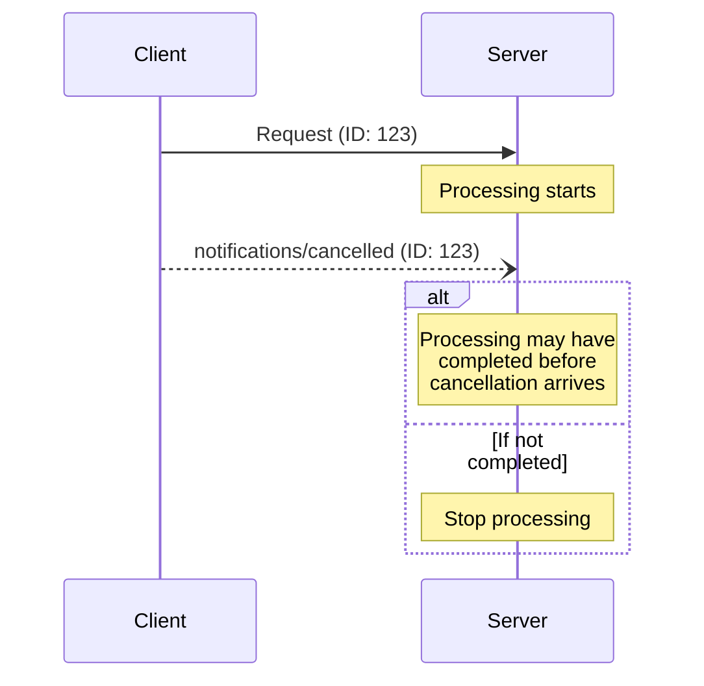

<div id="enable-section-numbers" />

<Info>**プロトコル改訂**: 2025-06-18</Info>

Model Context Protocol（MCP）は、通知メッセージによって進行中のリクエストを任意でキャンセルできるようにしています。どちらの当事者からでもキャンセル通知を送信でき、既に発行されたリクエストを終了すべきであることを示します。

<div id="cancellation-flow">
  ## キャンセルフロー
</div>

いずれかの当事者が進行中のリクエストをキャンセルする場合は、`notifications/cancelled`
通知を送信し、次を含めます:

- キャンセル対象のリクエストID
- ログ出力や表示に使用できる任意の理由文字列

```json
{
  "jsonrpc": "2.0",
  "method": "notifications/cancelled",
  "params": {
    "requestId": "123",
    "reason": "User requested cancellation"
  }
}
```

<div id="behavior-requirements">
  ## 動作要件
</div>

1. 取消通知は、次の条件を満たすリクエストのみを参照することが**必須**です:
   - 同一方向で以前に発行されたもの
   - 依然として進行中であると見なされるもの
2. `initialize` リクエストは、クライアントがキャンセルしては**ならない**
3. 取消通知の受信者は**推奨**として次を行うべきです:
   - キャンセル対象のリクエスト処理を停止する
   - 関連するリソースを解放する
   - キャンセル対象のリクエストに対してはレスポンスを送信しない
4. 次の場合、受信者は取消通知を無視**してもよい**です:
   - 参照されたリクエストが不明である
   - 処理がすでに完了している
   - リクエストをキャンセルできない
5. 取消通知の送信者は、その後に到着する当該リクエストへのレスポンスを無視することが**推奨**されます

<div id="timing-considerations">
  ## タイミングに関する考慮事項
</div>

ネットワーク遅延により、キャンセル通知はリクエスト処理の完了後、場合によってはすでにレスポンス送信後に到着することがあります。

双方はこれらのレースコンディションを適切に処理しなければなりません。



<div id="implementation-notes">
  ## 実装に関する注意
</div>

- 両者はデバッグのため、キャンセル理由をログに記録することが望ましい（SHOULD）
- アプリケーションのUIは、キャンセル要求中であることを示すべきである（SHOULD）

<div id="error-handling">
  ## エラーハンドリング
</div>

無効なキャンセル通知は無視することが**推奨されます**:

- 不明なリクエストID
- すでに完了したリクエスト
- 不正形式の通知

これは、非同期通信におけるレースコンディションを許容しつつ、通知の「投げっぱなし」的な性質を維持します。