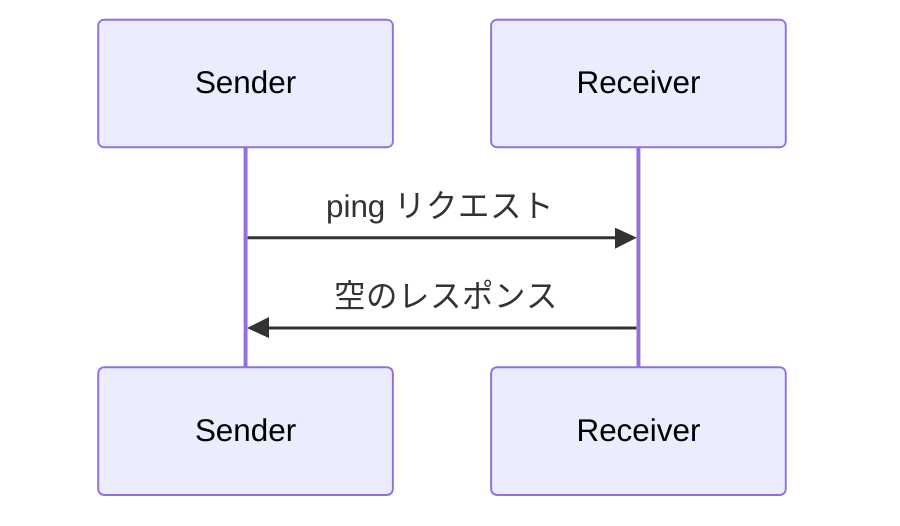

<div id="enable-section-numbers" />

<Info>**プロトコル改訂**: 2025-06-18</Info>

Model Context Protocol（MCP）には、オプションの ping メカニズムがあり、双方が相手が引き続き応答しており、接続が生存していることを確認できます。

<div id="overview">
  ## 概要
</div>

ping 機能は、シンプルなリクエスト／レスポンスのパターンで実装されています。クライアントまたはサーバーのどちらからでも、`ping` リクエストを送信して ping を開始できます。

<div id="message-format">
  ## メッセージ形式
</div>

ping リクエストは、パラメータを取らない標準的な JSON-RPC リクエストです。

```json
{
  "jsonrpc": "2.0",
  "id": "123",
  "method": "ping"
}
```

<div id="behavior-requirements">
  ## 動作要件
</div>

1. 受信側は、空のレスポンスで速やかに応答することが**必須**です:

```json
{
  "jsonrpc": "2.0",
  "id": "123",
  "result": {}
}
```

2. 妥当なタイムアウト期間内に応答がない場合、送信側は**任意**で次を行ってもよい:
   - 接続が古くなった（stale）と見なす
   - 接続を終了する
   - 再接続手順を試みる

<div id="usage-patterns">
  ## 利用パターン
</div>



<div id="implementation-considerations">
  ## 実装における考慮事項
</div>

- 実装は接続の健全性を確認するため、定期的に ping を送信することが望ましい（SHOULD）
- ping の頻度は設定できるようにすることが望ましい（SHOULD）
- タイムアウトはネットワーク環境に適した値にすることが望ましい（SHOULD）
- ネットワークのオーバーヘッドを抑えるため、過度な ping の送信は避けることが望ましい（SHOULD）

<div id="error-handling">
  ## エラーハンドリング
</div>

- タイムアウトは接続失敗として扱うべきです（SHOULD）
- 複数回の ping 失敗により接続リセットを行ってもかまいません（MAY）
- 実装は診断のために ping 失敗をログ記録すべきです（SHOULD）