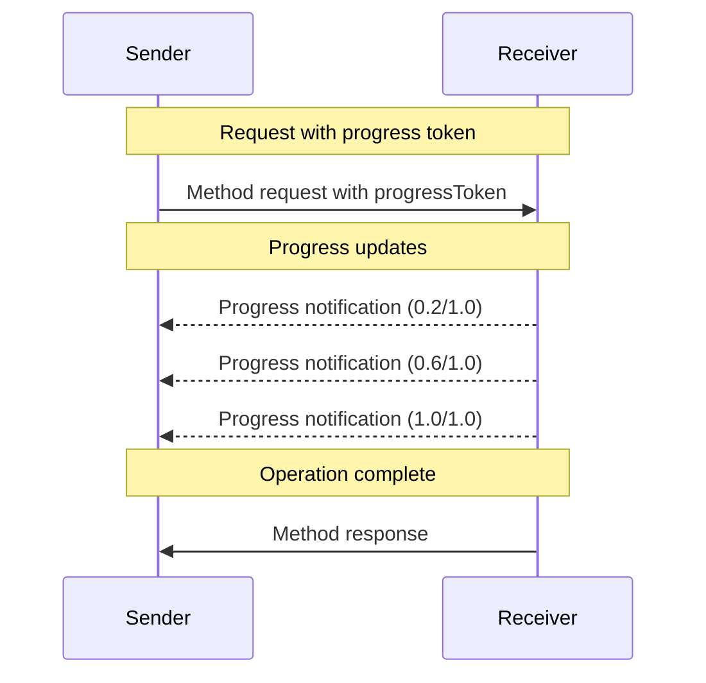

<div id="enable-section-numbers" />

<Info>**プロトコル改訂**: 2025-06-18</Info>

Model Context Protocol（MCP）は、通知メッセージを用いて、長時間実行される
オペレーションの進行状況を任意で追跡できます。双方の当事者が進行状況通知を送信し、
オペレーションの状態に関する最新情報を提供できます。

<div id="progress-flow">
  ## 進捗フロー
</div>

ある当事者がリクエストに対する進捗更新を「受け取り」たい場合、リクエストのメタデータに
`progressToken` を含めます。

- 進捗トークンは文字列または整数値であることが**必須**です
- 進捗トークンは送信者が任意の方法で選択できますが、すべてのアクティブなリクエスト間で一意であることが**必須**です。

```json
{
  "jsonrpc": "2.0",
  "id": 1,
  "method": "some_method",
  "params": {
    "_meta": {
      "progressToken": "abc123"
    }
  }
}
```

受信者は、次を含む進捗通知を送信しても**構いません**:

- 元の進捗トークン
- これまでの進捗値
- 任意の「total」値
- 任意の「message」値

```json
{
  "jsonrpc": "2.0",
  "method": "notifications/progress",
  "params": {
    "progressToken": "abc123",
    "progress": 50,
    "total": 100,
    "message": "Reticulating splines..."
  }
}
```

- `progress` の値は、合計が不明であっても通知のたびに増加することが**必須**です。
- `progress` および `total` の値は浮動小数点でも**構いません**。
- `message` フィールドは、人間が読める適切な進捗情報を提供することが**推奨**されます。

<div id="behavior-requirements">
  ## 動作要件
</div>

1. 進捗通知は、次のトークンのみを参照することが**必須**（MUST）です:
   - アクティブなリクエストで提供されたもの
   - 進行中の処理に関連付けられているもの

2. 進捗リクエストの受信側は**任意**（MAY）で以下を行えます:
   - 進捗通知を送信しないことを選択する
   - 適切と判断する任意の頻度で通知を送信する
   - 不明な場合は total の値を省略する



<div id="implementation-notes">
  ## 実装に関する注意事項
</div>

- 送信側・受信側は、アクティブな進行状況トークンを追跡することが望ましい（SHOULD）
- 双方とも、フラッディングを防ぐためにレート制限を実装することが望ましい（SHOULD）
- 完了後は進行状況の通知を停止しなければならない（MUST）