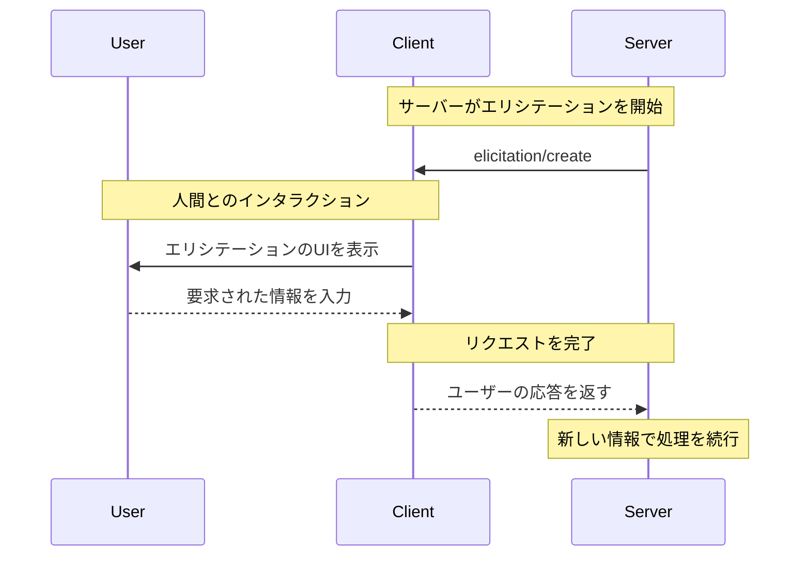

<div id="enable-section-numbers" />

<Info>**プロトコル改訂**: 2025-06-18</Info>

<Note>
  エリシテーションは、このバージョンのModel Context Protocol（MCP）仕様で新たに導入された機能であり、その設計は今後のプロトコルバージョンで変更される可能性があります。
</Note>

Model Context Protocol（MCP）は、やり取りの最中にクライアントを介してサーバーがユーザーに追加情報を求めるための標準化された方法を提供します。このフローにより、クライアントはユーザーとのインタラクションやデータ共有に対する制御を維持しつつ、サーバーは必要な情報を動的に収集できます。
サーバーは、JSONスキーマを用いてユーザーから構造化データを取得し、レスポンスを検証します。

<div id="user-interaction-model">
  ## ユーザーインタラクションモデル
</div>

MCPのエリシテーションは、他のMCPサーバー機能の内側に&#95;ネスト&#95;された形でユーザー入力の要求を行えるようにし、サーバーが対話型ワークフローを実装できるようにします。

実装は、ニーズに合った任意のインターフェースパターンでエリシテーションを提供して構いません。プロトコル自体は特定のユーザーインタラクションモデルを規定しません。

<Warning>
  トラスト&amp;セーフティおよびセキュリティの観点から:

  * サーバーは、機微な情報の要求にエリシテーションを使用しては**なりません**。

  アプリケーションは次のことを**推奨**します:

  * どのサーバーが情報を要求しているかを明確に示すUIを提供する
  * 送信前にユーザーが自分の回答を確認・修正できるようにする
  * ユーザーのプライバシーを尊重し、明確な「拒否」および「キャンセル」オプションを提供する
</Warning>

<div id="capabilities">
  ## 機能
</div>

エリシテーションをサポートするクライアントは、[初期化](/ja/specification/2025-06-18/basic/lifecycle#initialization)時に `elicitation` 機能を宣言しなければなりません（**MUST**）。

```json
{
  "capabilities": {
    "elicitation": {}
  }
}
```

<div id="protocol-messages">
  ## プロトコルメッセージ
</div>

<div id="creating-elicitation-requests">
  ### エリシテーション要求の作成
</div>

ユーザーに情報を求める場合、サーバーは `elicitation/create` リクエストを送信します。

<div id="simple-text-request">
  #### シンプルなテキストリクエスト
</div>

**リクエスト:**

```json
{
  "jsonrpc": "2.0",
  "id": 1,
  "method": "elicitation/create",
  "params": {
    "message": "GitHub のユーザー名を入力してください",
    "requestedSchema": {
      "type": "object",
      "properties": {
        "name": {
          "type": "string"
        }
      },
      "required": ["name"]
    }
  }
}
```

**レスポンス:**

```json
{
  "jsonrpc": "2.0",
  "id": 1,
  "result": {
    "action": "accept",
    "content": {
      "name": "octocat"
    }
  }
}
```

<div id="structured-data-request">
  #### 構造化データのリクエスト
</div>

**リクエスト:**

```json
{
  "jsonrpc": "2.0",
  "id": 2,
  "method": "elicitation/create",
  "params": {
    "message": "Please provide your contact information",
    "requestedSchema": {
      "type": "object",
      "properties": {
        "name": {
          "type": "string",
          "description": "Your full name"
        },
        "email": {
          "type": "string",
          "format": "email",
          "description": "Your email address"
        },
        "age": {
          "type": "number",
          "minimum": 18,
          "description": "Your age"
        }
      },
      "required": ["name", "email"]
    }
  }
}
```

**レスポンス:**

```json
{
  "jsonrpc": "2.0",
  "id": 2,
  "result": {
    "action": "accept",
    "content": {
      "name": "Monalisa Octocat",
      "email": "octocat@github.com",
      "age": 30
    }
  }
}
```

**拒否時のレスポンス例:**

```json
{
  "jsonrpc": "2.0",
  "id": 2,
  "result": {
    "action": "decline"
  }
}
```

**キャンセル時のレスポンス例:**

```json
{
  "jsonrpc": "2.0",
  "id": 2,
  "result": {
    "action": "cancel"
  }
}
```

<div id="message-flow">
  ## メッセージフロー
</div>



<div id="request-schema">
  ## リクエストスキーマ
</div>

`requestedSchema` フィールドは、制限された JSON Schema のサブセットを用いて、サーバーが期待されるレスポンスの構造を定義できるようにします。クライアント実装を簡素化するため、エリシテーションのスキーマはプリミティブなプロパティのみを持つフラットなオブジェクトに限定されています:

```json
"requestedSchema": {
  "type": "object",
  "properties": {
    "propertyName": {
      "type": "string",
      "title": "Display Name",
      "description": "Description of the property"
    },
    "anotherProperty": {
      "type": "number",
      "minimum": 0,
      "maximum": 100
    }
  },
  "required": ["propertyName"]
}
```

<div id="supported-schema-types">
  ### サポートされるスキーマ型
</div>

スキーマは次のプリミティブ型に限定されています:

1. **String Schema**

   ```json
   {
     "type": "string",
     "title": "Display Name",
     "description": "Description text",
     "minLength": 3,
     "maxLength": 50,
     "format": "email" // サポートされる形式: "email", "uri", "date", "date-time"
   }
   ```

   サポートされる形式: `email`, `uri`, `date`, `date-time`

2. **Number Schema**

   ```json
   {
     "type": "number", // または "integer"
     "title": "Display Name",
     "description": "Description text",
     "minimum": 0,
     "maximum": 100
   }
   ```

3. **Boolean Schema**

   ```json
   {
     "type": "boolean",
     "title": "Display Name",
     "description": "Description text",
     "default": false
   }
   ```

4. **Enum Schema**
   ```json
   {
     "type": "string",
     "title": "Display Name",
     "description": "Description text",
     "enum": ["option1", "option2", "option3"],
     "enumNames": ["Option 1", "Option 2", "Option 3"]
   }
   ```

クライアントはこのスキーマを次の用途に利用できます:

1. 適切な入力フォームの生成
2. 送信前のユーザー入力の検証
3. ユーザーへのより的確なガイダンスの提供

クライアント実装を簡素化するため、複雑なネスト構造、オブジェクト配列、その他の高度な JSON Schema 機能は、意図的にサポート対象外としています。

<div id="response-actions">
  ## レスポンスアクション
</div>

エリシテーションのレスポンスは、異なるユーザー操作を明確に区別するために3つのアクションモデルを使用します:

```json
{
  "jsonrpc": "2.0",
  "id": 1,
  "result": {
    "action": "accept", // または "decline" または "cancel"
    "content": {
      "propertyName": "value",
      "anotherProperty": 42
    }
  }
}
```

3つのレスポンスアクションは次のとおりです:

1. **Accept** (`action: "accept"`): ユーザーが明示的に承認し、データを送信した
   * `content` フィールドには、要求されたスキーマに適合する送信データが含まれる
   * 例: ユーザーが「Submit」「OK」「Confirm」などをクリック

2. **Decline** (`action: "decline"`): ユーザーが明示的にリクエストを拒否した
   * `content` フィールドは通常省略される
   * 例: ユーザーが「Reject」「Decline」「No」などをクリック

3. **Cancel** (`action: "cancel"`): ユーザーが明示的な選択をせずに却下した
   * `content` フィールドは通常省略される
   * 例: ユーザーがダイアログを閉じた、外側をクリックした、Escapeキーを押した など

サーバーは各状態を適切に処理する必要があります:

* **Accept**: 送信されたデータを処理する
* **Decline**: 明示的な拒否を処理する（例: 代替案を提示する）
* **Cancel**: 却下を処理する（例: 後で再度プロンプトする）

<div id="security-considerations">
  ## セキュリティ上の考慮事項
</div>

1. サーバーはエリシテーションを通じて機微な情報を要求してはならない（MUST NOT）
2. クライアントはユーザー承認のコントロールを実装するべきである（SHOULD）
3. 両者は提供されたスキーマに基づいてエリシテーション内容を検証するべきである（SHOULD）
4. クライアントはどのサーバーが情報を要求しているかを明確に示すべきである（SHOULD）
5. クライアントはユーザーがいつでもエリシテーション要求を拒否できるようにするべきである（SHOULD）
6. クライアントはレート制限を実装するべきである（SHOULD）
7. クライアントは何の情報が、なぜ要求されているのかが明確になる形でエリシテーション要求を提示するべきである（SHOULD）