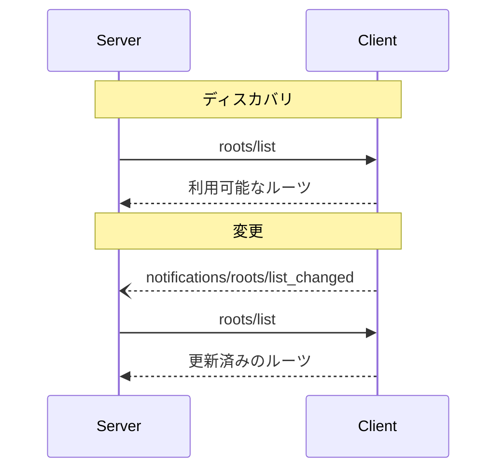

<div id="enable-section-numbers" />

<Info>**プロトコル改訂**: 2025-06-18</Info>

Model Context Protocol（MCP）は、クライアントがサーバーに対してファイルシステムの「ルーツ」を公開するための標準化された方法を提供します。ルーツは、サーバーがファイルシステム内で操作できる範囲の境界を定義し、どのディレクトリやファイルにアクセス可能かを理解できるようにします。サーバーは、対応するクライアントからルーツの一覧を要求でき、その一覧が変更された際には通知を受け取ることができます。

<div id="user-interaction-model">
  ## ユーザーインタラクションモデル
</div>

MCP におけるルーツは、通常、ワークスペースやプロジェクトの設定インターフェースを通じて公開されます。

たとえば、実装では、サーバーにアクセスさせるディレクトリやファイルをユーザーが選べるワークスペース／プロジェクト用のピッカーを提供できます。これは、バージョン管理システムやプロジェクトファイルに基づくワークスペースの自動検出と組み合わせられます。

ただし、実装はニーズに合った任意のインターフェースパターンでルーツを公開して構いません。プロトコル自体は特定のユーザーインタラクションモデルを要求していません。

<div id="capabilities">
  ## 機能
</div>

ルーツをサポートするクライアントは、[初期化](/ja/specification/2025-06-18/basic/lifecycle#initialization)時に `roots` 機能を宣言することが**必須**です:

```json
{
  "capabilities": {
    "roots": {
      "listChanged": true
    }
  }
}
```

`listChanged` は、ルーツの一覧が変更された際にクライアントが通知を送出するかどうかを示します。

<div id="protocol-messages">
  ## プロトコルメッセージ
</div>

<div id="listing-roots">
  ### ルーツの一覧
</div>

ルーツを取得するには、サーバーは `roots/list` リクエストを送信します。

**リクエスト:**

```json
{
  "jsonrpc": "2.0",
  "id": 1,
  "method": "roots/list"
}
```

**レスポンス:**

```json
{
  "jsonrpc": "2.0",
  "id": 1,
  "result": {
    "roots": [
      {
        "uri": "file:///home/user/projects/myproject",
        "name": "My Project"
      }
    ]
  }
}
```

<div id="root-list-changes">
  ### ルーツ一覧の変更
</div>

ルーツが変更された場合、`listChanged` をサポートするクライアントは通知を送信しなければなりません:

```json
{
  "jsonrpc": "2.0",
  "method": "notifications/roots/list_changed"
}
```

<div id="message-flow">
  ## メッセージフロー
</div>



<div id="data-types">
  ## データ型
</div>

<div id="root">
  ### ルート
</div>

ルート定義には次が含まれます:

* `uri`: ルートの一意識別子。現行の仕様では、`file://` URI であることが**必須**です。
* `name`: 表示用の任意の人間可読名。

さまざまなユースケース向けのルート例:

<div id="project-directory">
  #### プロジェクトディレクトリ
</div>

```json
{
  "uri": "file:///home/user/projects/myproject",
  "name": "My Project"
}
```

<div id="multiple-repositories">
  #### 複数のリポジトリ
</div>

```json
[
  {
    "uri": "file:///home/user/repos/frontend",
    "name": "フロントエンド・リポジトリ"
  },
  {
    "uri": "file:///home/user/repos/backend",
    "name": "バックエンド・リポジトリ"
  }
]
```

<div id="error-handling">
  ## エラー処理
</div>

クライアントは、一般的な失敗ケースに対して標準のJSON-RPCエラーを返すことが望ましい（SHOULD）:

* クライアントがルーツをサポートしていない場合: `-32601`（Method not found）
* 内部エラー: `-32603`

エラー例:

```json
{
  "jsonrpc": "2.0",
  "id": 1,
  "error": {
    "code": -32601,
    "message": "Roots not supported",
    "data": {
      "reason": "Client does not have roots capability"
    }
  }
}
```

<div id="security-considerations">
  ## セキュリティに関する考慮事項
</div>

1. クライアントは**必須**:
   * 適切な権限を付与したルーツのみを公開する
   * パストラバーサルを防ぐため、すべてのルーツURIを検証する
   * 適切なアクセス制御を実装する
   * ルーツの到達可能性を監視する

2. サーバーは**推奨**:
   * ルーツが利用不能になった場合に対処する
   * 操作中はルーツの境界を順守する
   * 提供されたルーツに照らしてすべてのパスを検証する

<div id="implementation-guidelines">
  ## 実装ガイドライン
</div>

1. クライアントは**推奨**:
   * MCPサーバーにルーツを公開する前にユーザーの同意を求める
   * ルーツ管理のためのわかりやすいユーザーインターフェースを提供する
   * 公開前にルーツへのアクセス可否を検証する
   * ルーツの変更を監視する

2. サーバーは**推奨**:
   * 使用前にルーツ機能のサポート有無を確認する
   * ルーツ一覧の変更を適切に扱う
   * 操作時にルーツの境界を遵守する
   * ルーツ情報を適切にキャッシュする