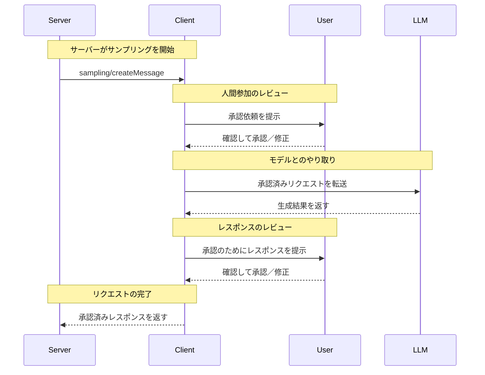

<div id="enable-section-numbers" />

<Info>**プロトコル改訂**: 2025-06-18</Info>

Model Context Protocol（MCP）は、サーバーがクライアント経由で言語モデルに対してLLMの
サンプリング（「completions」または「generations」）をリクエストできる標準化された方法を提供します。このフローにより、
クライアントはモデルへのアクセス、選択、権限を管理しつつ、サーバーはAI機能を活用できます。サーバー側のAPIキーは不要です。
サーバーはテキスト、音声、または画像を用いたインタラクションをリクエストでき、必要に応じて
プロンプトにMCPサーバー由来のコンテキストを含めることも可能です。

<div id="user-interaction-model">
  ## ユーザーインタラクションモデル
</div>

MCPのサンプリングは、LLM呼び出しを他のMCPサーバー機能の内部で&#95;ネスト&#95;して実行できるようにすることで、サーバーがエージェント的な挙動を実装できるようにします。

実装側は、自身のニーズに合った任意のインターフェースパターンでサンプリングを提供して構いません。プロトコル自体は特定のユーザーインタラクションモデルを要求しません。

<Warning>
  トラスト＆セーフティおよびセキュリティの観点から、サンプリング要求を拒否できる権限を持つ人間が常に関与していることが**推奨されます（SHOULD）**。

  アプリケーションは**次を満たすべきです（SHOULD）**:

  * サンプリング要求を容易かつ直感的にレビューできるUIを提供する
  * 送信前にユーザーがプロンプトを閲覧・編集できるようにする
  * 生成結果を配信前にレビュー用に提示する
</Warning>

<div id="capabilities">
  ## 機能
</div>

サンプリングをサポートするクライアントは、[初期化](/ja/specification/2025-06-18/basic/lifecycle#initialization)時に `sampling` 機能を宣言しなければなりません。

```json
{
  "capabilities": {
    "sampling": {}
  }
}
```

<div id="protocol-messages">
  ## プロトコル・メッセージ
</div>

<div id="creating-messages">
  ### メッセージの作成
</div>

言語モデルによる生成をリクエストするには、サーバーは `sampling/createMessage` リクエストを送信します:

**リクエスト:**

```json
{
  "jsonrpc": "2.0",
  "id": 1,
  "method": "sampling/createMessage",
  "params": {
    "messages": [
      {
        "role": "user",
        "content": {
          "type": "text",
          "text": "What is the capital of France?"
        }
      }
    ],
    "modelPreferences": {
      "hints": [
        {
          "name": "claude-3-sonnet"
        }
      ],
      "intelligencePriority": 0.8,
      "speedPriority": 0.5
    },
    "systemPrompt": "You are a helpful assistant.",
    "maxTokens": 100
  }
}
```

**レスポンス:**

```json
{
  "jsonrpc": "2.0",
  "id": 1,
  "result": {
    "role": "assistant",
    "content": {
      "type": "text",
      "text": "The capital of France is Paris."
    },
    "model": "claude-3-sonnet-20240307",
    "stopReason": "endTurn"
  }
}
```

<div id="message-flow">
  ## メッセージフロー
</div>



<div id="data-types">
  ## データ型
</div>

<div id="messages">
  ### メッセージ
</div>

サンプリングのメッセージには、次の内容を含められます。

<div id="text-content">
  #### テキスト内容
</div>

```json
{
  "type": "text",
  "text": "The message content"
}
```

<div id="image-content">
  #### 画像コンテンツ
</div>

```json
{
  "type": "image",
  "data": "base64-encoded-image-data",
  "mimeType": "image/jpeg"
}
```

<div id="audio-content">
  #### 音声コンテンツ
</div>

```json
{
  "type": "audio",
  "data": "base64-encoded-audio-data",
  "mimeType": "audio/wav"
}
```

<div id="model-preferences">
  ### モデルの優先設定
</div>

MCP におけるモデル選択は、サーバーとクライアントが異なる AI プロバイダーを利用し、提供モデルも異なる場合があるため、慎重な抽象化が求められます。クライアントがそのモデルにアクセスできなかったり、別プロバイダーの同等モデルを使いたい場合があるため、サーバーは単に特定のモデル名を指定して要求することはできません。

この課題に対処するため、MCP は抽象的な機能優先度に、任意のモデルヒントを組み合わせた優先度システムを実装しています。

<div id="capability-priorities">
  #### 機能の優先順位
</div>

サーバーは、正規化された3つの優先度（0〜1）でニーズを示します:

* `costPriority`: コスト削減の重要度。値が高いほど、より低コストなモデルを優先します。
* `speedPriority`: 低レイテンシの重要度。値が高いほど、より高速なモデルを優先します。
* `intelligencePriority`: 高度な機能の重要度。値が高いほど、より高性能なモデルを優先します。

<div id="model-hints">
  #### モデルのヒント
</div>

優先度は特性に基づいてモデル選択に役立ちますが、`hints` を使うとサーバーは
特定のモデルやモデルファミリーを提案できます。

* ヒントは部分文字列として扱われ、モデル名に柔軟にマッチします
* 複数のヒントは優先順に評価されます
* クライアントは、異なるプロバイダーの同等モデルへヒントをマッピングしてもよい（MAY）
* ヒントは助言的なもので、最終的なモデル選択はクライアントが行います

例:

```json
{
  "hints": [
    { "name": "claude-3-sonnet" }, // Sonnetクラスのモデルを優先
    { "name": "claude" } // 任意のClaudeモデルにフォールバック
  ],
  "costPriority": 0.3, // コストの重要度は低い
  "speedPriority": 0.8, // 速度の重要度は非常に高い
  "intelligencePriority": 0.5 // 必要な能力は中程度
}
```

クライアントはこれらの優先度を考慮して、利用可能なオプションから適切なモデルを選択します。たとえば、クライアントがClaudeモデルにアクセスできずGeminiを利用できる場合、類似の能力に基づいてsonnetのヒントを `gemini-1.5-pro` に対応付けることがあります。

<div id="error-handling">
  ## エラー処理
</div>

クライアントは、一般的な失敗ケースに対してエラーを返すことが**推奨されます**。

エラーの例:

```json
{
  "jsonrpc": "2.0",
  "id": 1,
  "error": {
    "code": -1,
    "message": "User rejected sampling request"
  }
}
```

<div id="security-considerations">
  ## セキュリティ上の考慮事項
</div>

1. クライアントはユーザー承認の制御を実装することが望ましい（SHOULD）
2. 双方はメッセージ内容を検証することが望ましい（SHOULD）
3. クライアントはモデルの嗜好に関するヒントを尊重することが望ましい（SHOULD）
4. クライアントはレート制限を実装することが望ましい（SHOULD）
5. 双方は機微なデータを適切に取り扱うことが必須である（MUST）