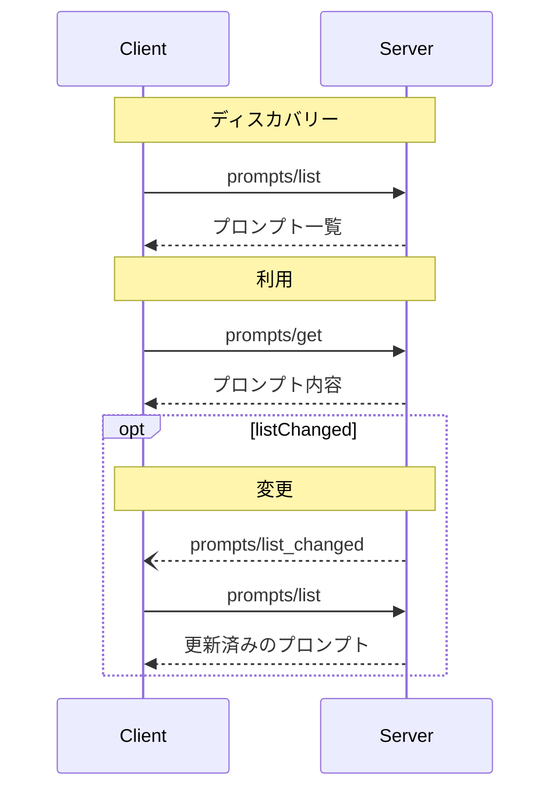

<div id="enable-section-numbers" />

<Info>**プロトコル改訂**: 2025-06-18</Info>

Model Context Protocol（MCP）は、サーバーがクライアントにプロンプト
テンプレートを公開するための標準化された方法を提供します。プロンプトによって、サーバーは言語モデルとの対話に用いる構造化されたメッセージや
指示を提供できます。クライアントは利用可能な
プロンプトを検出し、その内容を取得し、引数を指定してカスタマイズできます。

<div id="user-interaction-model">
  ## ユーザーインタラクションモデル
</div>

プロンプトはユーザー主導で扱えるように設計されています。つまり、サーバーからクライアントに公開され、ユーザーが明示的に選択して利用できることを意図しています。

一般的に、プロンプトはユーザーインターフェース上でユーザーが起動するコマンドを通じてトリガーされ、利用可能なプロンプトを自然に見つけて呼び出せるようにします。

例えば、スラッシュコマンドとして:


ただし、実装者はニーズに合った任意のインターフェースパターンでプロンプトを公開できます。プロトコル自体は特定のユーザーインタラクションモデルを要求しません。

<div id="capabilities">
  ## 機能
</div>

プロンプトをサポートするサーバーは、[初期化](/ja/specification/2025-06-18/basic/lifecycle#initialization)時に `prompts` 機能を宣言することが**必須**です:

```json
{
  "capabilities": {
    "prompts": {
      "listChanged": true
    }
  }
}
```

`listChanged` は、利用可能なプロンプトの一覧に変更があった際に、サーバーが通知を発行するかどうかを示します。

<div id="protocol-messages">
  ## プロトコル・メッセージ
</div>

<div id="listing-prompts">
  ### プロンプトの一覧取得
</div>

利用可能なプロンプトを取得するには、クライアントは `prompts/list` リクエストを送信します。この操作は[ページネーション](/ja/specification/2025-06-18/server/utilities/pagination)に対応しています。

**リクエスト:**

```json
{
  "jsonrpc": "2.0",
  "id": 1,
  "method": "prompts/list",
  "params": {
    "cursor": "optional-cursor-value"
  }
}
```

**レスポンス:**

```json
{
  "jsonrpc": "2.0",
  "id": 1,
  "result": {
    "prompts": [
      {
        "name": "code_review",
        "title": "コードレビューを依頼",
        "description": "LLMにコード品質を分析させ、改善点を提案させます",
        "arguments": [
          {
            "name": "code",
            "description": "レビュー対象のコード",
            "required": true
          }
        ]
      }
    ],
    "nextCursor": "next-page-cursor"
  }
}
```

<div id="getting-a-prompt">
  ### プロンプトの取得
</div>

特定のプロンプトを取得するには、クライアントは `prompts/get` リクエストを送信します。引数は[補完API](/ja/specification/2025-06-18/server/utilities/completion)で自動補完される場合があります。

**リクエスト:**

```json
{
  "jsonrpc": "2.0",
  "id": 2,
  "method": "prompts/get",
  "params": {
    "name": "code_review",
    "arguments": {
      "code": "def hello():\n    print('world')"
    }
  }
}
```

**レスポンス:**

```json
{
  "jsonrpc": "2.0",
  "id": 2,
  "result": {
    "description": "コードレビュー用のプロンプト",
    "messages": [
      {
        "role": "user",
        "content": {
          "type": "text",
          "text": "次の Python コードをレビューしてください：\ndef hello():\n    print('world')"
        }
      }
    ]
  }
}
```

<div id="list-changed-notification">
  ### 変更通知（リスト）
</div>

利用可能なプロンプトのリストが変更された場合、`listChanged`
機能を宣言しているサーバーは通知を送信することが**推奨されます**:

```json
{
  "jsonrpc": "2.0",
  "method": "notifications/prompts/list_changed"
}
```

<div id="message-flow">
  ## メッセージフロー
</div>



<div id="data-types">
  ## データ型
</div>

<div id="prompt">
  ### プロンプト
</div>

プロンプト定義には次が含まれます:

* `name`: プロンプトの一意の識別子
* `title`: 表示用の任意の人間可読なプロンプト名
* `description`: 任意の人間可読な説明
* `arguments`: カスタマイズ用の任意の引数リスト

<div id="promptmessage">
  ### プロンプトメッセージ
</div>

プロンプト内のメッセージには次の要素を含められます:

* `role`: 話し手を示す &quot;user&quot; または &quot;assistant&quot; のいずれか
* `content`: 次のいずれかのコンテンツタイプ

<Note>
  プロンプトメッセージ内のすべてのコンテンツタイプは、対象読者、優先度、更新時刻に関するメタデータ用の
  [注釈](/ja/specification/2025-06-18/server/resources#annotations) を任意指定でサポートします。
</Note>

<div id="text-content">
  #### テキストコンテンツ
</div>

テキストコンテンツは、プレーンテキストのメッセージを表します。

```json
{
  "type": "text",
  "text": "The text content of the message"
}
```

これは自然言語でのやり取りで最も一般的に使われるコンテンツタイプです。

<div id="image-content">
  #### 画像コンテンツ
</div>

画像コンテンツにより、メッセージに視覚情報を含められます：

```json
{
  "type": "image",
  "data": "base64-encoded-image-data",
  "mimeType": "image/png"
}
```

画像データは、base64でエンコードし、有効なMIMEタイプを含めることが**必須**です。これにより、視覚的なコンテキストが重要なマルチモーダルなやり取りが可能になります。

<div id="audio-content">
  #### 音声コンテンツ
</div>

音声コンテンツを使用すると、メッセージに音声情報を含められます:

```json
{
  "type": "audio",
  "data": "base64-encoded-audio-data",
  "mimeType": "audio/wav"
}
```

音声データは必ず base64 でエンコードし、有効な MIME タイプを含めなければなりません。これにより、
音声コンテキストが重要なマルチモーダルなインタラクションが可能になります。

<div id="embedded-resources">
  #### 埋め込みリソース
</div>

埋め込みリソースを使用すると、メッセージ内でサーバー側のリソースを直接参照できます。

```json
{
  "type": "resource",
  "resource": {
    "uri": "resource://example",
    "name": "example",
    "title": "My Example Resource",
    "mimeType": "text/plain",
    "text": "Resource content"
  }
}
```

リソースはテキストまたはバイナリ（blob）データのいずれかを含められ、以下を必ず含みます（必須）:

* 有効なリソースURI
* 適切なMIMEタイプ
* テキスト本文またはbase64エンコードされたblobデータのいずれか

埋め込みリソースにより、ドキュメント、コード例、その他の参照資料といったサーバー管理のコンテンツを、会話フローに直接シームレスに取り込めます。

<div id="error-handling">
  ## エラー処理
</div>

サーバーは、一般的な失敗ケースに対して標準のJSON-RPCエラーを返すことが望ましい（SHOULD）:

* 無効なプロンプト名: `-32602`（無効なパラメータ）
* 必須引数の欠如: `-32602`（無効なパラメータ）
* 内部エラー: `-32603`（内部エラー）

<div id="implementation-considerations">
  ## 実装に関する考慮事項
</div>

1. サーバーは処理前にプロンプトの引数を検証することが望ましい（SHOULD）
2. クライアントは大規模なプロンプト一覧に対してページネーションを処理することが望ましい（SHOULD）
3. 両者は機能のネゴシエーションを尊重することが望ましい（SHOULD）

<div id="security">
  ## セキュリティ
</div>

実装は、インジェクション攻撃やリソースへの不正アクセスを防ぐため、すべてのプロンプトの入出力を厳密に検証しなければなりません。