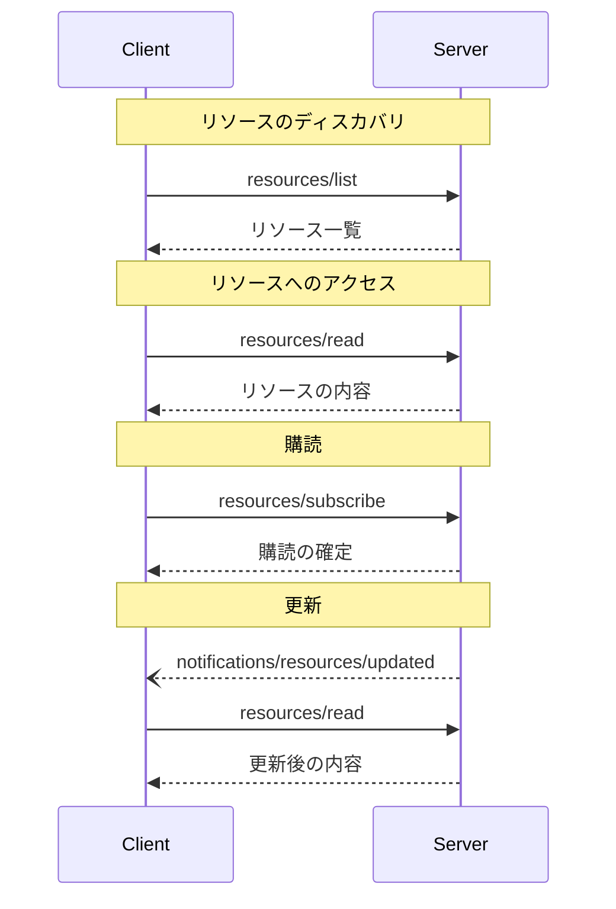

<div id="enable-section-numbers" />

<Info>**プロトコル改訂**: 2025-06-18</Info>

Model Context Protocol（MCP）は、サーバーがクライアントにリソースを公開するための標準化された方法を提供します。リソースにより、サーバーはファイル、データベースのスキーマ、アプリケーション固有の情報など、言語モデルにコンテキストを与えるデータを共有できます。各リソースは
[URI](https://datatracker.ietf.org/doc/html/rfc3986)
によって一意に識別されます。

<div id="user-interaction-model">
  ## ユーザーインタラクションモデル
</div>

MCP におけるリソースは、ホストアプリケーションが
自らのニーズに応じてコンテキストの取り込み方法を決定できる、**アプリケーション主導**で設計されています。

たとえば、アプリケーションは次のようなことができます:

* ツリーまたはリストビューでの明示的な選択のため、UI 要素を通じてリソースを公開する
* 利用可能なリソースをユーザーが検索・フィルタリングできるようにする
* ヒューリスティクスや AI モデルの選択に基づいて、コンテキストを自動的に取り込む


ただし、実装はニーズに合った任意のインターフェースパターンでリソースを公開して構いません。プロトコル自体は特定のユーザー
インタラクションモデルを要求していません。

<div id="capabilities">
  ## 機能
</div>

リソースをサポートするサーバーは、`resources` 機能を宣言することが**必須**です:

```json
{
  "capabilities": {
    "resources": {
      "subscribe": true,
      "listChanged": true
    }
  }
}
```

この機能は次の2つの任意機能をサポートします:

* `subscribe`: クライアントが個々のリソースの変更通知を受け取るために購読できるかどうか。
* `listChanged`: 利用可能なリソース一覧が変更された際に、サーバーが通知を送信するかどうか。

`subscribe` と `listChanged` はどちらも任意です。サーバーはどちらもサポートしない、どちらか一方のみ、または両方をサポートできます:

```json
{
  "capabilities": {
    "resources": {} // Neither feature supported
  }
}
```

```json
{
  "capabilities": {
    "resources": {
      "subscribe": true // Only subscriptions supported
    }
  }
}
```

```json
{
  "capabilities": {
    "resources": {
      "listChanged": true // Only list change notifications supported
    }
  }
}
```

<div id="protocol-messages">
  ## プロトコルメッセージ
</div>

<div id="listing-resources">
  ### リソースの一覧取得
</div>

利用可能なリソースを取得するには、クライアントは `resources/list` リクエストを送信します。この操作は[ページネーション](/ja/specification/2025-06-18/server/utilities/pagination)をサポートします。

**リクエスト:**

```json
{
  "jsonrpc": "2.0",
  "id": 1,
  "method": "resources/list",
  "params": {
    "cursor": "optional-cursor-value"
  }
}
```

**レスポンス:**

```json
{
  "jsonrpc": "2.0",
  "id": 1,
  "result": {
    "resources": [
      {
        "uri": "file:///project/src/main.rs",
        "name": "main.rs",
        "title": "Rust ソフトウェアアプリケーションのメインファイル",
        "description": "アプリケーションのエントリーポイント",
        "mimeType": "text/x-rust"
      }
    ],
    "nextCursor": "next-page-cursor"
  }
}
```

<div id="reading-resources">
  ### リソースの読み取り
</div>

リソースの内容を取得するには、クライアントは `resources/read` リクエストを送信します。

**リクエスト:**

```json
{
  "jsonrpc": "2.0",
  "id": 2,
  "method": "resources/read",
  "params": {
    "uri": "file:///project/src/main.rs"
  }
}
```

**レスポンス:**

```json
{
  "jsonrpc": "2.0",
  "id": 2,
  "result": {
    "contents": [
      {
        "uri": "file:///project/src/main.rs",
        "name": "main.rs",
        "title": "Rust ソフトウェアアプリケーションのメインファイル",
        "mimeType": "text/x-rust",
        "text": "fn main() {\n    println!(\"Hello world!\");\n}"
      }
    ]
  }
}
```

<div id="resource-templates">
  ### リソーステンプレート
</div>

リソーステンプレートを使うと、サーバーは[URIテンプレート](https://datatracker.ietf.org/doc/html/rfc6570)を用いてパラメータ化されたリソースを公開できます。引数は[補完API](/ja/specification/2025-06-18/server/utilities/completion)を通して自動補完される場合があります。

これ・

**リクエスト:**

```json
{
  "jsonrpc": "2.0",
  "id": 3,
  "method": "resources/templates/list"
}
```

**レスポンス:**

```json
{
  "jsonrpc": "2.0",
  "id": 3,
  "result": {
    "resourceTemplates": [
      {
        "uriTemplate": "file:///{path}",
        "name": "Project Files",
        "title": "📁 Project Files",
        "description": "プロジェクトディレクトリ内のファイルにアクセスします",
        "mimeType": "application/octet-stream"
      }
    ]
  }
}
```

<div id="list-changed-notification">
  ### リスト変更通知
</div>

利用可能なリソースの一覧が変更された場合、`listChanged`
機能を宣言しているサーバーは通知を送信することが**推奨されます**。

```json
{
  "jsonrpc": "2.0",
  "method": "notifications/resources/list_changed"
}
```

<div id="subscriptions">
  ### サブスクリプション
</div>

このプロトコルは、リソース変更への任意のサブスクリプションをサポートします。クライアントは特定のリソースを購読し、変更があった際に通知を受け取れます。

**サブスクライブ要求:**

```json
{
  "jsonrpc": "2.0",
  "id": 4,
  "method": "resources/subscribe",
  "params": {
    "uri": "file:///project/src/main.rs"
  }
}
```

**更新通知:**

```json
{
  "jsonrpc": "2.0",
  "method": "notifications/resources/updated",
  "params": {
    "uri": "file:///project/src/main.rs",
    "title": "Rust ソフトウェアアプリケーションのメインファイル"
  }
}
```

<div id="message-flow">
  ## メッセージフロー
</div>



<div id="data-types">
  ## データ型
</div>

<div id="resource">
  ### リソース
</div>

リソース定義には次が含まれます:

* `uri`: リソースの一意の識別子
* `name`: リソース名
* `title`: 表示用の任意の人間可読名
* `description`: 任意の説明
* `mimeType`: 任意のMIMEタイプ
* `size`: 任意のバイト数

<div id="resource-contents">
  ### リソースの内容
</div>

リソースには、テキストまたはバイナリのいずれかのデータを含められます：

<div id="text-content">
  #### テキスト内容
</div>

```json
{
  "uri": "file:///example.txt",
  "name": "example.txt",
  "title": "Example Text File",
  "mimeType": "text/plain",
  "text": "Resource content"
}
```

<div id="binary-content">
  #### バイナリコンテンツ
</div>

```json
{
  "uri": "file:///example.png",
  "name": "example.png",
  "title": "Example Image",
  "mimeType": "image/png",
  "blob": "base64-encoded-data"
}
```

<div id="annotations">
  ### 注釈
</div>

リソース、リソーステンプレート、コンテンツブロックには、クライアントに対してリソースの使い方や表示方法のヒントを与える任意の注釈を付与できます:

* **`audience`**: このリソースの対象読者を示す配列。有効な値は `"user"` と `"assistant"`。たとえば `["user", "assistant"]` は両方に有用なコンテンツを示します。
* **`priority`**: このリソースの重要度を 0.0 から 1.0 の数値で示します。1 は「最も重要」（実質的に必須）、0 は「最も重要度が低い」（完全に任意）を意味します。
* **`lastModified`**: リソースが最後に更新された日時を示す ISO 8601 形式のタイムスタンプ（例: `"2025-01-12T15:00:58Z"`）。

注釈付きリソースの例:

```json
{
  "uri": "file:///project/README.md",
  "name": "README.md",
  "title": "Project Documentation",
  "mimeType": "text/markdown",
  "annotations": {
    "audience": ["user"],
    "priority": 0.8,
    "lastModified": "2025-01-12T15:00:58Z"
  }
}
```

クライアントはこれらの注釈を次の用途に利用できます:

* 対象読者に基づいてリソースをフィルタリングする
* コンテキストに含めるリソースの優先順位を付ける
* 更新日時を表示したり、新しい順に並べ替えたりする

<div id="common-uri-schemes">
  ## 一般的なURIスキーム
</div>

このプロトコルはいくつかの標準的なURIスキームを定義しています。ただし、この一覧は網羅的ではありません。実装側は、必要に応じて追加のカスタムURIスキームを自由に使用できます。

<div id="https">
  ### https://
</div>

ウェブ上で利用可能なリソースを表すために使用します。

クライアントがそのリソースをウェブから直接取得して読み込める場合に限り、サーバーはこのスキームを使用するべきです（SHOULD）。つまり、MCPサーバー経由でリソースを読む必要がないケースです。

その他の用途では、たとえサーバー自身がインターネット経由でリソース内容をダウンロードする場合であっても、サーバーは別のURIスキームを使うか、カスタムスキームを定義することを推奨します（SHOULD）。

<div id="file">
  ### file://
</div>

ファイルシステムのように振る舞うリソースを識別するために使用します。ただし、リソースが実際の物理的なファイルシステムに対応している必要はありません。

MCPサーバーは、標準的なMIMEタイプがない非正規ファイル（ディレクトリなど）を表現するために、`inode/directory` のような
[XDG MIME type](https://specifications.freedesktop.org/shared-mime-info-spec/0.14/ar01s02.html#id-1.3.14)
を用いて file:// リソースを識別してもよい（MAY）とします。

<div id="git">
  ### git://
</div>

Git バージョン管理との統合。

<div id="custom-uri-schemes">
  ### カスタムURIスキーム
</div>

カスタムURIスキームは、上記の指針を踏まえつつ、[RFC3986](https://datatracker.ietf.org/doc/html/rfc3986)に準拠しなければなりません。

<div id="error-handling">
  ## エラー処理
</div>

サーバーは、一般的な失敗ケースに対して標準のJSON-RPCエラーを返すべきです（**SHOULD**）:

* リソースが見つからない: `-32002`
* 内部エラー: `-32603`

エラー例:

```json
{
  "jsonrpc": "2.0",
  "id": 5,
  "error": {
    "code": -32002,
    "message": "Resource not found",
    "data": {
      "uri": "file:///nonexistent.txt"
    }
  }
}
```

<div id="security-considerations">
  ## セキュリティに関する考慮事項
</div>

1. サーバーはすべてのリソースURIを検証しなければならない（MUST）
2. 機微なリソースにはアクセス制御を実装するべきである（SHOULD）
3. バイナリデータは適切にエンコードしなければならない（MUST）
4. 操作の前にリソースの権限を確認するべきである（SHOULD）