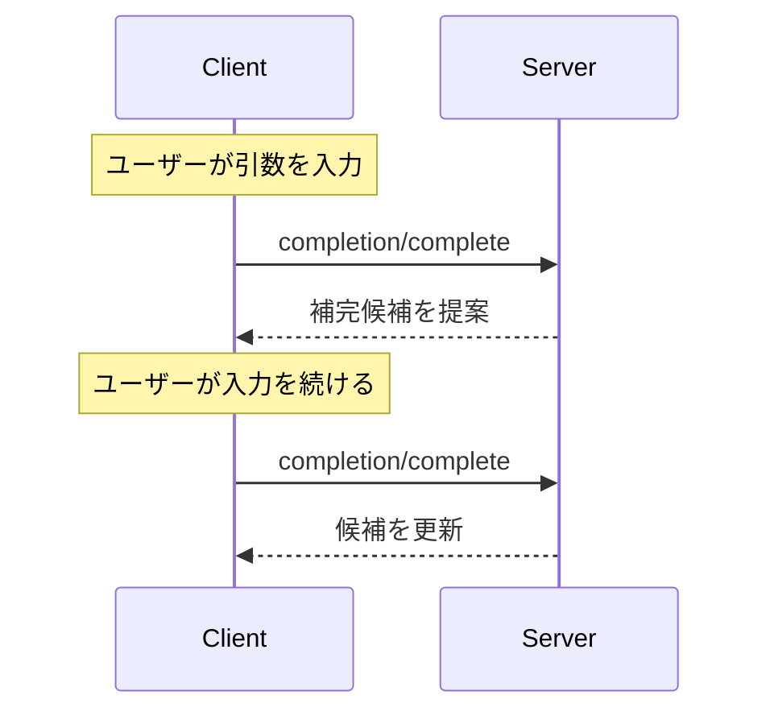

<div id="enable-section-numbers" />

<Info>**プロトコル改訂**: 2025-06-18</Info>

Model Context Protocol（MCP）は、サーバーがプロンプトやリソースURIの引数に対するオートコンプリート候補を提示できるようにする標準化された手段を提供します。これにより、ユーザーが引数値を入力する際に文脈に応じた候補が提示される、IDEのようにリッチな体験が可能になります。

<div id="user-interaction-model">
  ## ユーザーインタラクションモデル
</div>

MCPにおける補完は、IDEのコード補完に類似したインタラクティブなユーザー体験をサポートするよう設計されています。

たとえば、アプリケーションはユーザーの入力に応じてドロップダウンやポップアップメニューで補完候補を表示し、利用可能なオプションからの絞り込みや選択を可能にする場合があります。

ただし、実装はニーズに合った任意のインターフェースパターンで補完を提供してかまいません。プロトコル自体は特定のユーザーインタラクションモデルを義務付けていません。

<div id="capabilities">
  ## 機能
</div>

補完に対応するサーバーは、`completions` 機能を宣言することが**必須**です:

```json
{
  "capabilities": {
    "completions": {}
  }
}
```

<div id="protocol-messages">
  ## プロトコルメッセージ
</div>

<div id="requesting-completions">
  ### 補完のリクエスト
</div>

補完候補を取得するには、クライアントは参照タイプで「何を補完するか」を指定した `completion/complete` リクエストを送信します。

**リクエスト:**

```json
{
  "jsonrpc": "2.0",
  "id": 1,
  "method": "completion/complete",
  "params": {
    "ref": {
      "type": "ref/prompt",
      "name": "code_review"
    },
    "argument": {
      "name": "language",
      "value": "py"
    }
  }
}
```

**レスポンス:**

```json
{
  "jsonrpc": "2.0",
  "id": 1,
  "result": {
    "completion": {
      "values": ["python", "pytorch", "pyside"],
      "total": 10,
      "hasMore": true
    }
  }
}
```

複数の引数を取るプロンプトやURIテンプレートの場合、クライアントは後続のリクエストに文脈を与えるため、これまでの補完結果を `context.arguments` オブジェクトに含める必要があります。

**リクエスト:**

```json
{
  "jsonrpc": "2.0",
  "id": 1,
  "method": "completion/complete",
  "params": {
    "ref": {
      "type": "ref/prompt",
      "name": "code_review"
    },
    "argument": {
      "name": "framework",
      "value": "fla"
    },
    "context": {
      "arguments": {
        "language": "python"
      }
    }
  }
}
```

**レスポンス:**

```json
{
  "jsonrpc": "2.0",
  "id": 1,
  "result": {
    "completion": {
      "values": ["flask"],
      "total": 1,
      "hasMore": false
    }
  }
}
```

<div id="reference-types">
  ### 参照タイプ
</div>

このプロトコルは2種類の補完参照をサポートします。

| 種類           | 説明                         | 例                                                 |
| -------------- | ---------------------------- | -------------------------------------------------- |
| `ref/prompt`   | 名前でプロンプトを参照       | `{"type": "ref/prompt", "name": "code_review"}`     |
| `ref/resource` | リソースのURIを参照          | `{"type": "ref/resource", "uri": "file:///{path}"}` |

<div id="completion-results">
  ### 完了結果
</div>

サーバーは関連性順に並べた補完結果の配列を返します。内容は次のとおりです:

- 応答ごとに最大100件
- 利用可能な一致件数の総数（任意）
- 追加の結果が存在するかどうかを示すブール値

<div id="message-flow">
  ## メッセージフロー
</div>



<div id="data-types">
  ## データ型
</div>

<div id="completerequest">
  ### CompleteRequest
</div>

- `ref`: `PromptReference` または `ResourceReference`
- `argument`: 以下を含むオブジェクト:
  - `name`: 引数名
  - `value`: 現在の値
- `context`: 以下を含むオブジェクト:
  - `arguments`: すでに解決済みの引数名とその値のマッピング

<div id="completeresult">
  ### CompleteResult
</div>

- `completion`: 次を含むオブジェクト：
  - `values`: 候補の配列（最大100件）
  - `total`: 一致件数（省略可）
  - `hasMore`: さらに結果があるかを示すフラグ

<div id="error-handling">
  ## エラー処理
</div>

サーバーは、一般的な失敗ケースに対して標準のJSON-RPCエラーを返すことが望ましい（SHOULD）:

- メソッドが見つからない: `-32601`（機能がサポートされていない）
- 無効なプロンプト名: `-32602`（無効なパラメータ）
- 必須引数の不足: `-32602`（無効なパラメータ）
- 内部エラー: `-32603`（内部エラー）

<div id="implementation-considerations">
  ## 実装に関する考慮事項
</div>

1. サーバーは**推奨**:
   - 関連度順に並べた候補を返す
   - 適切な場合はファジーマッチを実装する
   - 補完リクエストにレート制限を設ける
   - すべての入力を検証する

2. クライアントは**推奨**:
   - 頻発する補完リクエストをデバウンスする
   - 適切な場合は補完結果をキャッシュする
   - 欠落または不完全な結果を適切に処理する

<div id="security">
  ## セキュリティ
</div>

実装は必ず次を満たすこと:

- すべての補完入力を検証する
- 適切なレート制限を実装する
- 機密性の高い提案へのアクセスを制御する
- 補完に起因する情報漏えいを防止する