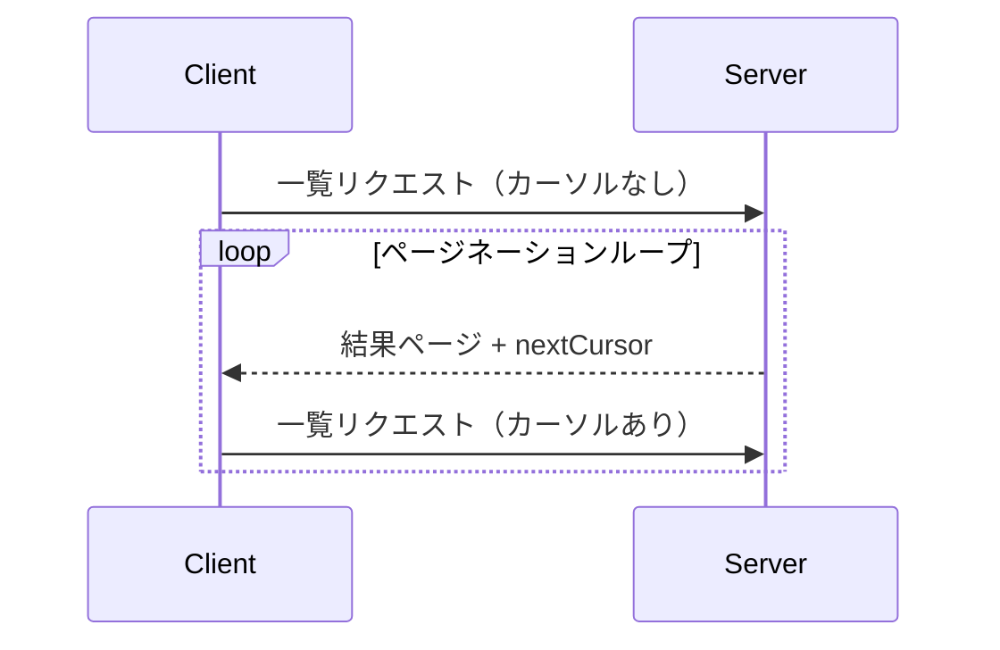

<div id="enable-section-numbers" />

<Info>**プロトコル改訂**: 2025-06-18</Info>

Model Context Protocol（MCP）は、大きな結果セットを返す可能性のあるリスト処理に対してページネーションをサポートします。ページネーションにより、サーバーは結果を一度にまとめて返すのではなく、より小さな単位で段階的に返せるようになります。

ページネーションは、インターネット経由で外部サービスに接続する場合に特に重要ですが、大規模なデータセットによるパフォーマンス低下を避けるうえで、ローカル統合でも有用です。

<div id="pagination-model">
  ## ページネーションモデル
</div>

MCPにおけるページネーションは、ページ番号方式ではなく、不透明なカーソルベース方式を採用します。

- **カーソル**は、結果セット内の位置を示す不透明な文字列トークンです
- **ページサイズ**はサーバーが決定し、クライアントは固定のページサイズを想定しては**なりません**

<div id="response-format">
  ## レスポンス形式
</div>

サーバーから次を含む**レスポンス**が送信されると、ページネーションが開始されます：

- 現在の結果ページ
- さらに結果がある場合は、オプションの `nextCursor` フィールド

```json
{
  "jsonrpc": "2.0",
  "id": "123",
  "result": {
    "resources": [...],
    "nextCursor": "eyJwYWdlIjogM30="
  }
}
```

<div id="request-format">
  ## リクエスト形式
</div>

カーソルを受け取った後、クライアントはそのカーソルを含むリクエストを送信することで、ページネーションを継続できます：

```json
{
  "jsonrpc": "2.0",
  "method": "resources/list",
  "params": {
    "cursor": "eyJwYWdlIjogMn0="
  }
}
```

<div id="pagination-flow">
  ## ページネーションフロー
</div>



<div id="operations-supporting-pagination">
  ## ページネーションに対応するオペレーション
</div>

次のMCPのオペレーションはページネーションに対応しています:

- `resources/list` - 利用可能なリソースの一覧
- `resources/templates/list` - リソーステンプレートの一覧
- `prompts/list` - 利用可能なプロンプトの一覧
- `tools/list` - 利用可能なツールの一覧

<div id="implementation-guidelines">
  ## 実装ガイドライン
</div>

1. サーバーは**推奨**:
   - 安定したカーソルを提供すること
   - 無効なカーソルを穏当に処理すること

2. クライアントは**推奨**:
   - `nextCursor` がない場合は結果の終了として扱うこと
   - ページネーションの有無どちらのフローもサポートすること

3. クライアントはカーソルを不透明なトークンとして扱うことを**必須**とする:
   - カーソルの形式について仮定しないこと
   - カーソルの解析や変更を試みないこと
   - セッションをまたいでカーソルを永続化しないこと

<div id="error-handling">
  ## エラー処理
</div>

無効なカーソルは、エラーコード -32602（Invalid params）でエラーとすべきです（SHOULD）。