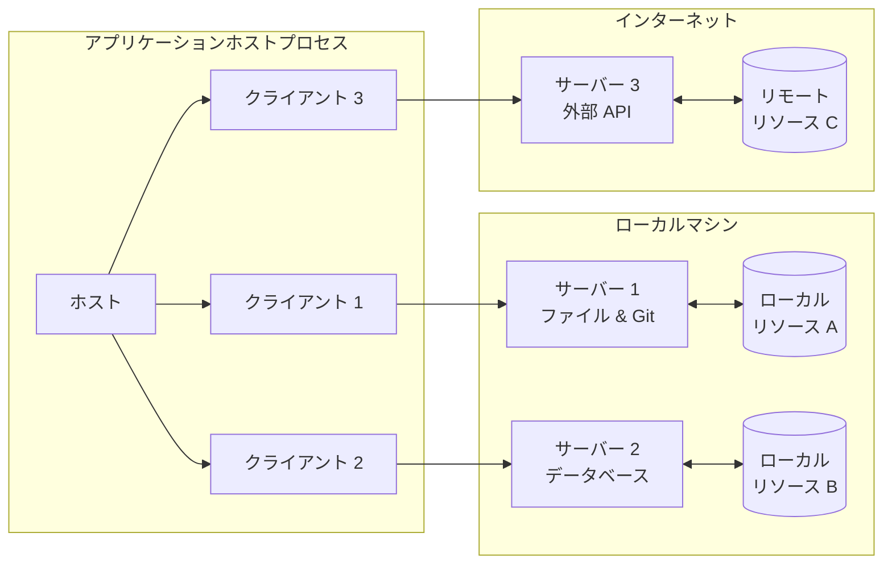
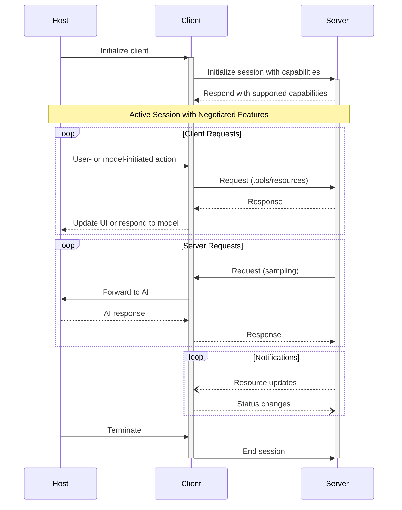

Model Context Protocol（MCP）はクライアント—ホスト—サーバー型のアーキテクチャに従い、各ホストは複数のクライアントインスタンスを実行できます。このアーキテクチャにより、明確なセキュリティ境界を保ちつつ関心事を分離し、アプリケーションをまたいでAI機能を統合できます。JSON-RPC 2.0の上に構築されたMCPは、クライアントとサーバー間のコンテキスト交換とサンプリングの調整に特化したステートフルなセッションプロトコルを提供します。

  ## コアコンポーネント

  ### ホスト

ホストプロセスはコンテナ兼コーディネーターとして機能します:

* 複数のクライアントインスタンスを作成・管理する
* クライアントの接続権限とライフサイクルを制御する
* セキュリティポリシーと同意要件を遵守させる
* ユーザーの認可に関する判断を処理する
* AI/LLM の統合とサンプリングを調整する
* クライアント間のコンテキスト集約を管理する

  ### クライアント

各クライアントはホストによって作成され、サーバーごとに独立した接続を維持します:

* サーバーごとに状態を持つセッションを1つ確立
* プロトコルのネゴシエーションと機能のやり取りを処理
* プロトコルメッセージを双方向にルーティング
* サブスクリプションと通知を管理
* サーバー間のセキュリティ境界を維持

ホストアプリケーションは複数のクライアントを作成・管理し、各クライアントは特定のサーバーと1対1の関係を持ちます。

  ### サーバー

サーバーは、特化したコンテキストと機能を提供します：

* MCPのプリミティブを通じてリソース、ツール、プロンプトを公開する
* 明確に絞られた責務で独立して動作する
* クライアントのインターフェース経由でサンプリングを要求する
* セキュリティ上の制約を順守する必要がある
* ローカルプロセスとしてもリモートサービスとしても動作できる

  ## 設計原則

MCPは、そのアーキテクチャと実装方針に影響するいくつかの主要な設計原則に基づいて構築されています。

1. **サーバーは極めて容易に構築できるべき**
   * ホストアプリケーションが複雑なオーケストレーションを担う
   * サーバーは明確に定義された特定の機能に専念する
   * シンプルなインターフェースで実装コストを最小化する
   * 明確な分離によって保守性の高いコードを実現する

2. **サーバーは高い合成可能性を備えるべき**
   * 各サーバーは独立した形で焦点の定まった機能を提供する
   * 複数のサーバーをシームレスに組み合わせられる
   * 共有プロトコルにより相互運用性を確保する
   * モジュール化設計で拡張性を支える

3. **サーバーは会話全体を読めず、他のサーバーを「覗き見る」こともできないべき**
   * サーバーは必要な最小限のコンテキスト情報のみを受け取る
   * 会話履歴全体はホスト側に留まる
   * 各サーバー接続は分離を維持する
   * サーバー間のやり取りはホストが制御する
   * ホストプロセスがセキュリティ境界を強制する

4. **機能はサーバーとクライアントに段階的に追加できる**
   * コアプロトコルは必要最小限の機能を提供する
   * 追加の能力は必要に応じて交渉して合意できる
   * サーバーとクライアントは独立に進化できる
   * 将来の拡張を見据えたプロトコル設計
   * 下位互換性を維持する

  ## 機能ネゴシエーション

Model Context Protocol（MCP）は、初期化時にクライアントとサーバーがサポートする機能を明示的に宣言する、機能ベースのネゴシエーション方式を採用しています。宣言された機能により、セッション中に利用可能なプロトコル機能やプリミティブが決まります。

* サーバーは、リソースの購読、ツール対応、プロンプトのテンプレートなどの機能を宣言します
* クライアントは、サンプリング対応や通知処理などの機能を宣言します
* 両者はセッションを通じて、宣言済みの機能を遵守する必要があります
* 追加の機能は、プロトコル拡張によってネゴシエートできます

各機能は、セッション中に使用可能となる特定のプロトコル機能を有効化します。例えば:

* 実装済みの[サーバー機能](/ja/specification/draft/server)は、サーバーの機能として明示されている必要があります
* リソース購読の通知を送信するには、サーバーが購読対応を宣言している必要があります
* ツールの呼び出しには、サーバーがツール機能を宣言している必要があります
* [サンプリング](/ja/specification/draft/client)を利用するには、クライアントが機能として対応を宣言している必要があります

この機能ネゴシエーションにより、プロトコルの拡張性を保ちながら、クライアントとサーバーはサポートされる機能について明確な共通認識を持てます。