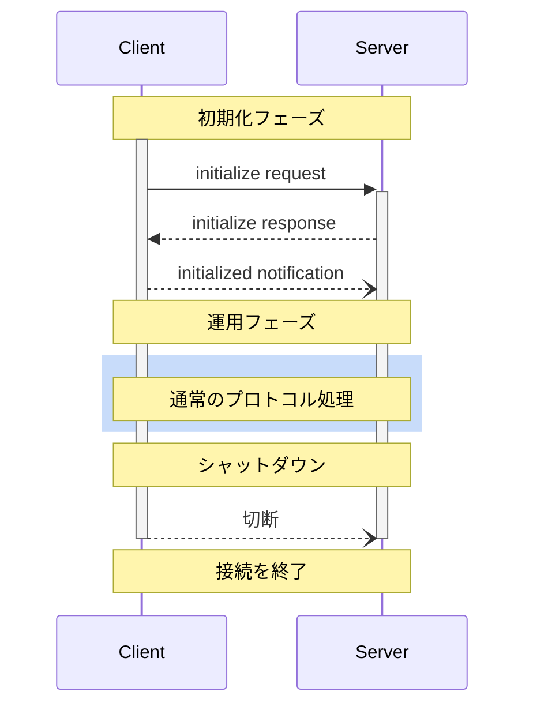

<div id="enable-section-numbers" />

<Info>**プロトコル版**: draft</Info>

Model Context Protocol（MCP）は、適切な機能ネゴシエーションと状態管理を確保するための、クライアント-サーバー接続における厳密なライフサイクルを定義します。

1. **初期化**: 機能ネゴシエーションとプロトコルバージョン合意
2. **運用**: 通常のプロトコル通信
3. **シャットダウン**: 接続の正常終了



<div id="lifecycle-phases">
  ## ライフサイクルフェーズ
</div>

<div id="initialization">
  ### 初期化
</div>

初期化フェーズは、クライアントとサーバー間の最初のやり取りでなければなりません（MUST）。
このフェーズでは、クライアントとサーバーは次を行います:

* プロトコルバージョンの互換性を確認する
* 機能を交換・交渉する
* 実装の詳細を共有する

クライアントは、次を含む `initialize` リクエストを送信してこのフェーズを開始しなければなりません（MUST）:

* サポートしているプロトコルバージョン
* クライアントの機能
* クライアントの実装情報

```json
{
  "jsonrpc": "2.0",
  "id": 1,
  "method": "initialize",
  "params": {
    "protocolVersion": "2024-11-05",
    "capabilities": {
      "roots": {
        "listChanged": true
      },
      "sampling": {},
      "elicitation": {}
    },
    "clientInfo": {
      "name": "ExampleClient",
      "title": "Example Client Display Name",
      "version": "1.0.0",
      "icons": [
        {
          "src": "https://example.com/icon.png",
          "mimeType": "image/png",
          "sizes": "48x48"
        }
      ],
      "websiteUrl": "https://example.com"
    }
  }
}
```

サーバーは、自身の機能と情報で応答しなければなりません（MUST）:

```json
{
  "jsonrpc": "2.0",
  "id": 1,
  "result": {
    "protocolVersion": "2024-11-05",
    "capabilities": {
      "logging": {},
      "prompts": {
        "listChanged": true
      },
      "resources": {
        "subscribe": true,
        "listChanged": true
      },
      "tools": {
        "listChanged": true
      }
    },
    "serverInfo": {
      "name": "ExampleServer",
      "title": "Example Server Display Name",
      "version": "1.0.0",
      "icons": [
        {
          "src": "https://example.com/server-icon.svg",
          "mimeType": "image/svg+xml",
          "sizes": "any"
        }
      ],
      "websiteUrl": "https://example.com/server"
    },
    "instructions": "Optional instructions for the client"
  }
}
```

初期化が成功した後、クライアントは通常の動作を開始する準備が整ったことを示すために
`initialized` 通知を送信しなければなりません（MUST）:

```json
{
  "jsonrpc": "2.0",
  "method": "notifications/initialized"
}
```

* サーバーが `initialize` リクエストに応答する前に、クライアントは
  [pings](/ja/specification/draft/basic/utilities/ping) 以外のリクエストを送信すべきではありません（SHOULD NOT）。
* `initialized` 通知を受け取る前に、サーバーは
  [pings](/ja/specification/draft/basic/utilities/ping) および
  [logging](/ja/specification/draft/server/utilities/logging) 以外のリクエストを送信すべきではありません（SHOULD NOT）。

<div id="version-negotiation">
  #### バージョン交渉
</div>

`initialize` リクエストでは、クライアントは自分がサポートするプロトコルバージョンを送信する **必要がある（MUST）**。
これはクライアントがサポートする *最新* のバージョンである **べきである（SHOULD）**。

サーバーが要求されたプロトコルバージョンをサポートしている場合は、同じバージョンで応答する **必要がある（MUST）**。
それ以外の場合は、サーバーがサポートする別のプロトコルバージョンで応答する **必要がある（MUST）**。
この場合、そのバージョンはサーバーがサポートする *最新* のものである **べきである（SHOULD）**。

クライアントがサーバーの応答に含まれるバージョンをサポートしていない場合は、切断する **べきである（SHOULD）**。

<Note>
  HTTP を使用する場合、クライアントは以降のすべての MCPサーバー へのリクエストに `MCP-Protocol-Version: <protocol-version>` HTTP ヘッダーを含める **必要がある（MUST）**。
  詳細は、[トランスポートにおけるプロトコルバージョンヘッダーのセクション](/ja/specification/draft/basic/transports#protocol-version-header)を参照してください。
</Note>

<div id="capability-negotiation">
  #### 機能ネゴシエーション
</div>

クライアントとサーバーが持つ機能によって、セッション中に利用可能な任意のプロトコル機能が決まります。

主な機能は次のとおりです:

| Category | Capability     | Description                                                                                 |
| -------- | -------------- | ------------------------------------------------------------------------------------------- |
| Client   | `roots`        | ファイルシステムの[ルーツ](/ja/specification/draft/client/roots)を提供する機能                  |
| Client   | `sampling`     | LLMの[サンプリング](/ja/specification/draft/client/sampling)要求のサポート                     |
| Client   | `elicitation`  | サーバーからの[エリシテーション](/ja/specification/draft/client/elicitation)要求のサポート      |
| Client   | `experimental` | 非標準の実験的機能に対するサポート内容の記述                                                 |
| Server   | `prompts`      | [プロンプト](/ja/specification/draft/server/prompts)テンプレートの提供                          |
| Server   | `resources`    | 読み取り可能な[リソース](/ja/specification/draft/server/resources)の提供                        |
| Server   | `tools`        | 呼び出し可能な[ツール](/ja/specification/draft/server/tools)の公開                             |
| Server   | `logging`      | 構造化された[ログメッセージ](/ja/specification/draft/server/utilities/logging)の出力            |
| Server   | `completions`  | 引数の[自動補完](/ja/specification/draft/server/utilities/completion)のサポート                |
| Server   | `experimental` | 非標準の実験的機能に対するサポート内容の記述                                                 |

Capabilityオブジェクトは、次のようなサブ機能を記述できます:

* `listChanged`: リスト変更通知（プロンプト、リソース、ツール）のサポート
* `subscribe`: 個々の項目の変更を購読する機能のサポート（リソースのみ）

<div id="operation">
  ### オペレーション
</div>

オペレーション段階では、クライアントとサーバーは合意済みの機能に従ってメッセージをやり取りします。

双方は次を必須要件として満たさなければなりません（MUST）:

* 合意したプロトコルバージョンに従う
* 交渉が成立した機能のみを使用する

<div id="shutdown">
  ### シャットダウン
</div>

シャットダウン段階では、一方（通常はクライアント）がプロトコル接続を適切に終了します。特定のシャットダウン用メッセージは定義されていません。代わりに、基盤のトランスポート機構を用いて接続終了を示すべきです。

<div id="stdio">
  #### stdio
</div>

stdioの[トランスポート](/ja/specification/draft/basic/transports)では、クライアントは次の手順で
シャットダウンを開始することが推奨されます（SHOULD）:

1. まず、子プロセス（サーバー）への入力ストリームを閉じる
2. サーバーが終了するのを待つか、妥当な時間内に終了しない場合は `SIGTERM` を送信する
3. `SIGTERM` 後も妥当な時間内にサーバーが終了しない場合は `SIGKILL` を送信する

サーバーは、クライアントへの出力ストリームを閉じて終了することで、シャットダウンを開始してもよい（MAY）。

<div id="http">
  #### HTTP
</div>

HTTPの[トランスポート](/ja/specification/draft/basic/transports)では、関連するHTTP接続を閉じることでシャットダウンを示します。

<div id="timeouts">
  ## タイムアウト
</div>

実装は、ハングした接続やリソースの枯渇を防ぐため、送信するすべてのリクエストに対してタイムアウトを設定するべきです（SHOULD）。タイムアウト期間内に成功またはエラーの応答がない場合、送信者はそのリクエストに対して[cancellation notification](/ja/specification/draft/basic/utilities/cancellation)を発行し、応答待ちをやめるべきです（SHOULD）。

SDK およびその他のミドルウェアは、これらのタイムアウトをリクエスト単位で設定可能にするべきです（SHOULD）。

実装は、当該リクエストに対応する[progress notification](/ja/specification/draft/basic/utilities/progress)を受信した場合、実際に処理が進行していることを踏まえ、タイムアウトのカウントをリセットしてもよいです（MAY）。ただし、誤動作するクライアントやサーバーの影響を抑えるため、進捗通知の有無にかかわらず、最大タイムアウトは常に適用するべきです（SHOULD）。

<div id="error-handling">
  ## エラーハンドリング
</div>

実装は次のエラーケースに対処できるようにしておくことが望ましい（SHOULD）:

* プロトコルバージョンの不一致
* 必須機能のネゴシエーション失敗
* リクエストの[タイムアウト](#timeouts)

初期化時のエラー例:

```json
{
  "jsonrpc": "2.0",
  "id": 1,
  "error": {
    "code": -32602,
    "message": "Unsupported protocol version",
    "data": {
      "supported": ["2024-11-05"],
      "requested": "1.0.0"
    }
  }
}
```