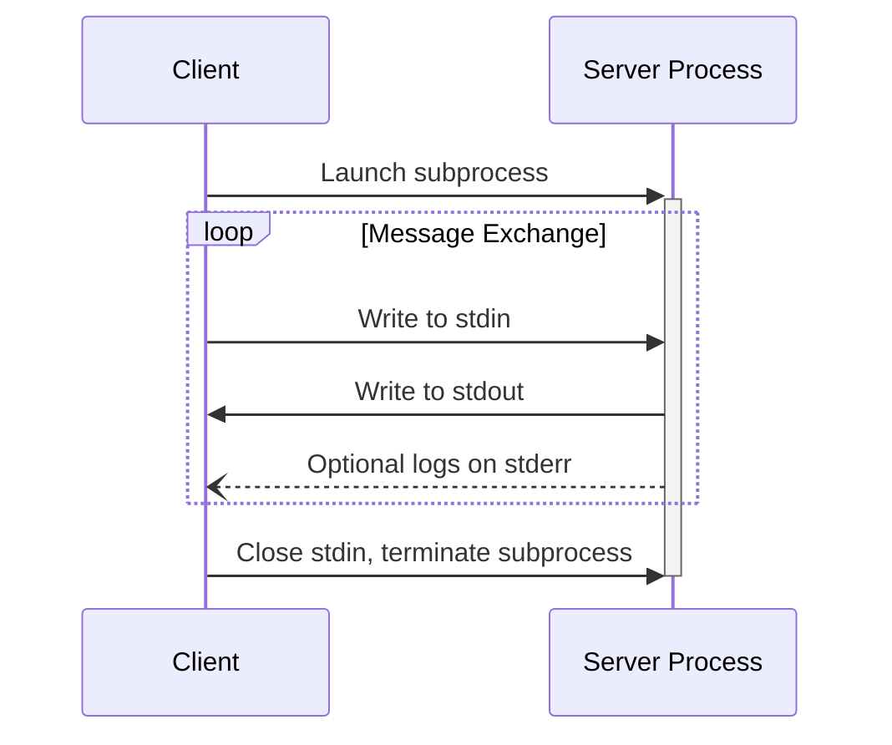
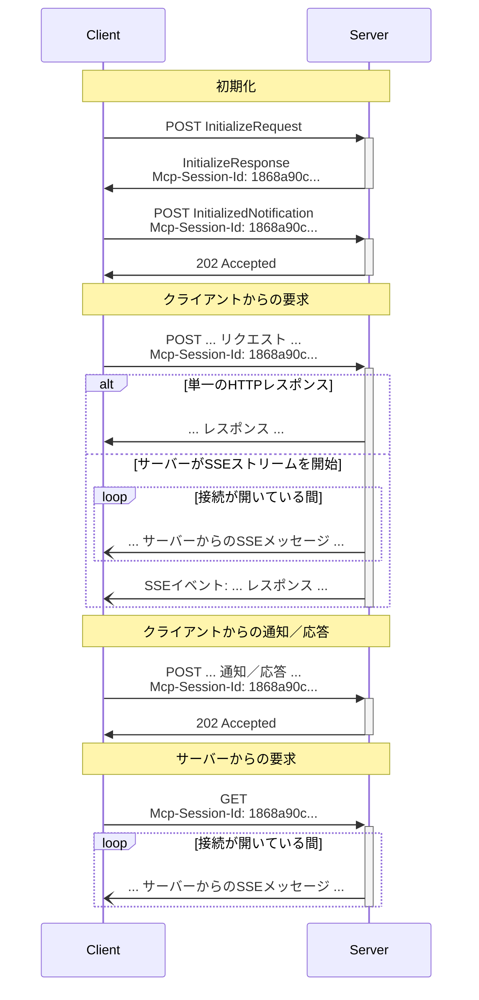

<Info>**プロトコル改訂**: draft</Info>

MCPはメッセージのエンコードにJSON-RPCを使用します。JSON-RPCメッセージは**UTF-8**でエンコードされていなければなりません。

本プロトコルは現在、クライアントとサーバー間の通信向けに、2つの標準的なトランスポート機構を定義しています。

1. [stdio](#stdio)（標準入力・標準出力を用いた通信）
2. [ストリーム対応HTTP](#streamable-http)

クライアントは、可能な限りstdioを**サポートすることが望まれます**。

また、クライアントおよびサーバーがプラグイン可能な方式で
[カスタムトランスポート](#custom-transports)を実装することも可能です。

  ## stdio

**stdio** トランスポートでは、次のとおりです。

* クライアントは MCPサーバー をサブプロセスとして起動します。
* サーバーは標準入力（`stdin`）から JSON-RPC メッセージを読み取り、標準出力（`stdout`）へメッセージを送信します。
* メッセージは個々の JSON-RPC のリクエスト、通知、またはレスポンスです。
* メッセージは改行で区切られ、埋め込みの改行を含めてはなりません（**MUST NOT**）。
* サーバーはログ目的で標準エラー（`stderr`）へ UTF-8 文字列を書き込んでもかまいません（**MAY**）。クライアントはこのログを取得、転送、または無視してもかまいません（**MAY**）。
* サーバーは有効な MCP メッセージ以外を `stdout` に書き込んではなりません（**MUST NOT**）。
* クライアントは有効な MCP メッセージ以外をサーバーの `stdin` に書き込んではなりません（**MUST NOT**）。

  ## ストリーム対応HTTP

<Info>
  これはプロトコルバージョン 2024-11-05 の[HTTP+SSE
  トランスポート](/ja/specification/2024-11-05/basic/transports#http-with-sse)を置き換えます。下記の[後方互換性](#backwards-compatibility)
  ガイドを参照してください。
</Info>

**ストリーム対応HTTP**トランスポートでは、サーバーは複数のクライアント接続を処理できる独立したプロセスとして動作します。このトランスポートは HTTP の POST および GET リクエストを使用します。
サーバーは必要に応じて[サーバー送信イベント（SSE）](https://en.wikipedia.org/wiki/Server-sent_events)を利用し、複数のサーバーメッセージをストリーミングできます。これにより、基本的な MCPサーバーだけでなく、ストリーミングやサーバーからクライアントへの通知・リクエストに対応する、より多機能なサーバーも実現できます。

サーバーは、POST と GET の両メソッドをサポートする単一の HTTP エンドポイントパス（以下、**MCPエンドポイント**）を提供する必要があります（MUST）。たとえば、`https://example.com/mcp` のような URL が考えられます。

  #### セキュリティ警告

ストリーム対応HTTPトランスポートを実装する際は、以下に留意してください。

1. すべての受信接続で `Origin` ヘッダーを検証し、DNSリバインディング攻撃を防ぐことがサーバーには必須（MUST）です
2. ローカル実行時は、サーバーはすべてのネットワークインターフェイス（0.0.0.0）ではなく、localhost（127.0.0.1）のみにバインドすることが推奨（SHOULD）されます
3. すべての接続に対して適切な認証を実装することが推奨（SHOULD）されます

これらの保護がない場合、攻撃者はDNSリバインディングを悪用して、リモートのウェブサイトからローカルのMCPサーバーとやり取りできてしまいます。

  ### サーバーへのメッセージ送信

クライアントから送信されるすべてのJSON-RPCメッセージは、MCPエンドポイントへの新規のHTTP POSTリクエストであることが**必須**です。

1. クライアントは、JSON-RPCメッセージをMCPエンドポイントに送信する際、HTTP POSTを使用することが**必須**です。
2. クライアントは、`Accept`ヘッダーに`application/json`と`text/event-stream`の両方を、サポートするコンテンツタイプとして指定することが**必須**です。
3. POSTリクエストのボディは、単一のJSON-RPCの_request_、*notification*、または_response_であることが**必須**です。
4. 入力がJSON-RPCの_response_または_notification_の場合:
   * サーバーが入力を受け付けた場合、本文なしでHTTPステータスコード202 Acceptedを返すことが**必須**です。
   * サーバーが入力を受け付けられない場合、HTTPエラーステータスコード（例: 400 Bad Request）を返すことが**必須**です。HTTPレスポンスボディは、`id`を持たないJSON-RPCの_error response_としても**可**です。
5. 入力がJSON-RPCの_request_の場合、サーバーはSSEストリームを開始するために`Content-Type: text/event-stream`を返すか、単一のJSONオブジェクトを返すために`Content-Type: application/json`を返すことが**必須**です。クライアントはこれら両方のケースをサポートすることが**必須**です。
6. サーバーがSSEストリームを開始した場合:
   * SSEストリームには、POSTボディで送信されたJSON-RPCの_request_に対するJSON-RPCの_response_が最終的に含まれることが**推奨**されます。
   * サーバーは、JSON-RPCの_response_を送信する前に、JSON-RPCの_request_や_notification_を送信しても**可**です。これらのメッセージは、元のクライアント_request_に関連していることが**推奨**されます。
   * [session](#session-management)の有効期限切れを除き、受信したJSON-RPCの_request_に対するJSON-RPCの_response_を送信する前にSSEストリームを閉じないことが**推奨**されます。
   * JSON-RPCの_response_送信後は、サーバーはSSEストリームを閉じることが**推奨**されます。
   * 切断はいつでも発生し得ます（例: ネットワーク状況）。したがって:
     * 切断を、クライアントがリクエストをキャンセルしたと解釈すべきではありません。
     * キャンセルする場合、クライアントは明示的にMCPの`CancelledNotification`を送信することが**推奨**されます。
     * 切断によるメッセージ損失を避けるため、サーバーはストリームを[resumable](#resumability-and-redelivery)にしても**可**です。

  ### サーバーからのメッセージの受信

1. クライアントは、MCPエンドポイントに対してHTTP GETを発行してもよい（MAY）。これはSSEストリームを開くために使用でき、クライアントが先にHTTP POSTでデータを送信しなくても、サーバーがクライアントへ通信できるようにする。
2. クライアントは、`Accept` ヘッダーに `text/event-stream` をサポートするコンテンツタイプとして含めなければならない（MUST）。
3. サーバーは、このHTTP GETに対して `Content-Type: text/event-stream` を返すか、あるいはHTTP 405 Method Not Allowedを返して、このエンドポイントでSSEストリームを提供していないことを示さなければならない（MUST）。
4. サーバーがSSEストリームを開始する場合:
   * サーバーは、ストリーム上でJSON-RPCのリクエストおよび通知を送信してもよい（MAY）。
   * これらのメッセージは、クライアントからの同時実行中のいかなるJSON-RPCリクエストとも無関係であるべきである（SHOULD）。
   * サーバーは、以前のクライアントリクエストに関連付けられたストリームを[再開](#resumability-and-redelivery)する場合を除き、ストリーム上でJSON-RPCのレスポンスを送ってはならない（MUST NOT）。
   * サーバーは、いつでもSSEストリームを閉じてもよい（MAY）。
   * クライアントは、いつでもSSEストリームを閉じてもよい（MAY）。

  ### 複数接続

1. クライアントは、複数のSSEストリームに同時に接続したままにしてもよい（**MAY**）。
2. サーバーは、各JSON-RPCメッセージを接続中のストリームのうち1つにのみ送信しなければならない（**MUST**）。つまり、同一メッセージを複数のストリームにブロードキャストしてはならない（**MUST NOT**）。
   * メッセージ損失のリスクは、ストリームを[再開可能](#resumability-and-redelivery)にすることで軽減できる（**MAY**）。

  ### レジュームと再配信

切断された接続の再開や、失われる可能性のあるメッセージの再配信をサポートするために:

1. サーバーは、[SSE標準](https://html.spec.whatwg.org/multipage/server-sent-events.html#event-stream-interpretation)に記載のとおり、SSEイベントに`id`フィールドを付与しても**よい（MAY）**。
   * 付与する場合、そのIDは、その[セッション](#session-management)内のすべてのストリーム—またはセッション管理を使用していない場合は当該クライアントとのすべてのストリーム—をまたいでグローバルに一意である**必要がある（MUST）**。
2. クライアントが切断後に再開したい場合、MCPエンドポイントにHTTP GETを発行し、受信した最後のイベントIDを示す[`Last-Event-ID`](https://html.spec.whatwg.org/multipage/server-sent-events.html#the-last-event-id-header)ヘッダーを含める**べきである（SHOULD）**。
   * サーバーは、このヘッダーを使用して、最後のイベントIDの後に送信されるはずだったメッセージを、_切断されていたストリーム上で_再送し、その時点からストリームを再開しても**よい（MAY）**。
   * サーバーは、別のストリームで配信されるはずだったメッセージを再送しては**ならない（MUST NOT）**。

言い換えると、これらのイベントIDはサーバーが_ストリームごと_に割り当て、そのストリーム内でのカーソルとして機能する**べきである**。

  ### セッション管理

MCPの「セッション」は、[初期化フェーズ](/ja/specification/draft/basic/lifecycle)から始まる、クライアントとサーバー間の論理的に関連するやり取りの集合です。ステートフルなセッションを確立したいサーバーをサポートするために:

1. ストリーム対応HTTPトランスポートを使用するサーバーは、初期化時に、`InitializeResult` を含むHTTPレスポンスの `Mcp-Session-Id` ヘッダーにセッションIDを含めることで、セッションIDを割り当てることが**できます**。
   * セッションIDは、グローバルに一意で暗号学的に安全である**べきです**（例: 安全に生成されたUUID、JWT、または暗号学的ハッシュ）。
   * セッションIDは、可視ASCII文字（0x21〜0x7E）のみで構成されている**必要があります**。
2. 初期化時にサーバーから `Mcp-Session-Id` が返された場合、ストリーム対応HTTPトランスポートを使用するクライアントは、以降のすべてのHTTPリクエストの `Mcp-Session-Id` ヘッダーにそれを含める**必要があります**。
   * セッションIDを必須とするサーバーは、（初期化以外で）`Mcp-Session-Id` ヘッダーのないリクエストに対して、HTTP 400 Bad Request で応答する**べきです**。
3. サーバーは、任意の時点でセッションを終了することが**できます**。以後、そのセッションIDを含むリクエストには HTTP 404 Not Found で応答する**必要があります**。
4. クライアントが、`Mcp-Session-Id` を含むリクエストへの応答として HTTP 404 を受け取った場合、セッションIDを付与せずに新しい `InitializeRequest` を送信して新しいセッションを開始する**必要があります**。
5. もはや特定のセッションを必要としないクライアント（例: ユーザーがクライアントアプリケーションを離れる場合）は、セッションを明示的に終了するため、`Mcp-Session-Id` ヘッダーを付けて MCP エンドポイントに HTTP DELETE を送信する**べきです**。
   * サーバーは、クライアントによるセッション終了を許可しないことを示すために、このリクエストに HTTP 405 Method Not Allowed で応答することが**できます**。

  ### シーケンス図

  ### プロトコルバージョンヘッダー

HTTP を使用する場合、クライアントは以後のすべての MCP サーバーへのリクエストに `MCP-Protocol-Version: <protocol-version>` HTTP ヘッダーを必ず含めなければなりません。これにより、MCP サーバーは MCP プロトコルのバージョンに基づいて応答できます。

例: `MCP-Protocol-Version: 2025-06-18`

クライアントが送信するプロトコルバージョンは、[初期化時のネゴシエーション](/ja/specification/draft/basic/lifecycle#version-negotiation)で合意されたものにするべきです。

後方互換性のため、サーバーが `MCP-Protocol-Version` ヘッダーを受け取らず、かつバージョンを特定する他の手段（たとえば初期化時にネゴシエーションで合意したプロトコルバージョンに依拠することなど）もない場合、サーバーはプロトコルバージョン `2025-03-26` を前提とするべきです。

サーバーが無効または未サポートの `MCP-Protocol-Version` を含むリクエストを受け取った場合は、`400 Bad Request` で必ず応答しなければなりません。

  ### 後方互換性

クライアントとサーバーは、非推奨となった[HTTP+SSE
トランスポート](/ja/specification/2024-11-05/basic/transports#http-with-sse)（プロトコルバージョン 2024-11-05）との後方互換性を、次のように維持できます。

古いクライアントをサポートしたい**サーバー**は:

* ストリーム対応HTTP用に定義された新しい「MCPエンドポイント」と並行して、旧トランスポートの SSE エンドポイントと POST エンドポイントの両方を引き続きホストする。
  * 旧 POST エンドポイントと新しい MCP エンドポイントを統合することも可能だが、不要な複雑さを招く場合がある。

古いサーバーをサポートしたい**クライアント**は:

1. ユーザーから MCP サーバーの URL を受け付ける。この URL は旧トランスポートまたは新トランスポートを使用するサーバーのいずれかを指す可能性がある。
2. 上記で定義したとおりの `Accept` ヘッダーを付けて、サーバーの URL に `InitializeRequest` を POST で送信することを試みる:
   * 成功した場合、クライアントはそのサーバーが新しいストリーム対応HTTPトランスポートをサポートしているとみなせる。
   * HTTP 4xx ステータスコード（例: 405 Method Not Allowed または 404 Not Found）で失敗した場合:
     * サーバーの URL に対して GET リクエストを送信し、これにより SSE ストリームが開かれ、最初のイベントとして `endpoint` イベントが返されることを期待する。
     * `endpoint` イベントが到着したら、そのサーバーは旧 HTTP+SSE トランスポートで動作しているとみなせるため、以後の通信にはそのトランスポートを使用する。

  ## カスタムトランスポート

クライアントとサーバーは、特定の要件に合わせて追加のカスタムトランスポート機構を実装してもかまいません（MAY）。本プロトコルはトランスポート非依存であり、双方向のメッセージ交換をサポートするあらゆる通信チャネル上で実装できます。

カスタムトランスポートをサポートする実装者は、MCPで定義されたJSON-RPCメッセージ形式とライフサイクル要件を維持することを必ず保証しなければなりません（MUST）。相互運用性の向上のため、カスタムトランスポートは接続確立方法やメッセージ交換パターンの詳細を文書化することが望まれます（SHOULD）。