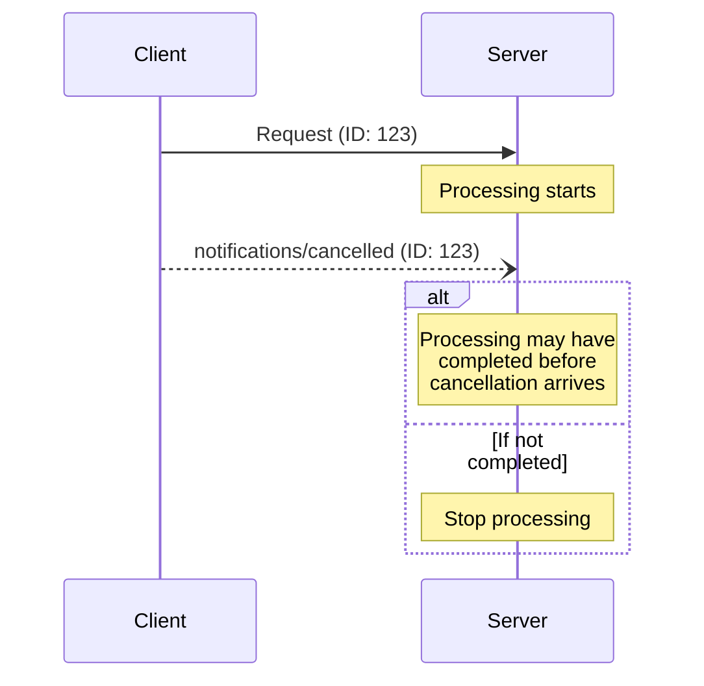

<div id="enable-section-numbers" />

<Info>**Protocol Revision**: draft</Info>

Model Context Protocol（MCP）は、通知メッセージを用いて進行中のリクエストを任意にキャンセルすることをサポートします。どちらの側からでもキャンセル通知を送信でき、これにより、以前に発行されたリクエストを終了すべきであることを示せます。

<div id="cancellation-flow">
  ## キャンセルフロー
</div>

進行中のリクエストをキャンセルする場合、次の内容を含む `notifications/cancelled`
通知を送信します。

- キャンセルするリクエストのID
- ログ出力や画面表示に利用できる任意の理由文字列

```json
{
  "jsonrpc": "2.0",
  "method": "notifications/cancelled",
  "params": {
    "requestId": "123",
    "reason": "User requested cancellation"
  }
}
```

<div id="behavior-requirements">
  ## 動作要件
</div>

1. 取消通知は、次の条件を満たす要求のみを参照しなければならない（MUST）:
   - 同一方向で以前に発行された
   - 依然として進行中であると見なされる
2. `initialize` 要求は、クライアントがキャンセルしてはならない（MUST NOT）
3. 取消通知の受信者は、次を行うべきである（SHOULD）:
   - 取り消された要求の処理を停止する
   - 関連するリソースを解放する
   - 取り消された要求に対する応答を送信しない
4. 受信者は、次の場合には取消通知を無視してもよい（MAY）:
   - 参照された要求が不明である
   - 処理が既に完了している
   - その要求をキャンセルできない
5. 取消通知の送信者は、その後に到着する当該要求へのいかなる応答も無視すべきである（SHOULD）

<div id="timing-considerations">
  ## タイミングに関する考慮事項
</div>

ネットワークの遅延により、キャンセル通知はリクエスト処理の完了後、場合によってはすでにレスポンス送信後に到着することがあります。

双方は、これらのレースコンディションを適切に処理することが**必須**です:



<div id="implementation-notes">
  ## 実装メモ
</div>

- 両者はデバッグのため、キャンセル理由をログに記録することが望ましい（SHOULD）
- アプリケーションのUIは、キャンセルが要求されたことを明示するべきである（SHOULD）

<div id="error-handling">
  ## エラー処理
</div>

無効なキャンセル通知は無視することが**推奨されます**:

- 不明なリクエストID
- 既に完了しているリクエスト
- 形式不正の通知

こうすることで、非同期通信におけるレースコンディションを許容しつつ、通知の「投げっぱなし」的な性質を維持できます。