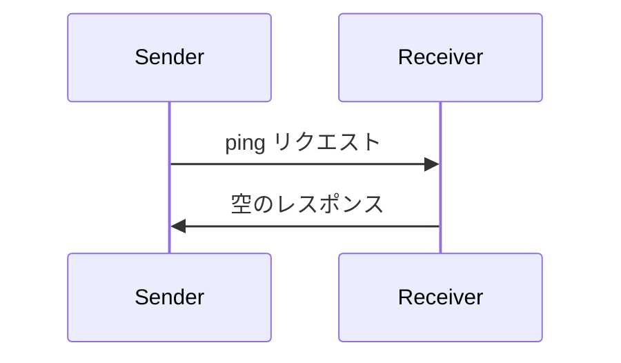

<div id="enable-section-numbers" />

<Info>**プロトコル版**: draft</Info>

Model Context Protocol（MCP）には、どちらの当事者も相手が引き続き応答しており、接続が維持されていることを確認できる任意の ping メカニズムが含まれています。

<div id="overview">
  ## 概要
</div>

ping 機能は、シンプルなリクエスト／レスポンスパターンで実装されています。クライアントとサーバーのどちらからでも、`ping` リクエストを送信して ping を開始できます。

<div id="message-format">
  ## メッセージ形式
</div>

ping リクエストは、パラメータを持たない標準的な JSON-RPC リクエストです:

```json
{
  "jsonrpc": "2.0",
  "id": "123",
  "method": "ping"
}
```

<div id="behavior-requirements">
  ## 動作要件
</div>

1. 受信側は、空のレスポンスで速やかに応答することが**必須**です：

```json
{
  "jsonrpc": "2.0",
  "id": "123",
  "result": {}
}
```

2. 合理的なタイムアウト期間内に応答が得られない場合、送信側は**任意**で以下を行ってもかまいません：
   - 接続が不活性になったと見なす
   - 接続を終了する
   - 再接続手順を試みる

<div id="usage-patterns">
  ## 使用パターン
</div>



<div id="implementation-considerations">
  ## 実装に関する考慮事項
</div>

- 接続の健全性を確認するため、実装は定期的に ping を送信することが望ましい（SHOULD）
- ping の頻度は設定可能であることが望ましい（SHOULD）
- タイムアウトはネットワーク環境に適切な値にすることが望ましい（SHOULD）
- ネットワークのオーバーヘッドを抑えるため、過度な ping は避けることが望ましい（SHOULD）

<div id="error-handling">
  ## エラー処理
</div>

- タイムアウトは接続失敗として扱うべきです（SHOULD）
- 複数回の ping 失敗時には接続をリセットしてもかまいません（MAY）
- 実装は診断のために ping 失敗をログに記録すべきです（SHOULD）