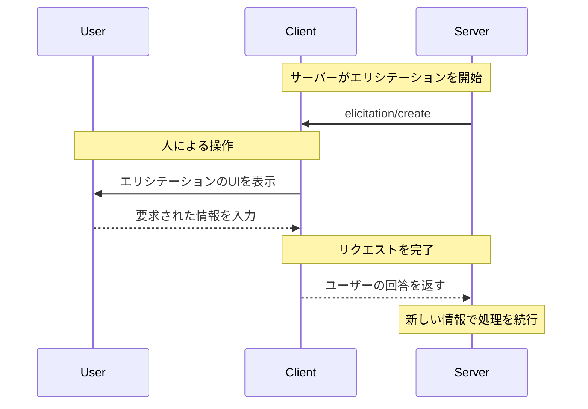

<div id="enable-section-numbers" />

<Info>**プロトコル改訂**: 草案</Info>

<Note>
  エリシテーションは、このバージョンのModel Context Protocol（MCP）仕様で新たに導入された機能であり、その設計は今後のプロトコルのバージョンで変更される可能性があります。
</Note>

Model Context Protocol（MCP）は、対話中にクライアントを介してサーバーがユーザーに追加情報を求めるための標準化された方法を提供します。このフローにより、クライアントはユーザーとのやり取りやデータ共有の制御を維持しつつ、サーバーは必要な情報を動的に収集できます。
サーバーはJSONスキーマを用いてユーザーから構造化データをリクエストし、応答を検証します。

<div id="user-interaction-model">
  ## ユーザーインタラクションモデル
</div>

MCPにおけるエリシテーションは、他のMCPサーバー機能の内側に_ネスト_された形でユーザー入力リクエストを発生させられるため、サーバーがインタラクティブなワークフローを実装できるようにします。

実装は、ニーズに合った任意のインターフェースパターンでエリシテーションを提供して構いません。プロトコル自体は特定のユーザーインタラクションモデルを要求しません。

<Warning>
  信頼性・安全性とセキュリティのために:

  * サーバーは、機微な情報の取得にエリシテーションを使用しては**なりません**。

  アプリケーションは**次を推奨**します:

  * どのサーバーが情報を要求しているかを明確に示すUIを提供する
  * 送信前にユーザーが自身の回答を確認・修正できるようにする
  * ユーザーのプライバシーを尊重し、明確な辞退およびキャンセルの選択肢を提供する
</Warning>

<div id="capabilities">
  ## 機能
</div>

エリシテーションをサポートするクライアントは、[初期化](/ja/specification/draft/basic/lifecycle#initialization)時に `elicitation` 機能を宣言しなければなりません（MUST）:

```json
{
  "capabilities": {
    "elicitation": {}
  }
}
```

<div id="protocol-messages">
  ## プロトコルメッセージ
</div>

<div id="creating-elicitation-requests">
  ### エリシテーション要求の作成
</div>

ユーザーに情報を求めるため、サーバーは `elicitation/create` リクエストを送信します。

<div id="simple-text-request">
  #### シンプルなテキストリクエスト
</div>

**リクエスト：**

```json
{
  "jsonrpc": "2.0",
  "id": 1,
  "method": "elicitation/create",
  "params": {
    "message": "GitHub のユーザー名を入力してください",
    "requestedSchema": {
      "type": "object",
      "properties": {
        "name": {
          "type": "string"
        }
      },
      "required": ["name"]
    }
  }
}
```

**レスポンス：**

```json
{
  "jsonrpc": "2.0",
  "id": 1,
  "result": {
    "action": "accept",
    "content": {
      "name": "octocat"
    }
  }
}
```

<div id="structured-data-request">
  #### 構造化データのリクエスト
</div>

**リクエスト：**

```json
{
  "jsonrpc": "2.0",
  "id": 2,
  "method": "elicitation/create",
  "params": {
    "message": "Please provide your contact information",
    "requestedSchema": {
      "type": "object",
      "properties": {
        "name": {
          "type": "string",
          "description": "Your full name"
        },
        "email": {
          "type": "string",
          "format": "email",
          "description": "Your email address"
        },
        "age": {
          "type": "number",
          "minimum": 18,
          "description": "Your age"
        }
      },
      "required": ["name", "email"]
    }
  }
}
```

**レスポンス：**

```json
{
  "jsonrpc": "2.0",
  "id": 2,
  "result": {
    "action": "accept",
    "content": {
      "name": "Monalisa Octocat",
      "email": "octocat@github.com",
      "age": 30
    }
  }
}
```

**拒否レスポンスの例：**

```json
{
  "jsonrpc": "2.0",
  "id": 2,
  "result": {
    "action": "decline"
  }
}
```

**キャンセルレスポンスの例：**

```json
{
  "jsonrpc": "2.0",
  "id": 2,
  "result": {
    "action": "cancel"
  }
}
```

<div id="message-flow">
  ## メッセージフロー
</div>



<div id="request-schema">
  ## リクエストスキーマ
</div>

`requestedSchema` フィールドにより、サーバーは制限されたサブセットの JSON Schema を用いて、想定される応答の構造を定義できます。クライアントのユーザー体験を簡潔に保つため、エリシテーションのスキーマは、プリミティブなプロパティのみを持つフラットなオブジェクトに限定されます:

```json
"requestedSchema": {
  "type": "object",
  "properties": {
    "propertyName": {
      "type": "string",
      "title": "Display Name",
      "description": "Description of the property"
    },
    "anotherProperty": {
      "type": "number",
      "minimum": 0,
      "maximum": 100
    }
  },
  "required": ["propertyName"]
}
```

<div id="supported-schema-types">
  ### サポートされるスキーマ型
</div>

スキーマは次のプリミティブ型に制限されています：

1. **String スキーマ**

   ```json
   {
     "type": "string",
     "title": "Display Name",
     "description": "Description text",
     "minLength": 3,
     "maxLength": 50,
     "pattern": "^[A-Za-z]+$",
     "format": "email",
     "default": "user@example.com"
   }
   ```

   サポートされるフォーマット: `email`, `uri`, `date`, `date-time`

2. **Number スキーマ**

   ```json
   {
     "type": "number", // または "integer"
     "title": "Display Name",
     "description": "Description text",
     "minimum": 0,
     "maximum": 100,
     "default": 50
   }
   ```

3. **Boolean スキーマ**

   ```json
   {
     "type": "boolean",
     "title": "Display Name",
     "description": "Description text",
     "default": false
   }
   ```

4. **Enum スキーマ**
   ```json
   {
     "type": "string",
     "title": "Display Name",
     "description": "Description text",
     "enum": ["option1", "option2", "option3"],
     "enumNames": ["Option 1", "Option 2", "Option 3"],
     "default": "option1"
   }
   ```

クライアントはこのスキーマを用いて次のことができます：

1. 適切な入力フォームを生成する
2. 送信前にユーザー入力を検証する
3. ユーザーにより良い指針を提供する

すべてのプリミティブ型は、現実的な初期値を示すための任意のデフォルト値をサポートします。デフォルトをサポートするクライアントは、これらの値でフォームフィールドを事前入力するべきです（SHOULD）。

クライアントのユーザー体験をシンプルにするため、複雑な入れ子構造、オブジェクト配列、その他の高度な JSON Schema 機能は意図的にサポートしていない点に留意してください。

<div id="response-actions">
  ## レスポンスアクション
</div>

エリシテーションのレスポンスは、異なるユーザー操作を明確に区別するために3つのアクションモデルを採用します：

```json
{
  "jsonrpc": "2.0",
  "id": 1,
  "result": {
    "action": "accept", // または "decline" または "cancel"
    "content": {
      "propertyName": "value",
      "anotherProperty": 42
    }
  }
}
```

3つのレスポンスアクションは次のとおりです：

1. **Accept** (`action: "accept"`): ユーザーが明示的に承認し、データを送信した
   * `content` フィールドには、要求されたスキーマに適合する送信データが含まれる
   * 例: ユーザーが「Submit」「OK」「Confirm」などをクリック

2. **Decline** (`action: "decline"`): ユーザーが要求を明示的に拒否した
   * `content` フィールドは通常省略される
   * 例: ユーザーが「Reject」「Decline」「No」などをクリック

3. **Cancel** (`action: "cancel"`): ユーザーが明示的な選択をせずに閉じた
   * `content` フィールドは通常省略される
   * 例: ユーザーがダイアログを閉じた、外側をクリックした、Escapeキーを押した など

サーバーは各状態を適切に処理する必要があります：

* **Accept**: 送信データを処理する
* **Decline**: 明示的な拒否を処理する（例：代替案を提示する）
* **Cancel**: 取り消し（ディスミス）を処理する（例：後で再度プロンプトする）

<div id="security-considerations">
  ## セキュリティに関する考慮事項
</div>

1. サーバーは、エリシテーションを通じて機微な情報を要求してはならない（MUST NOT）
2. クライアントは、ユーザー承認のためのコントロールを実装すべきである（SHOULD）
3. 両者は、提供されたスキーマに照らしてエリシテーションの内容を検証すべきである（SHOULD）
4. クライアントは、どのサーバーが情報を要求しているかを明確に示すべきである（SHOULD）
5. クライアントは、ユーザーがいつでもエリシテーションの要求を拒否できるようにすべきである（SHOULD）
6. クライアントは、レート制限を実装すべきである（SHOULD）
7. クライアントは、どの情報がなぜ要求されているのかが明確になるようにエリシテーションの要求を提示すべきである（SHOULD）