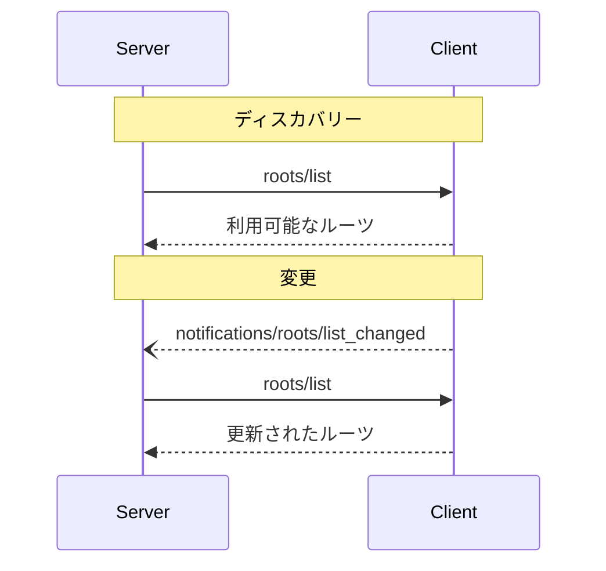

<div id="enable-section-numbers" />

<Info>**プロトコル改訂**: draft</Info>

Model Context Protocol（MCP）は、クライアントがファイルシステムの「ルーツ」をサーバーに公開するための標準化された方法を提供します。ルーツは、サーバーがファイルシステム内で動作できる範囲の境界を定義し、どのディレクトリやファイルにアクセス可能かを明確にします。対応クライアントからサーバーはルーツの一覧を要求でき、その一覧に変更があった場合は通知を受け取れます。

<div id="user-interaction-model">
  ## ユーザーインタラクションモデル
</div>

MCP におけるルーツは、一般的にワークスペースやプロジェクトの設定インターフェースを通じて公開されます。

たとえば、実装側はワークスペース／プロジェクトのピッカーを用意し、サーバーがアクセスすべきディレクトリやファイルをユーザーが選択できるようにできます。これは、バージョン管理システムやプロジェクトファイルからの自動ワークスペース検出と組み合わせることも可能です。

ただし、実装はニーズに合った任意のインターフェースパターンでルーツを公開して構いません。プロトコル自体は特定のユーザーインタラクションモデルを要求しません。

<div id="capabilities">
  ## 機能
</div>

ルーツをサポートするクライアントは、[初期化](/ja/specification/draft/basic/lifecycle#initialization)時に `roots` の機能を宣言することが**必須**です。

```json
{
  "capabilities": {
    "roots": {
      "listChanged": true
    }
  }
}
```

`listChanged` は、ルーツのリストが変更されたときにクライアントが通知を発行するかどうかを示します。

<div id="protocol-messages">
  ## プロトコルメッセージ
</div>

<div id="listing-roots">
  ### ルーツの一覧取得
</div>

ルーツを取得するには、サーバーは `roots/list` リクエストを送信します:

**リクエスト:**

```json
{
  "jsonrpc": "2.0",
  "id": 1,
  "method": "roots/list"
}
```

**レスポンス:**

```json
{
  "jsonrpc": "2.0",
  "id": 1,
  "result": {
    "roots": [
      {
        "uri": "file:///home/user/projects/myproject",
        "name": "My Project"
      }
    ]
  }
}
```

<div id="root-list-changes">
  ### ルーツ一覧の変更
</div>

ルーツが変更された場合、`listChanged` をサポートするクライアントは通知を送信しなければ**なりません**:

```json
{
  "jsonrpc": "2.0",
  "method": "notifications/roots/list_changed"
}
```

<div id="message-flow">
  ## メッセージフロー
</div>



<div id="data-types">
  ## データ型
</div>

<div id="root">
  ### ルーツ
</div>

ルート定義には以下が含まれます:

* `uri`: ルーツの一意の識別子。現在の仕様では、これは `file://` のURIであることが**必須**です。
* `name`: 表示用の任意の人間可読な名前。

さまざまなユースケースにおけるルーツの例:

<div id="project-directory">
  #### プロジェクトディレクトリ
</div>

```json
{
  "uri": "file:///home/user/projects/myproject",
  "name": "My Project"
}
```

<div id="multiple-repositories">
  #### 複数のリポジトリ
</div>

```json
[
  {
    "uri": "file:///home/user/repos/frontend",
    "name": "フロントエンド リポジトリ"
  },
  {
    "uri": "file:///home/user/repos/backend",
    "name": "バックエンド リポジトリ"
  }
]
```

<div id="error-handling">
  ## エラーハンドリング
</div>

クライアントは、一般的な失敗ケースに対して標準的なJSON-RPCエラーを返すべきです（SHOULD）:

* クライアントがルーツをサポートしていない場合: `-32601`（メソッドが見つかりません）
* 内部エラー: `-32603`

エラー例:

```json
{
  "jsonrpc": "2.0",
  "id": 1,
  "error": {
    "code": -32601,
    "message": "Roots not supported",
    "data": {
      "reason": "Client does not have roots capability"
    }
  }
}
```

<div id="security-considerations">
  ## セキュリティ上の考慮事項
</div>

1. クライアントは**必須**:
   * 適切な権限を付与したルーツのみを公開する
   * パストラバーサルを防ぐため、すべてのルーツURIを検証する
   * 適切なアクセス制御を実装する
   * ルーツの到達可能性を監視する

2. サーバーは**推奨**:
   * ルーツが利用不能になるケースを適切に処理する
   * 操作中はルーツの境界を遵守する
   * 提供されたルーツに照らしてすべてのパスを検証する

<div id="implementation-guidelines">
  ## 実装ガイドライン
</div>

1. クライアントは**推奨**:
   * サーバーにルーツを公開する前に、ユーザーに明示的な同意を得る
   * ルーツ管理のための分かりやすいユーザーインターフェースを提供する
   * 公開前にルーツへアクセス可能かを検証する
   * ルーツの変更を監視する

2. サーバーは**推奨**:
   * 使用前にルーツ機能が利用可能かを確認する
   * ルーツ一覧の変更にスムーズに対応する
   * 操作においてルーツの境界を厳守する
   * ルーツ情報を適切にキャッシュする