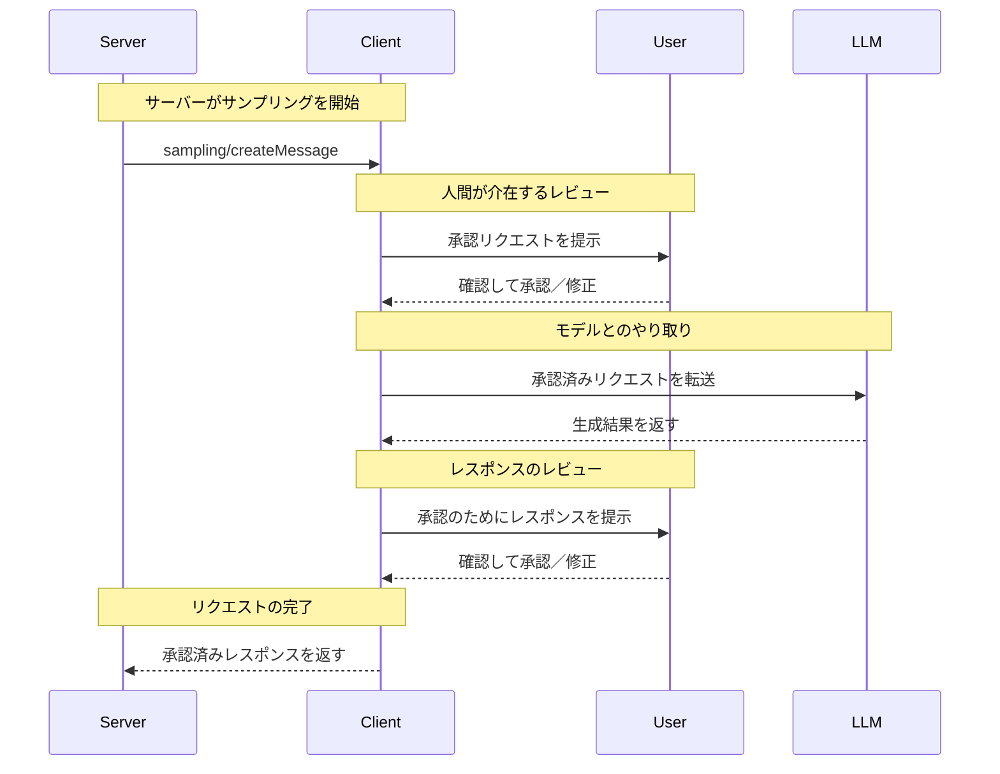

<div id="enable-section-numbers" />

<Info>**プロトコル改訂**: draft</Info>

Model Context Protocol（MCP）は、サーバーがクライアント経由で言語モデルに対し、LLMのサンプリング（「completions」や「generations」）をリクエストするための標準化された手段を提供します。このフローにより、クライアントはモデルへのアクセス、選択、権限を引き続き管理しつつ、サーバーはAI機能を活用できます。サーバー側のAPIキーは不要です。サーバーはテキスト、音声、または画像に基づくやり取りをリクエストでき、必要に応じてプロンプトにMCPサーバーからのコンテキストを含めることも可能です。

<div id="user-interaction-model">
  ## ユーザーインタラクションモデル
</div>

MCPにおけるサンプリングは、LLM呼び出しを他のMCPサーバー機能の内側で&#95;ネスト&#95;して実行できるようにすることで、サーバーがエージェント的な挙動を実装できるようにします。

実装は、ニーズに合う任意のインターフェースパターンでサンプリングを提供して構いません。プロトコル自体は特定のユーザーインタラクションモデルを義務付けていません。

<Warning>
  トラスト＆セーフティおよびセキュリティの観点から、サンプリング要求を拒否できる権限を持つ人間が常に関与しているべきです（**SHOULD**）。

  アプリケーションは**SHOULD**：

  * サンプリング要求を簡単かつ直感的に確認できるUIを提供する
  * 送信前にプロンプトを閲覧・編集できるようにする
  * 生成された応答を配信前に確認できるように提示する
</Warning>

<div id="capabilities">
  ## 機能
</div>

サンプリングをサポートするクライアントは、[初期化](/ja/specification/draft/basic/lifecycle#initialization)時に `sampling` 機能を宣言しなければなりません（MUST）。

```json
{
  "capabilities": {
    "sampling": {}
  }
}
```

<div id="protocol-messages">
  ## プロトコルメッセージ
</div>

<div id="creating-messages">
  ### メッセージの作成
</div>

言語モデルによる生成を要求するには、サーバーが `sampling/createMessage` リクエストを送信します:

**リクエスト:**

```json
{
  "jsonrpc": "2.0",
  "id": 1,
  "method": "sampling/createMessage",
  "params": {
    "messages": [
      {
        "role": "user",
        "content": {
          "type": "text",
          "text": "What is the capital of France?"
        }
      }
    ],
    "modelPreferences": {
      "hints": [
        {
          "name": "claude-3-sonnet"
        }
      ],
      "intelligencePriority": 0.8,
      "speedPriority": 0.5
    },
    "systemPrompt": "You are a helpful assistant.",
    "maxTokens": 100
  }
}
```

**レスポンス:**

```json
{
  "jsonrpc": "2.0",
  "id": 1,
  "result": {
    "role": "assistant",
    "content": {
      "type": "text",
      "text": "The capital of France is Paris."
    },
    "model": "claude-3-sonnet-20240307",
    "stopReason": "endTurn"
  }
}
```

<div id="message-flow">
  ## メッセージフロー
</div>



<div id="data-types">
  ## データ型
</div>

<div id="messages">
  ### メッセージ
</div>

サンプリングのメッセージには次のものを含められます。

<div id="text-content">
  #### テキストコンテンツ
</div>

```json
{
  "type": "text",
  "text": "メッセージの内容"
}
```

<div id="image-content">
  #### 画像コンテンツ
</div>

```json
{
  "type": "image",
  "data": "base64-encoded-image-data",
  "mimeType": "image/jpeg"
}
```

<div id="audio-content">
  #### 音声コンテンツ
</div>

```json
{
  "type": "audio",
  "data": "base64-encoded-audio-data",
  "mimeType": "audio/wav"
}
```

<div id="model-preferences">
  ### モデルの優先設定
</div>

MCPにおけるモデル選択は、サーバーとクライアントがそれぞれ異なるAIプロバイダーを利用し、提供されるモデルも異なり得るため、慎重な抽象化が求められます。クライアントがそのモデルにアクセスできなかったり、別のプロバイダーの同等モデルを選びたい場合があるため、サーバーは単にモデル名だけで特定のモデルを要求することはできません。

これに対処するため、MCPは抽象的な機能の優先度と、任意のモデルヒントを組み合わせる優先設定システムを実装しています。

<div id="capability-priorities">
  #### 機能の優先度
</div>

サーバーは正規化された3つの優先度値（0〜1）でニーズを表現します:

* `costPriority`: コスト削減の重視度。値が高いほど安価なモデルを優先します。
* `speedPriority`: 低レイテンシの重視度。値が高いほど高速なモデルを優先します。
* `intelligencePriority`: 高度な能力の重視度。値が高いほど
  より高性能なモデルを優先します。

<div id="model-hints">
  #### モデルヒント
</div>

優先度は特性に基づいてモデル選択を助けますが、`hints` を使うとサーバーは
特定のモデルやモデルファミリーを提案できます:

* ヒントは部分文字列として扱われ、モデル名に柔軟にマッチします
* 複数のヒントは優先度の高い順に評価されます
* クライアントは異なるプロバイダーの同等モデルへヒントをマッピングすることが**できます**
* ヒントは助言的なものであり、最終的なモデル選択はクライアントが行います

例:

```json
{
  "hints": [
    { "name": "claude-3-sonnet" }, // Sonnetクラスのモデルを優先
    { "name": "claude" } // 任意のClaudeモデルにフォールバック
  ],
  "costPriority": 0.3, // コストの重要度は低い
  "speedPriority": 0.8, // スピードの重要度は高い
  "intelligencePriority": 0.5 // 能力要件は中程度
}
```

クライアントはこれらの指示を基に、利用可能なオプションから適切なモデルを選択します。たとえば、クライアントがClaudeモデルにアクセスできずGeminiのみ利用可能な場合、類似する能力に基づき sonnet のヒントを `gemini-1.5-pro` にマッピングすることがあります。

<div id="error-handling">
  ## エラー処理
</div>

クライアントは、一般的な失敗ケースに対してエラーを返すべきです（SHOULD）:

エラー例:

```json
{
  "jsonrpc": "2.0",
  "id": 1,
  "error": {
    "code": -1,
    "message": "User rejected sampling request"
  }
}
```

<div id="security-considerations">
  ## セキュリティに関する考慮事項
</div>

1. クライアントはユーザー承認のコントロールを実装することが望ましい（SHOULD）
2. 両者はメッセージ内容を検証することが望ましい（SHOULD）
3. クライアントはモデルの嗜好に関するヒントを尊重することが望ましい（SHOULD）
4. クライアントはレート制限を実装することが望ましい（SHOULD）
5. 両者は機密データを適切に取り扱わなければならない（MUST）