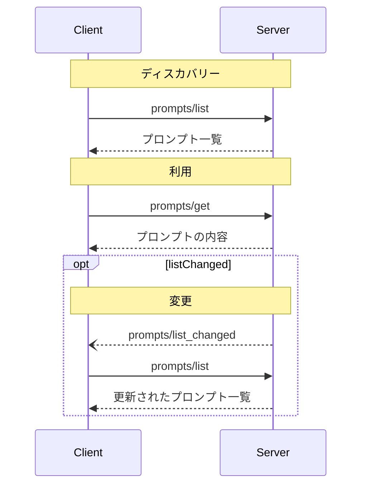

<div id="enable-section-numbers" />

<Info>**プロトコル改訂**: draft</Info>

Model Context Protocol（MCP）は、サーバーがクライアントに対してプロンプト
テンプレートを公開するための標準化された方法を提供します。プロンプトにより、サーバーは言語モデルとの対話に用いる構造化されたメッセージや
指示を提供できます。クライアントは、利用可能なプロンプトを検出し、その内容を取得し、引数を渡してカスタマイズできます。

<div id="user-interaction-model">
  ## ユーザーインタラクションモデル
</div>

プロンプトは**ユーザー主導**であるように設計されており、ユーザーが明示的に選択して使えるようサーバーからクライアントに公開されます。

一般的には、ユーザーインターフェースでユーザーが起動するコマンドによってプロンプトが呼び出され、利用可能なプロンプトを自然に見つけて実行できるようになります。

例えば、スラッシュコマンドとして:


ただし、実装者は自分たちのニーズに合った任意のインターフェースパターンでプロンプトを公開して構いません。プロトコル自体は特定のユーザーインタラクションモデルを義務付けていません。

<div id="capabilities">
  ## 機能
</div>

プロンプトをサポートするサーバーは、[初期化](/ja/specification/draft/basic/lifecycle#initialization)時に `prompts` 機能を宣言することが**必須**です:

```json
{
  "capabilities": {
    "prompts": {
      "listChanged": true
    }
  }
}
```

`listChanged` は、利用可能なプロンプトの一覧が変更された際に、サーバーが通知を発行するかどうかを示します。

<div id="protocol-messages">
  ## プロトコルメッセージ
</div>

<div id="listing-prompts">
  ### プロンプトの一覧取得
</div>

利用可能なプロンプトを取得するには、クライアントは `prompts/list` リクエストを送信します。この操作は[ページネーション](/ja/specification/draft/server/utilities/pagination)に対応しています。

**リクエスト:**

```json
{
  "jsonrpc": "2.0",
  "id": 1,
  "method": "prompts/list",
  "params": {
    "cursor": "optional-cursor-value"
  }
}
```

**レスポンス:**

```json
{
  "jsonrpc": "2.0",
  "id": 1,
  "result": {
    "prompts": [
      {
        "name": "code_review",
        "title": "コードレビューを依頼",
        "description": "LLM にコード品質の分析と改善提案を依頼します",
        "arguments": [
          {
            "name": "code",
            "description": "レビュー対象のコード",
            "required": true
          }
        ],
        "icons": [
          {
            "src": "https://example.com/review-icon.svg",
            "mimeType": "image/svg+xml",
            "sizes": "any"
          }
        ]
      }
    ],
    "nextCursor": "next-page-cursor"
  }
}
```

<div id="getting-a-prompt">
  ### プロンプトの取得
</div>

特定のプロンプトを取得するには、クライアントは `prompts/get` リクエストを送信します。引数は[Completion API](/ja/specification/draft/server/utilities/completion)で自動補完できます。

**リクエスト:**

```json
{
  "jsonrpc": "2.0",
  "id": 2,
  "method": "prompts/get",
  "params": {
    "name": "code_review",
    "arguments": {
      "code": "def hello():\n    print('world')"
    }
  }
}
```

**レスポンス:**

```json
{
  "jsonrpc": "2.0",
  "id": 2,
  "result": {
    "description": "コードレビュー用のプロンプト",
    "messages": [
      {
        "role": "user",
        "content": {
          "type": "text",
          "text": "次のPythonコードをレビューしてください:\ndef hello():\n    print('world')"
        }
      }
    ]
  }
}
```

<div id="list-changed-notification">
  ### リスト変更通知
</div>

利用可能なプロンプトのリストが変更された場合、`listChanged`
機能を宣言しているサーバーは通知を送信することが**推奨されます**:

```json
{
  "jsonrpc": "2.0",
  "method": "notifications/prompts/list_changed"
}
```

<div id="message-flow">
  ## メッセージフロー
</div>



<div id="data-types">
  ## データ型
</div>

<div id="prompt">
  ### プロンプト
</div>

プロンプト定義には次が含まれます：

* `name`: プロンプトの一意の識別子
* `title`: 表示用の任意の人間可読名
* `description`: 任意の人間可読の説明
* `arguments`: カスタマイズ用の任意の引数リスト

<div id="promptmessage">
  ### PromptMessage
</div>

プロンプト内のメッセージには次を含められます：

* `role`: 話し手を示す &quot;user&quot; または &quot;assistant&quot; のいずれか
* `content`: 次のいずれかのコンテンツタイプ

<Note>
  プロンプトメッセージのすべてのコンテンツタイプは、対象読者、優先度、変更時刻に関するメタデータ用の任意指定の
  [annotations](/ja/specification/2025-06-18/server/resources#annotations)
  をサポートします。
</Note>

<div id="text-content">
  #### テキストコンテンツ
</div>

テキストコンテンツはプレーンテキストのメッセージを表します:

```json
{
  "type": "text",
  "text": "The text content of the message"
}
```

これは自然言語での対話に最も一般的に使われるコンテンツタイプです。

<div id="image-content">
  #### 画像コンテンツ
</div>

画像コンテンツを使用すると、メッセージに視覚情報を含めることができます。

```json
{
  "type": "image",
  "data": "base64-encoded-image-data",
  "mimeType": "image/png"
}
```

画像データは**必ず**base64でエンコードし、有効なMIMEタイプを含める必要があります。これにより、視覚的なコンテキストが重要なマルチモーダルなやり取りが可能になります。

<div id="audio-content">
  #### 音声コンテンツ
</div>

音声コンテンツを使うと、メッセージに音声情報を含められます。

```json
{
  "type": "audio",
  "data": "base64-encoded-audio-data",
  "mimeType": "audio/wav"
}
```

音声データは必ず base64 でエンコードし、有効な MIME タイプを指定する必要があります。これにより、音声の文脈が重要なマルチモーダルな対話が可能になります。

<div id="embedded-resources">
  #### 埋め込みリソース
</div>

埋め込みリソースを使うと、メッセージ内でサーバー側のリソースを直接参照できます。

```json
{
  "type": "resource",
  "resource": {
    "uri": "resource://example",
    "name": "example",
    "title": "My Example Resource",
    "mimeType": "text/plain",
    "text": "Resource content"
  }
}
```

リソースにはテキストまたはバイナリ（blob）データのいずれかを含めることができ、かつ次を**必ず**含める必要があります。

* 有効なリソースURI
* 適切なMIMEタイプ
* テキスト本文またはbase64エンコードされたblobデータのいずれか

埋め込みリソースにより、ドキュメント、コードサンプル、その他の参照資料といったサーバー管理のコンテンツを、会話のフローにシームレスに取り込めます。

<div id="error-handling">
  ## エラー処理
</div>

サーバーは、一般的な失敗ケースに対して標準のJSON-RPCエラーを返すべきです（SHOULD）:

* 無効なプロンプト名: `-32602`（無効なパラメータ）
* 必須引数の欠如: `-32602`（無効なパラメータ）
* 内部エラー: `-32603`（内部エラー）

<div id="implementation-considerations">
  ## 実装に関する考慮事項
</div>

1. サーバーは処理前にプロンプトの引数を検証することが望ましい
2. クライアントは大量のプロンプト一覧に対してページネーションを適切に扱うことが望ましい
3. 両者は機能ネゴシエーションを適切に尊重することが望ましい

<div id="security">
  ## セキュリティ
</div>

インジェクション攻撃やリソースへの不正アクセスを防ぐため、実装はすべてのプロンプトの入力と出力を厳密に検証しなければなりません。