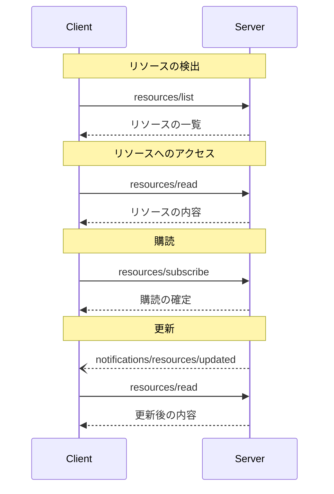

<div id="enable-section-numbers" />

<Info>**プロトコル改訂**: draft</Info>

Model Context Protocol（MCP）は、サーバーがクライアントにリソースを公開するための標準化された方法を提供します。リソースにより、サーバーはファイル、データベースのスキーマ、アプリケーション固有の情報など、言語モデルにコンテキストを与えるデータを共有できます。各リソースは
[URI](https://datatracker.ietf.org/doc/html/rfc3986)
によって一意に識別されます。

<div id="user-interaction-model">
  ## ユーザーインタラクションモデル
</div>

MCP におけるリソースは、ホストアプリケーションがニーズに応じてコンテキストの取り込み方法を決める、**アプリケーション主導**で設計されています。

たとえば、アプリケーションは次のことができます:

* ツリーまたはリストビューなどの UI 要素でリソースを提示し、明示的に選択できるようにする
* 利用可能なリソースをユーザーが検索・フィルタリングできるようにする
* ヒューリスティクスや AI モデルの選択に基づいてコンテキストを自動的に含める


ただし、実装はニーズに合う任意のインターフェースパターンでリソースを提示して構いません。プロトコル自体は特定のユーザーインタラクションモデルを規定しません。

<div id="capabilities">
  ## 機能
</div>

リソースをサポートするサーバーは、`resources` 機能を宣言することが**必須**です:

```json
{
  "capabilities": {
    "resources": {
      "subscribe": true,
      "listChanged": true
    }
  }
}
```

この機能は次の2つの任意機能をサポートします:

* `subscribe`: クライアントが個々のリソースの変更通知を受け取るために購読できるかどうか。
* `listChanged`: 利用可能なリソースの一覧が変更されたときに、サーバーが通知を送信するかどうか。

`subscribe` と `listChanged` はどちらも任意です—サーバーはどちらもサポートしない、片方のみ、または両方をサポートできます:

```json
{
  "capabilities": {
    "resources": {} // Neither feature supported
  }
}
```

```json
{
  "capabilities": {
    "resources": {
      "subscribe": true // Only subscriptions supported
    }
  }
}
```

```json
{
  "capabilities": {
    "resources": {
      "listChanged": true // Only list change notifications supported
    }
  }
}
```

<div id="protocol-messages">
  ## プロトコルのメッセージ
</div>

<div id="listing-resources">
  ### リソースの一覧取得
</div>

利用可能なリソースを取得するために、クライアントは `resources/list` リクエストを送信します。この操作は[ページネーション](/ja/specification/draft/server/utilities/pagination)に対応しています。

**リクエスト:**

```json
{
  "jsonrpc": "2.0",
  "id": 1,
  "method": "resources/list",
  "params": {
    "cursor": "optional-cursor-value"
  }
}
```

**レスポンス:**

```json
{
  "jsonrpc": "2.0",
  "id": 1,
  "result": {
    "resources": [
      {
        "uri": "file:///project/src/main.rs",
        "name": "main.rs",
        "title": "Rustアプリケーションのメインファイル",
        "description": "アプリケーションのエントリポイント",
        "mimeType": "text/x-rust",
        "icons": [
          {
            "src": "https://example.com/rust-file-icon.png",
            "mimeType": "image/png",
            "sizes": "48x48"
          }
        ]
      }
    ],
    "nextCursor": "next-page-cursor"
  }
}
```

<div id="reading-resources">
  ### リソースの読み取り
</div>

リソースの内容を取得するには、クライアントは `resources/read` リクエストを送信します。

**リクエスト:**

```json
{
  "jsonrpc": "2.0",
  "id": 2,
  "method": "resources/read",
  "params": {
    "uri": "file:///project/src/main.rs"
  }
}
```

**レスポンス:**

```json
{
  "jsonrpc": "2.0",
  "id": 2,
  "result": {
    "contents": [
      {
        "uri": "file:///project/src/main.rs",
        "name": "main.rs",
        "title": "Rustアプリケーションのメインファイル",
        "mimeType": "text/x-rust",
        "text": "fn main() {\n    println!(\"Hello world!\");\n}"
      }
    ]
  }
}
```

<div id="resource-templates">
  ### リソーステンプレート
</div>

リソーステンプレートを使うと、サーバーは
[URIテンプレート](https://datatracker.ietf.org/doc/html/rfc6570) によってパラメータ化されたリソースを公開できます。引数は
[補完 API](/ja/specification/draft/server/utilities/completion) で自動補完される場合があります。

**リクエスト:**

```json
{
  "jsonrpc": "2.0",
  "id": 3,
  "method": "resources/templates/list"
}
```

**レスポンス:**

```json
{
  "jsonrpc": "2.0",
  "id": 3,
  "result": {
    "resourceTemplates": [
      {
        "uriTemplate": "file:///{path}",
        "name": "Project Files",
        "title": "📁 Project Files",
        "description": "Access files in the project directory",
        "mimeType": "application/octet-stream"
      }
    ]
  }
}
```

<div id="list-changed-notification">
  ### リスト変更通知
</div>

利用可能なリソースの一覧が変更された場合、`listChanged`
機能を宣言しているサーバーは通知を送信するべきです（**SHOULD**）:

```json
{
  "jsonrpc": "2.0",
  "method": "notifications/resources/list_changed"
}
```

<div id="subscriptions">
  ### サブスクリプション
</div>

このプロトコルは、リソースの変更に対するオプションのサブスクリプションをサポートしています。クライアントは特定のリソースを購読し、変更があった際に通知を受け取れます：

**購読リクエスト：**

```json
{
  "jsonrpc": "2.0",
  "id": 4,
  "method": "resources/subscribe",
  "params": {
    "uri": "file:///project/src/main.rs"
  }
}
```

**更新通知：**

```json
{
  "jsonrpc": "2.0",
  "method": "notifications/resources/updated",
  "params": {
    "uri": "file:///project/src/main.rs",
    "title": "Rust ソフトウェアアプリケーションのメインファイル"
  }
}
```

<div id="message-flow">
  ## メッセージフロー
</div>



<div id="data-types">
  ## データ型
</div>

<div id="resource">
  ### リソース
</div>

リソース定義には以下が含まれます:

* `uri`: リソースの一意の識別子
* `name`: リソースの名称
* `title`: 表示用の任意の人間可読な名称
* `description`: 任意の説明
* `mimeType`: 任意のMIMEタイプ
* `size`: 任意のサイズ（バイト数）

<div id="resource-contents">
  ### リソースの内容
</div>

リソースにはテキストデータまたはバイナリデータのいずれかを含められます。

<div id="text-content">
  #### テキストの内容
</div>

```json
{
  "uri": "file:///example.txt",
  "name": "example.txt",
  "title": "Example Text File",
  "mimeType": "text/plain",
  "text": "Resource content"
}
```

<div id="binary-content">
  #### バイナリコンテンツ
</div>

```json
{
  "uri": "file:///example.png",
  "name": "example.png",
  "title": "サンプル画像",
  "mimeType": "image/png",
  "blob": "base64-encoded-data"
}
```

<div id="annotations">
  ### 注釈
</div>

リソース、リソーステンプレート、およびコンテンツブロックは、クライアントがリソースの使い方や表示方法を判断する際の手がかりとなる任意の注釈をサポートします。

* **`audience`**: このリソースの想定対象者を示す配列。有効な値は `"user"` と `"assistant"`。たとえば、`["user", "assistant"]` は両者に有用なコンテンツを示します。
* **`priority`**: このリソースの重要度を 0.0 から 1.0 で示す数値。1 は「最も重要」（事実上必須）、0 は「最も重要度が低い」（完全に任意）を意味します。
* **`lastModified`**: リソースが最後に更新された日時を示す ISO 8601 形式のタイムスタンプ（例: `"2025-01-12T15:00:58Z"`）。

注釈付きリソースの例:

```json
{
  "uri": "file:///project/README.md",
  "name": "README.md",
  "title": "Project Documentation",
  "mimeType": "text/markdown",
  "annotations": {
    "audience": ["user"],
    "priority": 0.8,
    "lastModified": "2025-01-12T15:00:58Z"
  }
}
```

クライアントはこれらの注釈を以下の用途に利用できます。

* 想定対象者に基づいてリソースをフィルタリングする
* コンテキストに含めるリソースの優先順位を付ける
* 更新日時を表示したり、新しい順に並べ替えたりする

<div id="common-uri-schemes">
  ## 一般的なURIスキーム
</div>

このプロトコルはいくつかの標準的なURIスキームを定義しています。なお、この一覧は網羅的ではありません。実装は、必要に応じて追加のカスタムURIスキームを自由に使用できます。

<div id="https">
  ### https://
</div>

ウェブ上で利用可能なリソースを表すために使用します。

サーバーは、クライアントがそのリソースをウェブから自力で取得・読み込みできる場合にのみ、このスキームを使用するべき（SHOULD）です。つまり、MCPサーバー経由でリソースを読む必要がない場合です。

それ以外の用途では、たとえサーバー自身がインターネット経由でリソース内容をダウンロードする場合でも、サーバーは別のURIスキームを使用するか、カスタムのスキームを定義することを優先するべき（SHOULD）です。

<div id="file">
  ### file://
</div>

ファイルシステムのように振る舞うリソースを識別するために使用します。ただし、リソースが実際の物理的なファイルシステムに対応している必要はありません。

MCPサーバーは、標準的なMIMEタイプが存在しない非正規ファイル（ディレクトリなど）を表現するために、`inode/directory` のような
[XDG MIME type](https://specifications.freedesktop.org/shared-mime-info-spec/0.14/ar01s02.html#id-1.3.14)
を用いて file:// リソースを識別してもよい（MAY）とします。

<div id="git">
  ### git://
</div>

Git バージョン管理との連携。

<div id="custom-uri-schemes">
  ### カスタムURIスキーム
</div>

カスタムURIスキームは、上記の指針を考慮したうえで、[RFC3986](https://datatracker.ietf.org/doc/html/rfc3986)に準拠しなければなりません。

<div id="error-handling">
  ## エラー処理
</div>

サーバーは、一般的な失敗ケースに対して標準のJSON-RPCエラーを返すべきです（SHOULD）:

* リソースが見つからない: `-32002`
* 内部エラー: `-32603`

エラー例:

```json
{
  "jsonrpc": "2.0",
  "id": 5,
  "error": {
    "code": -32002,
    "message": "Resource not found",
    "data": {
      "uri": "file:///nonexistent.txt"
    }
  }
}
```

<div id="security-considerations">
  ## セキュリティ上の考慮事項
</div>

1. サーバーはすべてのリソースURIを必ず検証する（MUST）
2. 機微なリソースにはアクセス制御を実装することが望ましい（SHOULD）
3. バイナリデータは適切にエンコードする（MUST）
4. 操作の実行前にリソースの権限を確認することが望ましい（SHOULD）