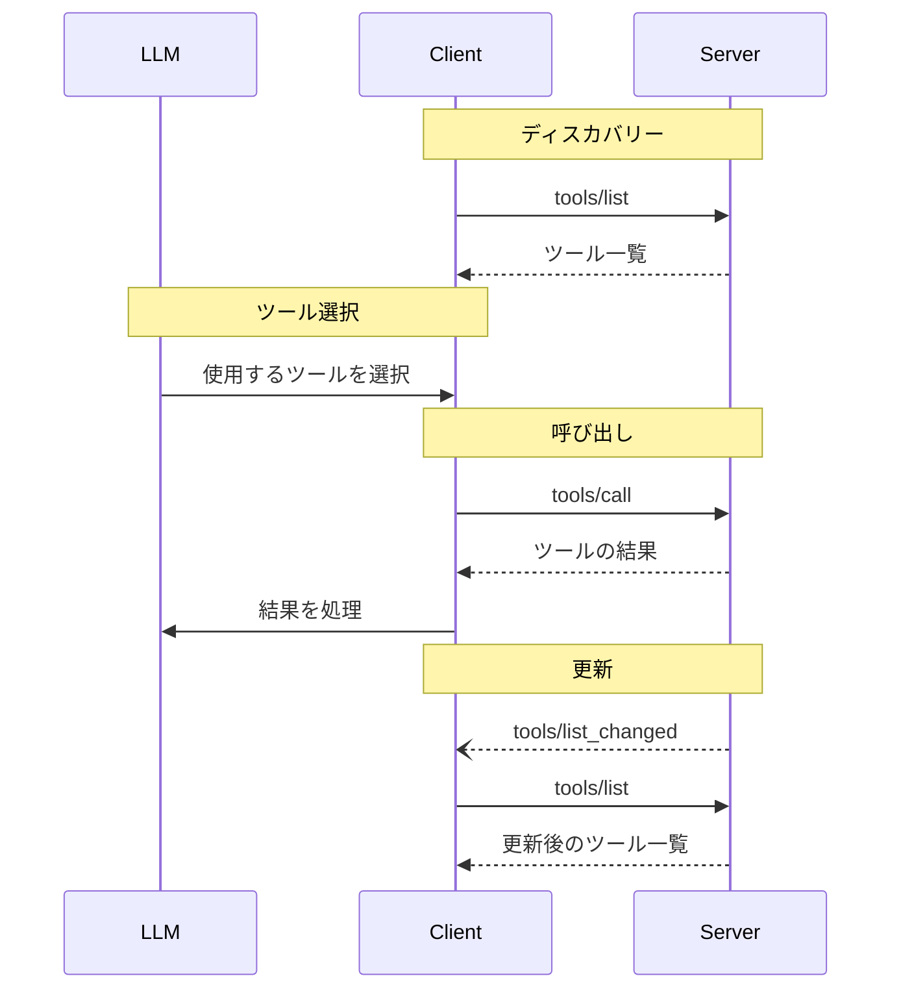

<div id="enable-section-numbers" />

<Info>**プロトコルリビジョン**: 草案</Info>

Model Context Protocol（MCP）は、サーバーが言語モデルから呼び出せるツールを公開できるようにします。ツールによって、モデルはデータベースのクエリ実行、API呼び出し、計算処理などの外部システムとのやり取りが可能になります。各ツールは一意の名前で識別され、そのスキーマを記述するメタデータを含みます。

<div id="user-interaction-model">
  ## ユーザーインタラクションモデル
</div>

MCPのツールは**モデル主導**を前提に設計されており、言語モデルが文脈理解と
ユーザーのプロンプトに基づいてツールを自動的に発見・呼び出せます。

ただし、実装はニーズに合った任意のインターフェースパターンでツールを公開できます。
プロトコル自体は特定のユーザーインタラクションモデルを要求しません。

<Warning>
  トラスト＆セーフティおよびセキュリティの観点から、ツールの呼び出しを拒否できる
  人間が常に関与している**べきです**。

  アプリケーションは**次を行うべきです**:

  * どのツールがAIモデルに公開されているかを明確に示すUIを提供する
  * ツールが呼び出された際に明確な視覚的インジケーターを表示する
  * 人間の関与を確実にするため、操作時にユーザーへ確認のプロンプトを提示する
</Warning>

<div id="capabilities">
  ## 機能
</div>

ツールをサポートするサーバーは、`tools` 機能を宣言しなければなりません（**MUST**）:

```json
{
  "capabilities": {
    "tools": {
      "listChanged": true
    }
  }
}
```

`listChanged` は、利用可能なツールのリストが変更された際にサーバーが通知を送信するかどうかを示します。

<div id="protocol-messages">
  ## プロトコルメッセージ
</div>

<div id="listing-tools">
  ### ツールの一覧取得
</div>

利用可能なツールを取得するには、クライアントは `tools/list` リクエストを送信します。この操作は
[ページネーション](/ja/specification/draft/server/utilities/pagination)に対応しています。

**リクエスト:**

```json
{
  "jsonrpc": "2.0",
  "id": 1,
  "method": "tools/list",
  "params": {
    "cursor": "optional-cursor-value"
  }
}
```

**レスポンス:**

```json
{
  "jsonrpc": "2.0",
  "id": 1,
  "result": {
    "tools": [
      {
        "name": "get_weather",
        "title": "Weather Information Provider",
        "description": "指定した場所の現在の天気情報を取得します",
        "inputSchema": {
          "type": "object",
          "properties": {
            "location": {
              "type": "string",
              "description": "都市名または郵便番号"
            }
          },
          "required": ["location"]
        },
        "icons": [
          {
            "src": "https://example.com/weather-icon.png",
            "mimeType": "image/png",
            "sizes": "48x48"
          }
        ]
      }
    ],
    "nextCursor": "next-page-cursor"
  }
}
```

<div id="calling-tools">
  ### ツールの呼び出し
</div>

ツールを実行するには、クライアントは `tools/call` リクエストを送信します。

**リクエスト:**

```json
{
  "jsonrpc": "2.0",
  "id": 2,
  "method": "tools/call",
  "params": {
    "name": "get_weather",
    "arguments": {
      "location": "New York"
    }
  }
}
```

**レスポンス:**

```json
{
  "jsonrpc": "2.0",
  "id": 2,
  "result": {
    "content": [
      {
        "type": "text",
        "text": "Current weather in New York:\nTemperature: 72°F\nConditions: Partly cloudy"
      }
    ],
    "isError": false
  }
}
```

<div id="list-changed-notification">
  ### リスト変更通知
</div>

利用可能なツールの一覧が変更された場合、`listChanged`
機能を宣言しているサーバーは通知を送信するべきです（SHOULD）:

```json
{
  "jsonrpc": "2.0",
  "method": "notifications/tools/list_changed"
}
```

<div id="message-flow">
  ## メッセージフロー
</div>



<div id="data-types">
  ## データ型
</div>

<div id="tool">
  ### ツール
</div>

ツールの定義には次が含まれます:

* `name`: ツールの一意な識別子
* `title`: 表示用の任意の人間可読名
* `description`: 機能の人間可読な説明
* `inputSchema`: 期待されるパラメータを定義するJSON Schema
* `outputSchema`: 期待される出力構造を定義する任意のJSON Schema
* `annotations`: ツールの動作を記述する任意のプロパティ

<Warning>
  トラスト＆セーフティおよびセキュリティの観点から、信頼できるサーバー由来でない限り、クライアントはツールのアノテーションを不信頼として扱わなければなりません。
</Warning>

<div id="tool-result">
  ### ツール結果
</div>

ツールの結果には[**構造化**](#structured-content)または**非構造化**のコンテンツが含まれる場合があります。

**非構造化**コンテンツは結果の`content`フィールドで返され、異なるタイプのコンテンツ項目を複数含むことができます：

<Note>
  すべてのコンテンツタイプ（テキスト、画像、音声、リソースリンク、埋め込みリソース）は、
  任意の
  [アノテーション](/ja/specification/draft/server/resources#annotations)をサポートしており、受け手、優先度、変更時刻に関するメタデータを付与できます。これはリソースおよびプロンプトで使用されるものと同一のアノテーション形式です。
</Note>

<div id="text-content">
  #### テキストコンテンツ
</div>

```json
{
  "type": "text",
  "text": "ツールの結果テキスト"
}
```

<div id="image-content">
  #### 画像コンテンツ
</div>

```json
{
  "type": "image",
  "data": "base64-encoded-data",
  "mimeType": "image/png",
  "annotations": {
    "audience": ["user"],
    "priority": 0.9
  }
}
```

<div id="audio-content">
  #### 音声コンテンツ
</div>

```json
{
  "type": "audio",
  "data": "base64-encoded-audio-data",
  "mimeType": "audio/wav"
}
```

<div id="resource-links">
  #### リソースリンク
</div>

ツールは追加のコンテキストやデータを提供するために[リソース](/ja/specification/draft/server/resources)へのリンクを返すことが**あります**。
この場合、ツールはクライアントが購読または取得できる URI を返します:

```json
{
  "type": "resource_link",
  "uri": "file:///project/src/main.rs",
  "name": "main.rs",
  "description": "Primary application entry point",
  "mimeType": "text/x-rust"
}
```

リソースリンクは、クライアントが利用方法を理解できるように、通常のリソースと同じ[リソースのアノテーション](/ja/specification/draft/server/resources#annotations)をサポートします。

<Info>
  ツールによって返されるリソースリンクが、
  `resources/list` リクエストの結果に含まれることは保証されません。
</Info>

<div id="embedded-resources">
  #### 埋め込みリソース
</div>

[リソース](/ja/specification/draft/server/resources) は、適切な [URI スキーム](ja/./resources#common-uri-schemes)を用いて追加のコンテキストやデータを提供する目的で埋め込むことができます（**MAY**）。埋め込みリソースを使用するサーバーは、`resources` 機能を実装するべきです（**SHOULD**）:

```json
{
  "type": "resource",
  "resource": {
    "uri": "file:///project/src/main.rs",
    "title": "Project Rust Main File",
    "mimeType": "text/x-rust",
    "text": "fn main() {\n    println!(\"Hello world!\");\n}",
    "annotations": {
      "audience": ["user", "assistant"],
      "priority": 0.7,
      "lastModified": "2025-05-03T14:30:00Z"
    }
  }
}
```

埋め込みリソースは、クライアントが使い方を把握できるよう、通常のリソースと同じ [リソースの注釈](/ja/specification/draft/server/resources#annotations)をサポートします。

<div id="structured-content">
  #### 構造化コンテンツ
</div>

**構造化**コンテンツは、結果の`structuredContent`フィールドで JSON オブジェクトとして返されます。

後方互換性のため、構造化コンテンツを返すツールは、TextContent ブロック内にもシリアライズ済みの JSON を返すべきです。

<div id="output-schema">
  #### 出力スキーマ
</div>

ツールは、構造化結果の検証のために出力スキーマを提供することもできます。
出力スキーマが提供されている場合:

* サーバーは、このスキーマに適合する構造化結果を提供することが**必須**です。
* クライアントは、このスキーマに対して構造化結果を検証することが**推奨**されます。

出力スキーマを持つツールの例:

```json
{
  "name": "get_weather_data",
  "title": "Weather Data Retriever",
  "description": "Get current weather data for a location",
  "inputSchema": {
    "type": "object",
    "properties": {
      "location": {
        "type": "string",
        "description": "City name or zip code"
      }
    },
    "required": ["location"]
  },
  "outputSchema": {
    "type": "object",
    "properties": {
      "temperature": {
        "type": "number",
        "description": "Temperature in celsius"
      },
      "conditions": {
        "type": "string",
        "description": "Weather conditions description"
      },
      "humidity": {
        "type": "number",
        "description": "Humidity percentage"
      }
    },
    "required": ["temperature", "conditions", "humidity"]
  }
}
```

このツールに対する有効なレスポンス例:

```json
{
  "jsonrpc": "2.0",
  "id": 5,
  "result": {
    "content": [
      {
        "type": "text",
        "text": "{\"temperature\": 22.5, \"conditions\": \"Partly cloudy\", \"humidity\": 65}"
      }
    ],
    "structuredContent": {
      "temperature": 22.5,
      "conditions": "Partly cloudy",
      "humidity": 65
    }
  }
}
```

出力スキーマを提供すると、次の点でクライアントやLLMが構造化ツール出力を理解し適切に扱えるようになります:

* レスポンスの厳密なスキーマ検証を可能にする
* プログラミング言語とのより良い統合のための型情報を提供する
* 返されたデータを適切にパースして活用するようクライアントやLLMを導く
* ドキュメント整備および開発者体験の向上に寄与する

<div id="error-handling">
  ## エラー処理
</div>

ツールは次の2種類のエラー報告メカニズムを使用します：

1. **プロトコルエラー**: 次のような問題に対する標準的な JSON-RPC エラー
   * 不明なツール
   * 無効な引数
   * サーバーエラー

2. **ツール実行エラー**: ツールの結果内で `isError: true` として報告
   * API の失敗
   * 無効な入力データ
   * ビジネスロジックエラー

プロトコルエラーの例:

```json
{
  "jsonrpc": "2.0",
  "id": 3,
  "error": {
    "code": -32602,
    "message": "Unknown tool: invalid_tool_name"
  }
}
```

ツール実行エラーの例:

```json
{
  "jsonrpc": "2.0",
  "id": 4,
  "result": {
    "content": [
      {
        "type": "text",
        "text": "Failed to fetch weather data: API rate limit exceeded"
      }
    ],
    "isError": true
  }
}
```

<div id="security-considerations">
  ## セキュリティ上の考慮事項
</div>

1. サーバーは**必須**:
   * すべてのツール入力を検証する
   * 適切なアクセス制御を実装する
   * ツールの呼び出しにレート制限を設ける
   * ツールの出力を無害化（サニタイズ）する

2. クライアントは**推奨**:
   * 機微な操作についてユーザー確認を求める
   * 悪意あるまたは偶発的なデータ流出を避けるため、サーバー呼び出しの前にツール入力をユーザーに表示する
   * ツールの結果をLLMに渡す前に検証する
   * ツール呼び出しにタイムアウトを設定する
   * 監査目的でツールの利用を記録する