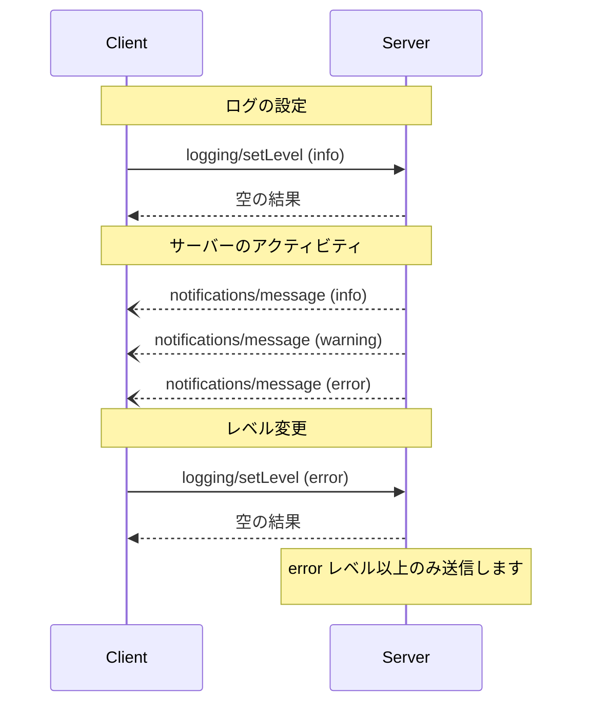

<div id="enable-section-numbers" />

<Info>**プロトコル改訂**: 草案</Info>

Model Context Protocol（MCP）は、サーバーが構造化ログメッセージをクライアントに送信するための標準的な手段を提供します。クライアントは最小ログレベルを設定してログの詳細度を制御でき、サーバーは重大度、任意のロガー名、任意のJSONシリアライズ可能なデータを含む通知を送信します。

<div id="user-interaction-model">
  ## ユーザーインタラクションモデル
</div>

実装は、ニーズに合った任意のインターフェースパターンでログ機能を提供できます。プロトコル自体は、特定のユーザーインタラクションモデルを規定していません。

<div id="capabilities">
  ## 機能
</div>

ログメッセージ通知を送信するサーバーは、`logging` 機能を宣言しなければなりません:

```json
{
  "capabilities": {
    "logging": {}
  }
}
```

<div id="log-levels">
  ## ログレベル
</div>

このプロトコルは、[RFC 5424](https://datatracker.ietf.org/doc/html/rfc5424#section-6.2.1) で規定されている標準の syslog の深刻度レベルに従います。

| レベル     | 説明                           | 代表的なユースケース        |
| --------- | ------------------------------ | --------------------------- |
| debug     | 詳細なデバッグ情報             | 関数の開始／終了ポイント    |
| info      | 一般的な情報メッセージ         | 処理の進行状況の更新        |
| notice    | 通常だが重要なイベント         | 設定変更                    |
| warning   | 警告状態                       | 非推奨機能の使用            |
| error     | エラー状態                     | 処理の失敗                  |
| critical  | 危機的な状態                   | システムコンポーネントの故障 |
| alert     | 直ちに対応が必要               | データ破損の検出            |
| emergency | システムが使用不能             | システム全体の障害          |

<div id="protocol-messages">
  ## プロトコル メッセージ
</div>

<div id="setting-log-level">
  ### ログレベルの設定
</div>

最小ログレベルを設定するために、クライアントは `logging/setLevel` リクエストを送信してもよい（**MAY**）。

**リクエスト:**

```json
{
  "jsonrpc": "2.0",
  "id": 1,
  "method": "logging/setLevel",
  "params": {
    "level": "info"
  }
}
```

<div id="log-message-notifications">
  ### ログメッセージの通知
</div>

サーバーは `notifications/message` 通知を用いてログメッセージを送信します：

```json
{
  "jsonrpc": "2.0",
  "method": "notifications/message",
  "params": {
    "level": "error",
    "logger": "database",
    "data": {
      "error": "Connection failed",
      "details": {
        "host": "localhost",
        "port": 5432
      }
    }
  }
}
```

<div id="message-flow">
  ## メッセージフロー
</div>



<div id="error-handling">
  ## エラー処理
</div>

サーバーは、一般的な失敗ケースに対して標準のJSON-RPCエラーを返すことが望ましい（SHOULD）:

- 無効なログレベル: `-32602`（無効なパラメータ）
- 設定エラー: `-32603`（内部エラー）

<div id="implementation-considerations">
  ## 実装時の考慮事項
</div>

1. サーバーは**推奨される**:
   - ログメッセージにレート制限を設ける
   - dataフィールドに関連するコンテキストを含める
   - 一貫したロガー名を使用する
   - 機微情報を削除する

2. クライアントは**任意**:
   - UIでログメッセージを表示する
   - ログのフィルタリングや検索を実装する
   - 重大度を視覚的に示す
   - ログメッセージを永続化する

<div id="security">
  ## セキュリティ
</div>

1. ログメッセージには、次を含めてはなりません（MUST NOT）:
   - 認証情報やシークレット
   - 個人を特定できる情報
   - 攻撃の助長につながり得る内部システムの詳細

2. 実装は、次を行うべきです（SHOULD）:
   - メッセージのレート制限
   - すべてのデータフィールドの検証
   - ログへのアクセス制御
   - 機微情報の監視