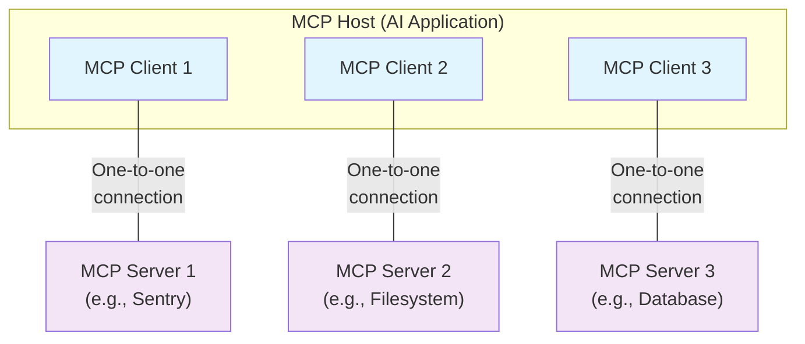

本文概述了模型上下文协议（MCP）的[范围](#scope)和[核心概念](#concepts-of-mcp)，并提供了一个[示例](#example)来演示每个核心概念。

由于 MCP SDK 抽象掉了许多复杂性，大多数开发者可能会发现[数据层协议](#data-layer-protocol)一节最为实用。该部分讨论 MCP 服务器如何为 AI 应用提供上下文。

关于具体实现细节，请参阅你所使用的[语言特定 SDK](/zh/docs/sdk)的文档。

<div id="scope">
  ## 范围
</div>

模型上下文协议（MCP）包含以下项目：

* [MCP 规范](https://modelcontextprotocol.io/specification/latest)：对 MCP 的规范，阐述对客户端和服务器的实现要求。
* [MCP SDK](/zh/docs/sdk)：面向不同编程语言、实现 MCP 的 SDK。
* **MCP 开发工具**：用于开发 MCP 服务器和 MCP 客户端的工具，包括 [MCP Inspector](https://github.com/modelcontextprotocol/inspector)。
* [MCP 参考服务器实现](https://github.com/modelcontextprotocol/servers)：MCP 服务器的参考实现。

<Note>
  MCP 专注于用于上下文交换的协议本身——并不规定
  AI 应用如何使用 LLM 或管理提供的上下文。
</Note>

<div id="concepts-of-mcp">
  ## MCP 基本概念
</div>

<div id="participants">
  ### 参与者
</div>

MCP 采用客户端-服务器架构，其中 MCP 主机——例如 [Claude Code](https://www.anthropic.com/claude-code) 或 [Claude Desktop](https://www.claude.ai/download) 这类 AI 应用——会与一个或多个 MCP 服务器建立连接。MCP 主机通过为每个 MCP 服务器创建一个 MCP 客户端来实现这一点。每个 MCP 客户端都会与其对应的 MCP 服务器保持专用的一对一连接。

MCP 架构中的关键参与者包括：

* **MCP 主机**：协调并管理一个或多个 MCP 客户端的 AI 应用
* **MCP 客户端**：为 MCP 主机维护与 MCP 服务器的连接，并从 MCP 服务器获取上下文的组件
* **MCP 服务器**：向 MCP 客户端提供上下文的程序

**例如**：Visual Studio Code 充当 MCP 主机。当 Visual Studio Code 与某个 MCP 服务器建立连接时（例如 [Sentry MCP 服务器](https://docs.sentry.io/product/sentry-mcp/)），Visual Studio Code 运行时会实例化一个 MCP 客户端对象来维护与该 Sentry MCP 服务器的连接。
当 Visual Studio Code 随后连接到另一个 MCP 服务器（例如 [本地文件系统服务器](https://github.com/modelcontextprotocol/servers/tree/main/src/filesystem)）时，Visual Studio Code 运行时会再实例化一个 MCP 客户端对象以维护该连接，从而保持 MCP 客户端与 MCP 服务器之间的一对一关系。



请注意，**MCP 服务器** 指的是提供上下文数据的程序，无论它运行在哪里。MCP 服务器可以在本地或远程运行。例如，当 Claude Desktop 启动 [filesystem server](https://github.com/modelcontextprotocol/servers/tree/main/src/filesystem) 时，由于使用 STDIO 传输方式，服务器会在同一台机器上本地运行。这通常称为“本地” MCP 服务器。官方的 [Sentry MCP 服务器](https://docs.sentry.io/product/sentry-mcp/) 运行在 Sentry 平台上，并使用可流式 HTTP 传输方式。这通常称为“远程” MCP 服务器。

<div id="layers">
  ### 分层
</div>

MCP 包含两个层级：

* **数据层**：定义基于 JSON-RPC 的客户端—服务器通信协议，涵盖生命周期管理，以及工具、资源、提示模板、通知等核心基元。
* **传输层**：定义实现客户端与服务器之间数据交换的通信机制与通道，包括特定于传输方式的连接建立、消息分帧与授权。

从概念上讲，数据层是内层，传输层是外层。

<div id="data-layer">
  #### 数据层
</div>

数据层实现了一个基于 [JSON-RPC 2.0](https://www.jsonrpc.org/) 的交换协议，用于定义消息结构和语义。
该层包括：

* **生命周期管理**：处理客户端与服务器之间的连接初始化、能力协商和连接终止
* **服务器功能**：使服务器能够提供核心能力，包括用于 AI 操作的工具、用于上下文数据的资源，以及供交互使用的提示模板
* **客户端功能**：使服务器能够请求客户端通过主机的 LLM 进行采样、向用户发起信息征询，并向客户端记录日志消息
* **辅助功能**：支持额外能力，例如用于实时更新的通知，以及对长时运行操作的进度跟踪

<div id="transport-layer">
  #### 传输层
</div>

传输层负责管理客户端与服务器之间的通信通道和身份验证，处理连接建立、消息帧封装，以及 MCP 参与方之间的安全通信。

MCP 支持两种传输方式：

* **STDIO 传输**：使用标准输入/输出流在同一台机器上的本地进程之间直接通信，在无网络开销的情况下提供最佳性能。
* **可流式 HTTP 传输**：使用 HTTP POST 发送客户端到服务器的消息，并可选用服务器发送事件（SSE）实现流式传输能力。该传输方式支持与远程服务器通信，并支持包括 Bearer 令牌、API 密钥和自定义请求头在内的标准 HTTP 身份验证方法。MCP 建议使用 OAuth 获取身份验证令牌。

传输层将通信细节从协议层中抽象出来，使所有传输方式均可使用相同的 JSON-RPC 2.0 消息格式。

<div id="data-layer-protocol">
  ### 数据层协议
</div>

MCP 的核心之一是定义 MCP 客户端与 MCP 服务器之间的数据模式与语义。开发者很可能会认为数据层——尤其是其中的[原语](#primitives)集合——是 MCP 最有趣的部分。它规定了开发者如何将上下文从 MCP 服务器共享到 MCP 客户端。

MCP 使用 [JSON-RPC 2.0](https://www.jsonrpc.org/) 作为其底层 RPC 协议。客户端与服务器相互发送请求并进行响应。当不需要响应时，可以使用通知。

<div id="lifecycle-management">
  #### 生命周期管理
</div>

MCP 是一种<Tooltip tip="使用可流式 HTTP 传输可以将 MCP 的部分功能做到无状态">有状态的协议</Tooltip>，因此需要进行生命周期管理。生命周期管理的目的是就客户端和服务器双方所支持的<Tooltip tip="客户端或服务器支持的功能与操作，例如工具、资源或提示模板">能力</Tooltip>达成一致。详细信息参见[规范](/zh/specification/2025-06-18/basic/lifecycle)，而[示例](#example)展示了初始化序列。

<div id="primitives">
  #### 基元
</div>

MCP 基元是 MCP 中最重要的概念。它们定义了客户端与服务器能够相互提供的能力与内容。这些基元明确了可与 AI 应用共享的上下文信息类型，以及可执行的操作范围。

MCP 定义了由_服务器_可公开的三类核心基元：

* **工具**：AI 应用可调用以执行操作的可执行功能（例如文件操作、API 调用、数据库查询）
* **资源**：向 AI 应用提供上下文信息的数据源（例如文件内容、数据库记录、API 响应）
* **提示模板**：用于组织与语言模型交互的可复用模板（例如系统提示、少样本示例）

每种基元类型都配有用于发现（`*/list`）、检索（`*/get`），以及在某些情况下用于执行（`tools/call`）的方法。
MCP 客户端将使用 `*/list` 方法发现可用的基元。例如，客户端可以先列出所有可用工具（`tools/list`），再对其进行调用。该设计使清单可动态变更。

举个具体例子，设想一个提供数据库上下文的 MCP 服务器：它可以公开用于查询数据库的工具、一个包含数据库架构的资源，以及一个包含与这些工具交互的少样本示例的提示模板。

有关服务器基元的更多信息，请参阅[服务器概念](zh/./server-concepts)。

MCP 也定义了由_客户端_可公开的基元，这些基元使 MCP 服务器作者能够构建更丰富的交互。

* **采样**：允许服务器通过客户端的 AI 应用请求语言模型补全。适用于服务器作者希望使用语言模型、但又保持与具体模型解耦且不在其 MCP 服务器中引入语言模型 SDK 的场景。可使用 `sampling/complete` 方法向客户端的 AI 应用请求补全。
* **信息征询**：允许服务器向用户请求补充信息。当服务器作者需要从用户获取更多信息或确认某项操作时尤为有用。可使用 `elicitation/request` 方法发起信息征询。
* **日志记录**：使服务器能够向客户端发送日志消息，用于调试和监控。

有关客户端基元的更多信息，请参阅[客户端概念](zh/./client-concepts)。

<div id="notifications">
  #### 通知
</div>

该协议支持实时通知，以便在服务器与客户端之间进行动态更新。例如，当服务器的可用工具发生变化（如新增功能上线或对现有工具进行修改）时，服务器可以向已连接的客户端发送工具更新通知，告知这些变更。通知以 JSON-RPC 2.0 的通知消息形式发送（无需响应），从而使 MCP 服务器能够向已连接的客户端提供实时更新。

<div id="example">
  ## 示例
</div>

<div id="data-layer">
  ### 数据层
</div>

本节将逐步演示一次 MCP 客户端—服务器交互，重点介绍数据层协议。我们将通过 JSON-RPC 2.0 消息展示生命周期顺序、工具操作和通知。

<Steps>
  <Step title="Initialization (Lifecycle Management)">
    MCP 的生命周期管理始于一次能力协商握手。正如在[lifecycle management](#lifecycle-management)部分所述，客户端会发送 `initialize` 请求以建立连接并协商支持的功能。

    <CodeGroup>
      ```json Initialize Request
      {
        "jsonrpc": "2.0",
        "id": 1,
        "method": "initialize",
        "params": {
          "protocolVersion": "2025-06-18",
          "capabilities": {
            "elicitation": {}
          },
          "clientInfo": {
            "name": "example-client",
            "version": "1.0.0"
          }
        }
      }
      ```

      ```json Initialize Response
      {
        "jsonrpc": "2.0",
        "id": 1,
        "result": {
          "protocolVersion": "2025-06-18",
          "capabilities": {
            "tools": {
              "listChanged": true
            },
            "resources": {}
          },
          "serverInfo": {
            "name": "example-server",
            "version": "1.0.0"
          }
        }
      }
      ```
    </CodeGroup>

    #### 理解初始化交换

    初始化过程是 MCP 生命周期管理的关键环节，具有以下几项重要作用：

    1. 协议版本协商：`protocolVersion` 字段（例如 &quot;2025-06-18&quot;）确保客户端与服务器使用兼容的协议版本，防止不同版本交互时出现通信错误。若无法协商出彼此兼容的版本，应终止连接。

    2. 能力发现：`capabilities` 对象用于让双方声明各自支持的功能，包括可处理哪些[基元](#primitives)（工具、资源、提示模板），以及是否支持[通知](#notifications)等功能。这样可以通过避免不受支持的操作来提高通信效率。

    3. 身份信息交换：`clientInfo` 和 `serverInfo` 提供用于调试与兼容性的标识和版本信息。

    在此示例中，能力协商展示了 MCP 基元的声明方式：

    客户端能力：

    * `"elicitation": {}` —— 客户端声明可处理用户信息征询请求（可接收 `elicitation/create` 方法调用）

    服务器能力：

    * `"tools": {"listChanged": true}` —— 服务器支持“工具”基元，并且当其工具列表发生变化时可以发送 `tools/list_changed` 通知
    * `"resources": {}` —— 服务器也支持“资源”基元（可处理 `resources/list` 与 `resources/read` 方法）

    成功完成初始化后，客户端会发送通知表示已就绪：

    ```json Notification
    {
      "jsonrpc": "2.0",
      "method": "notifications/initialized"
    }
    ```

    #### 在 AI 应用中的工作方式

    初始化期间，AI 应用的 MCP 客户端管理器会与已配置的服务器建立连接，并记录其能力以供后续使用。应用据此判断哪些服务器可提供特定类型的功能（工具、资源、提示模板），以及它们是否支持实时更新。

    ```python Pseudo-code for AI application initialization
    # 伪代码
    async with stdio_client(server_config) as (read, write):
        async with ClientSession(read, write) as session:
            init_response = await session.initialize()
            if init_response.capabilities.tools:
                app.register_mcp_server(session, supports_tools=True)
            app.set_server_ready(session)
    ```
  </Step>

  <Step title="Tool Discovery (Primitives)">
    现在连接已建立，客户端可以通过发送一个 `tools/list` 请求来发现可用的工具。该请求是 MCP 的工具发现机制的基础——它使客户端能够在尝试使用工具之前了解服务器上有哪些工具可用。

    <CodeGroup>
      ```json Tools List Request
      {
        "jsonrpc": "2.0",
        "id": 2,
        "method": "tools/list"
      }
      ```

      ```json Tools List Response
      {
        "jsonrpc": "2.0",
        "id": 2,
        "result": {
          "tools": [
            {
              "name": "calculator_arithmetic",
              "title": "Calculator",
              "description": "执行数学计算，包括基础算术、三角函数和代数运算",
              "inputSchema": {
                "type": "object",
                "properties": {
                  "expression": {
                    "type": "string",
                    "description": "要求值的数学表达式（例如：'2 + 3 * 4'、'sin(30)'、'sqrt(16)'）"
                  }
                },
                "required": ["expression"]
              }
            },
            {
              "name": "weather_current",
              "title": "Weather Information",
              "description": "获取全球任意位置的当前天气信息",
              "inputSchema": {
                "type": "object",
                "properties": {
                  "location": {
                    "type": "string",
                    "description": "城市名、地址或坐标（纬度,经度）"
                  },
                  "units": {
                    "type": "string",
                    "enum": ["metric", "imperial", "kelvin"],
                    "description": "响应中使用的温度单位",
                    "default": "metric"
                  }
                },
                "required": ["location"]
              }
            }
          ]
        }
      }
      ```
    </CodeGroup>

    #### 理解工具发现请求

    `tools/list` 请求很简单，不包含任何参数。

    #### 理解工具发现响应

    响应包含一个 `tools` 数组，提供每个可用工具的完整元数据。该基于数组的结构让服务器可以同时公开多个工具，并在不同功能之间保持清晰的边界。

    响应中的每个工具对象包含几个关键字段：

    * **`name`**：服务器命名空间内工具的唯一标识符。它作为工具执行的主键，应遵循清晰的命名模式（例如使用 `calculator_arithmetic` 而不是仅 `calculate`）
    * **`title`**：工具的易读显示名称，客户端可以展示给用户
    * **`description`**：对工具功能及其适用场景的详细说明
    * **`inputSchema`**：定义预期输入参数的 JSON Schema，支持类型校验，并清晰说明必填与可选参数

    #### 在 AI 应用中的工作方式

    AI 应用会从所有已连接的 MCP 服务器获取可用的工具，并将它们合并为语言模型可访问的统一工具注册表。这使得 LLM 能理解可执行的操作，并在对话中自动生成相应的工具调用。

    ```python Pseudo-code for AI application tool discovery
    # Pseudo-code using MCP Python SDK patterns
    available_tools = []
    for session in app.mcp_server_sessions():
        tools_response = await session.list_tools()
        available_tools.extend(tools_response.tools)
    conversation.register_available_tools(available_tools)
    ```
  </Step>

  <Step title="Tool Execution (Primitives)">
    客户端现在可以使用 `tools/call` 方法执行工具。这展示了 MCP 基础能力在实际中的用法：在发现可用工具后，客户端可以携带合适的参数调用它们。

    #### 理解工具执行请求

    `tools/call` 请求遵循结构化格式，以确保类型安全并在客户端与服务器之间清晰通信。注意我们使用的是发现响应中的准确工具名称（`weather_current`），而非简化名称：

    <CodeGroup>
      ```json Tool Call Request
      {
        "jsonrpc": "2.0",
        "id": 3,
        "method": "tools/call",
        "params": {
          "name": "weather_current",
          "arguments": {
            "location": "San Francisco",
            "units": "imperial"
          }
        }
      }
      ```

      ```json Tool Call Response
      {
        "jsonrpc": "2.0",
        "id": 3,
        "result": {
          "content": [
            {
              "type": "text",
              "text": "Current weather in San Francisco: 68°F, partly cloudy with light winds from the west at 8 mph. Humidity: 65%"
            }
          ]
        }
      }
      ```
    </CodeGroup>

    #### 工具执行的关键要素

    请求结构包含几个重要组成部分：

    1. **`name`**：必须与发现响应中的工具名称（`weather_current`）完全一致。这样服务器才能正确识别要执行的工具。

    2. **`arguments`**：包含由该工具的 `inputSchema` 定义的输入参数。本例中：
       * `location`：&quot;San Francisco&quot;（必填）
       * `units`：&quot;imperial&quot;（可选，未指定则默认 &quot;metric&quot;）

    3. **JSON-RPC 结构**：采用标准 JSON-RPC 2.0 格式，并使用唯一的 `id` 进行请求-响应关联。

    #### 理解工具执行响应

    该响应展示了 MCP 的灵活内容系统：

    1. **`content` 数组**：工具响应返回一个内容对象数组，支持丰富的多格式响应（文本、图像、资源等）。

    2. **内容类型**：每个内容对象都有 `type` 字段。此处 `"type": "text"` 表示纯文本内容；MCP 也支持针对不同场景的多种内容类型。

    3. **结构化输出**：响应提供可操作的信息，AI 应用可将其作为与语言模型交互的上下文。

    这种执行模式使 AI 应用能够动态调用服务器功能，并获得可无缝集成进与语言模型对话的结构化响应。

    #### 在 AI 应用中的工作方式

    当语言模型在对话中决定使用某个工具时，AI 应用会拦截该工具调用，将其路由至相应的 MCP 服务器，执行后把结果作为对话流程的一部分返回给 LLM，从而使 LLM 能访问实时数据并在外部世界执行操作。

    ```python
    # Pseudo-code for AI application tool execution
    async def handle_tool_call(conversation, tool_name, arguments):
        session = app.find_mcp_session_for_tool(tool_name)
        result = await session.call_tool(tool_name, arguments)
        conversation.add_tool_result(result.content)
    ```
  </Step>

  <Step title="Real-time Updates (Notifications)">
    MCP 支持实时通知，使服务器无需显式请求即可告知客户端发生的更改。以下示例展示了通知系统这一关键特性，它让 MCP 连接保持同步且响应迅速。

    #### 了解工具列表变更通知

    当服务器的可用工具发生变化——例如新增功能上线、现有工具被修改，或工具暂时不可用——服务器可以主动通知已连接的客户端：

    ```json Request
    {
      "jsonrpc": "2.0",
      "method": "notifications/tools/list_changed"
    }
    ```

    #### MCP 通知的关键特性

    1. 无需响应：注意通知中没有 `id` 字段。这遵循 JSON-RPC 2.0 的通知语义，即不期望也不发送响应。

    2. 基于能力：仅当服务器在初始化时在其工具能力中声明了 `"listChanged": true`（见步骤 1）时才会发送此通知。

    3. 事件驱动：服务器根据其内部状态变化决定何时发送通知，使 MCP 连接更加动态且响应迅速。

    #### 客户端对通知的响应

    收到此通知后，客户端通常会请求更新后的工具列表。由此形成一个刷新循环，确保客户端对可用工具的认知保持最新：

    ```json Request
    {
      "jsonrpc": "2.0",
      "id": 4,
      "method": "tools/list"
    }
    ```

    #### 为什么通知很重要

    该通知系统之所以重要，原因包括：

    1. 动态环境：工具可能因服务器状态、外部依赖或用户权限而增减
    2. 效率：客户端无需轮询更改；发生更新时会收到通知
    3. 一致性：确保客户端始终掌握服务器可用能力的准确信息
    4. 实时协作：使 AI 应用能够及时适配变化的上下文

    这种通知模式不仅适用于工具，还扩展到其他 MCP 基元，实现客户端与服务器之间全面的实时同步。

    #### 在 AI 应用中的工作方式

    当 AI 应用收到关于工具变更的通知后，会立即刷新其工具注册表，并更新 LLM 的可用能力。这样可确保进行中的对话始终能够访问最新的一组工具，且 LLM 能在新功能上线时动态适配。

    ```python
    # 处理 AI 应用通知的伪代码
    async def handle_tools_changed_notification(session):
        tools_response = await session.list_tools()
        app.update_available_tools(session, tools_response.tools)
        if app.conversation.is_active():
            app.conversation.notify_llm_of_new_capabilities()
    ```
  </Step>
</Steps>