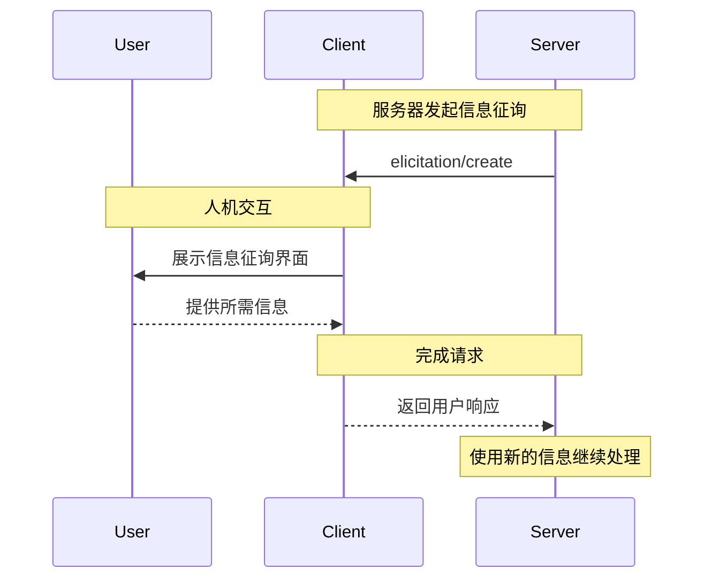
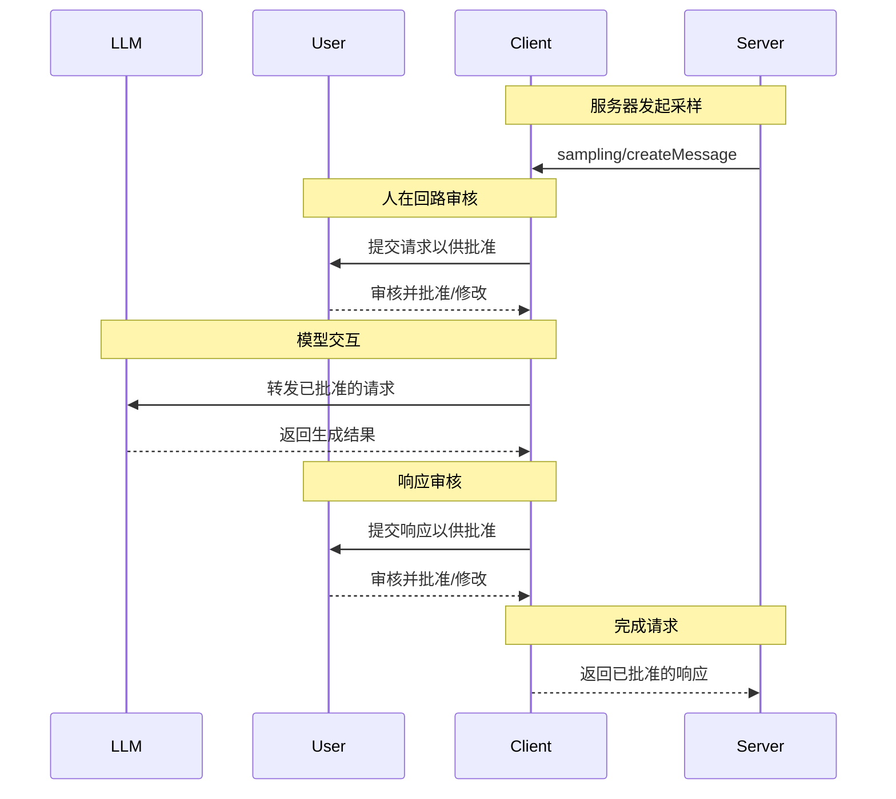

MCP 客户端由 MCP 主机应用实例化，用于与特定的 MCP 服务器通信。MCP 主机（如 Claude.ai 或 IDE）负责管理整体用户体验并协调多个客户端。每个客户端与一个服务器保持一次直接通信。

理解这种区分很重要：_主机_ 是用户直接使用的应用程序，而 _客户端_ 是在协议层面促成与服务器连接的组件。

<div id="core-client-features">
  ## 核心客户端功能
</div>

除了利用服务器提供的上下文之外，客户端还可以向服务器提供若干功能。这些客户端功能使服务器作者能够构建更丰富的交互。

| 功能             | 说明                                                                                                                                                                       | 示例                                                                                                                                    |
| ---------------- | -------------------------------------------------------------------------------------------------------------------------------------------------------------------------- | ---------------------------------------------------------------------------------------------------------------------------------------- |
| **采样**         | 采样允许服务器通过客户端请求 LLM 补全，从而启用代理式工作流。此方式使客户端对用户权限与安全措施拥有完全控制权。                                                           | 一个用于预订旅行的服务器可以将航班列表发送给 LLM，并请求 LLM 为用户选择最佳航班。                                                         |
| **根路径**       | 根路径允许客户端指定服务器可访问的文件范围，在保持安全边界的同时引导其定位到相关目录。                                                                                     | 一个用于预订旅行的服务器可以被授予访问某个特定目录的权限，并从中读取用户的日历。                                                         |
| **信息征询**     | 信息征询使服务器能够在交互过程中向用户请求特定信息，为服务器按需收集信息提供结构化方式。                                                                                   | 一个用于预订旅行的服务器可能会询问用户对飞机座位、房型的偏好，或其联系方式，以最终完成预订。                                                 |

<div id="elicitation">
  ### 信息征询
</div>

信息征询使服务器能够在交互过程中向用户请求特定信息，从而实现更灵活、更即时响应的工作流程。

<div id="overview">
  #### 概述
</div>

信息征询提供了一种结构化的方式，让服务器可按需收集必要信息。与其在一开始要求提供全部信息，或在数据缺失时直接失败，服务器可以暂时中止操作，向用户请求特定输入。这样能带来更灵活的交互，服务器根据用户需求进行调整，而非遵循僵化流程。

**信息征询流程：**



该流程支持动态信息收集。服务器可在需要时请求特定数据，用户通过合适的界面提供信息，服务器再基于新获取的上下文继续处理。

**信息征询组件示例：**

```typescript
{
  method: "elicitation/requestInput",
  params: {
    message: "Please confirm your Barcelona vacation booking details:",
    schema: {
      type: "object",
      properties: {
        confirmBooking: {
          type: "boolean",
          description: "Confirm the booking (Flights + Hotel = $3,000)"
        },
        seatPreference: {
          type: "string",
          enum: ["window", "aisle", "no preference"],
          description: "Preferred seat type for flights"
        },
        roomType: {
          type: "string",
          enum: ["sea view", "city view", "garden view"],
          description: "Preferred room type at hotel"
        },
        travelInsurance: {
          type: "boolean",
          default: false,
          description: "Add travel insurance ($150)"
        }
      },
      required: ["confirmBooking"]
    }
  }
}
```

<div id="example-holiday-booking-approval">
  #### 示例：假期预订确认审批
</div>

一个旅行预订服务器通过最终确认流程展示了信息征询的能力。当用户选定理想的巴塞罗那度假套餐后，服务器需要在继续之前收集最终确认以及任何缺失的细节。

服务器会通过一个结构化请求来征询预订确认，其中包含行程摘要（巴塞罗那航班 6 月 15–22 日、海滨酒店、总价 $3,000）以及用于补充偏好的字段——例如座位选择、房型或旅行保险选项。

随着预订推进，服务器还会征询完成预订所需的联系信息。它可能会询问航班预订的旅客信息、酒店的特殊需求，或紧急联系人信息。

<div id="user-interaction-model">
  #### 用户交互模型
</div>

信息征询交互旨在清晰、具备上下文，并尊重用户自主性：

**请求呈现**：MCP 客户端会在明确上下文的前提下展示信息征询请求，说明是哪台 MCP 服务器发起、为何需要这些信息、以及将如何使用。请求消息阐明目的，而 schema 提供结构与校验。

**响应选项**：用户可以通过合适的 UI 控件（文本框、下拉菜单、复选框）提供所需信息，也可以选择拒绝并可选填说明，或取消整个操作。MCP 客户端会依据提供的 schema 对响应进行校验后再返回给 MCP 服务器。

**隐私注意事项**：信息征询绝不会请求密码或 API 密钥。MCP 客户端会对可疑请求发出警示，并允许用户在发送前审阅数据。

<div id="roots">
  ### 根路径
</div>

根路径为服务器操作限定文件系统边界，允许客户端指定服务器应重点处理的目录。

<div id="overview">
  #### 概览
</div>

根路径是一种机制，供客户端向服务器传达文件系统访问边界。它由指示服务器可操作目录的文件 URI 组成，帮助服务器理解可用文件和文件夹的范围。与其给予服务器不受限制的文件系统访问权限，不如使用根路径在保持安全边界的同时将其引导至相关工作目录。

**根路径结构：**

```json
{
  "uri": "file:///Users/agent/travel-planning",
  "name": "Travel Planning Workspace"
}
```

根路径仅指文件系统路径，并始终使用 `file://` URI 方案。它有助于服务器理解项目边界、工作区组织以及可访问的目录。随着用户处理不同项目或文件夹，根路径列表可动态更新；当边界发生变化时，服务器会通过 `roots/list_changed` 接收通知。

需要注意的是，尽管根路径为服务器提供了操作范围的指引，但客户端始终对文件访问拥有完全控制权。根路径只用于传达预期的边界——实际的文件访问始终由客户端的安全策略加以控制。

<div id="example-travel-planning-workspace">
  #### 示例：旅行规划工作区
</div>

一位同时处理多个客户行程的旅行代理可以借助根路径来组织对文件系统的访问。设想一个用于旅行规划的工作区，为不同环节分别设有目录。

客户端向旅行规划服务器提供文件系统根路径：

- `file:///Users/agent/travel-planning` - 包含所有旅行文件的主工作区
- `file:///Users/agent/travel-templates` - 可复用的行程模板和资源
- `file:///Users/agent/client-documents` - 客户护照和旅行文件

当代理创建一份巴塞罗那行程时，服务器会在这些边界内工作——访问模板、保存新行程，并引用客户文件。它无法访问这些根路径之外的文件。服务器通常通过从根目录使用相对路径，或使用遵循根路径边界的文件搜索工具来访问根路径内的文件。

如果代理打开了一个存档文件夹，如 `file:///Users/agent/archive/2023-trips`，客户端会通过 `roots/list_changed` 更新根路径列表。

<div id="user-interaction-model">
  #### 用户交互模型
</div>

根路径通常由主机应用根据用户操作自动管理，但某些应用也可能提供手动管理方式：

**自动根路径检测**：当用户打开文件夹时，客户端会自动将其公开为根路径。比如，打开旅行工作区后，服务器即可访问该目录中的行程与文档。

**手动根路径配置**：高级用户可以通过配置指定根路径。例如，添加 `/travel-templates` 以提供可复用的资源，同时排除包含财务记录的目录。

<div id="sampling">
  ### 采样
</div>

采样允许服务器通过客户端请求语言模型补全，在确保安全与用户可控的前提下启用代理式行为。

<div id="overview">
  #### 概述
</div>

采样使服务器无需直接集成或为 AI 模型付费即可执行依赖 AI 的任务。相反，服务器可以请求已具备 AI 模型访问权限的客户端代为处理这些任务。此方式让客户端可以全面掌控用户权限与安全措施。由于采样请求发生在其他操作的上下文中——例如某个工具正在分析数据——并作为独立的模型调用处理，它们在不同上下文之间保持清晰边界，从而更高效地利用上下文窗口。

**采样流程：**



该流程通过多次“人在回路”的检查点确保安全性。用户会在返回给服务器之前审核并可修改初始请求和生成的响应。

**请求参数示例：**

```typescript
{
  messages: [
    {
      role: "user",
      content: "Analyze these flight options and recommend the best choice:\n" +
               "[47 flights with prices, times, airlines, and layovers]\n" +
               "User preferences: morning departure, max 1 layover"
    }
  ],
  modelPreferences: {
    hints: [{
      name: "claude-3-5-sonnet"  // 建议使用的模型
    }],
    costPriority: 0.3,      // 对 API 成本不太敏感
    speedPriority: 0.2,     // 可等待更彻底的分析
    intelligencePriority: 0.9  // 需要复杂权衡的评估
  },
  systemPrompt: "You are a travel expert helping users find the best flights based on their preferences",
  maxTokens: 1500
}
```

<div id="example-flight-analysis-tool">
  #### 示例：航班分析工具
</div>

设想一个旅行预订服务器，包含一个名为 `findBestFlight` 的工具，它使用采样来分析可用航班并推荐最优方案。当用户提出“下个月帮我预订去巴塞罗那的最佳航班”时，该工具需要 AI 协助来评估复杂取舍。

该工具查询航空公司 API，收集了 47 个航班选项。随后它请求 AI 协助分析这些选项：“请分析以下航班并推荐最佳方案：[47 个包含价格、时间、航空公司与经停信息的航班] 用户偏好：上午出发，最多 1 次经停。”

客户端发起采样请求，允许 AI 评估取舍——例如更便宜的红眼航班与更便利的上午出发之间。该工具据此分析给出前三个推荐。

<div id="user-interaction-model">
  #### 用户交互模型
</div>

虽然不是硬性要求，采样旨在实现“人类在环”的控制。用户可以通过多种机制保持监督：

**审批控制**：采样请求可能需要明确的用户同意。客户端可以展示服务器想要分析的内容及其原因。用户可以批准、拒绝或修改请求。

**透明性功能**：客户端可以显示确切的提示模板、模型选择和令牌上限，允许用户在结果返回服务器之前审阅 AI 的响应。

**配置选项**：用户可以设置模型偏好，为受信任的操作配置自动批准，或要求对所有操作进行审批。客户端可能提供选项以脱敏处理敏感信息。

**安全性考量**：在采样过程中，客户端和服务器都必须妥善处理敏感数据。客户端应实施速率限制并验证所有消息内容。“人类在环”的设计确保服务器发起的 AI 交互在没有明确用户同意的情况下，无法破坏安全或访问敏感数据。