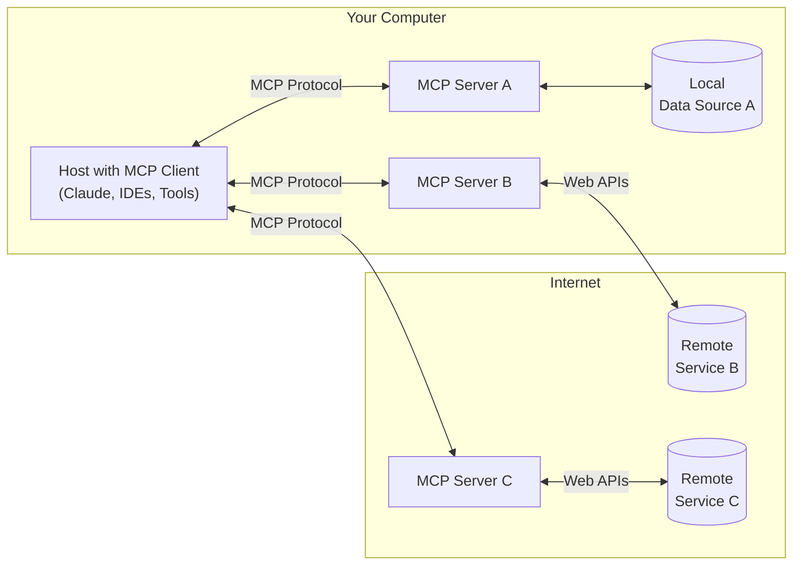

MCP 是一种开放协议，用于规范应用如何向 LLM 提供上下文。你可以把 MCP 比作面向 AI 应用的 USB‑C 接口。正如 USB‑C 为设备与各类外设和配件提供了标准化的连接方式，MCP 也为 AI 模型连接不同的数据源和工具提供了标准化方式。

  ## 为什么选择 MCP？

MCP 帮助你在 LLM 之上构建智能体和复杂工作流。LLM 常常需要与数据和工具集成，而 MCP 提供：

* 不断增加的现成集成，供你的 LLM 直接接入
* 在不同 LLM 提供商与厂商之间灵活切换的能力
* 在你的基础设施内保护数据的最佳实践

  ### 通用架构

从本质上讲，MCP 采用客户端-服务器架构，其中宿主应用可以连接到多个服务器：

* **MCP 主机**：如 Claude Desktop、IDE 或 AI 工具等希望通过 MCP 访问数据的程序
* **MCP 客户端**：与服务器保持一对一连接的协议客户端
* **MCP 服务器**：通过标准化的模型上下文协议（MCP）暴露特定功能的轻量级程序
* **本地数据源**：你计算机上的文件、数据库和服务，MCP 服务器可安全访问
* **远程服务**：通过互联网提供的外部系统（例如通过 API），MCP 服务器可连接

  ## 快速开始

选择最符合你需求的路径：

  ### 快速开始

<CardGroup cols={2}>
  <Card title="面向服务器开发者" icon="bolt" href="/zh/quickstart/server">
    开始构建你自己的服务器，用于 Claude for Desktop 及其他客户端
  </Card>

  <Card title="面向客户端开发者" icon="bolt" href="/zh/quickstart/client">
    开始构建你自己的客户端，可与所有 MCP 服务器集成
  </Card>

  <Card title="面向 Claude Desktop 用户" icon="bolt" href="/zh/docs/develop/connect-local-servers">
    开始在 Claude for Desktop 中使用预构建的服务器
  </Card>
</CardGroup>

  ### 示例

<CardGroup cols={2}>
  <Card title="示例服务器" icon="grid" href="/zh/examples">
    浏览我们官方 MCP 服务器与实现的精选集
  </Card>

  <Card title="示例客户端" icon="cubes" href="/zh/clients">
    查看支持 MCP 集成的客户端清单
  </Card>
</CardGroup>

  ## 教程

<CardGroup cols={2}>
  <Card title="用 LLM 构建 MCP" icon="comments" href="/zh/tutorials/building-mcp-with-llms">
    了解如何使用 Claude 等 LLM 加速你的 MCP 开发
  </Card>

  <Card title="调试指南" icon="bug" href="/zh/legacy/tools/debugging">
    学习如何高效调试 MCP 服务器与集成
  </Card>

  <Card title="MCP Inspector" icon="magnifying-glass" href="/zh/legacy/tools/inspector">
    使用我们的交互式调试工具测试并检视你的 MCP 服务器
  </Card>

  <Card title="MCP Workshop（视频，2 小时）" icon="person-chalkboard" href="https://www.youtube.com/watch?v=kQmXtrmQ5Zg">
    <iframe src="https://www.youtube.com/embed/kQmXtrmQ5Zg" />
  </Card>
</CardGroup>

  ## 探索 MCP

深入了解 MCP 的核心概念与能力：

<CardGroup cols={2}>
  <Card title="核心架构" icon="sitemap" href="/zh/legacy/concepts/architecture">
    理解 MCP 如何连接客户端、服务器与 LLM
  </Card>

  <Card title="资源" icon="database" href="/zh/legacy/concepts/resources">
    将你的服务器中的数据与内容提供给 LLM
  </Card>

  <Card title="提示" icon="message" href="/zh/legacy/concepts/prompts">
    创建可复用的提示模板与工作流
  </Card>

  <Card title="工具" icon="wrench" href="/zh/legacy/concepts/tools">
    让 LLM 通过你的服务器执行操作
  </Card>

  <Card title="采样" icon="robot" href="/zh/legacy/concepts/sampling">
    使你的服务器向 LLM 请求补全
  </Card>

  <Card title="传输" icon="network-wired" href="/zh/legacy/concepts/transports">
    了解 MCP 的通信机制
  </Card>
</CardGroup>

  ## 参与贡献

想参与？请查看我们的[贡献指南](/zh/development/contributing)，了解你如何帮助改进 MCP。

  ## 支持与反馈

以下是获取帮助或提供反馈的方式：

* 针对与 MCP 规范、SDK 或文档（开源）相关的错误报告和功能请求，请[创建 GitHub Issue](https://github.com/modelcontextprotocol)
* 关于 MCP 规范的讨论或问答，请使用[规范讨论区](https://github.com/modelcontextprotocol/specification/discussions)
* 关于其他 MCP 开源组件的讨论或问答，请使用[组织讨论区](https://github.com/orgs/modelcontextprotocol/discussions)
* 针对与 Claude.app 和 claude.ai 的 MCP 集成相关的错误报告、功能请求及问题，请参阅 Anthropic 的指南：[如何获取支持](https://support.anthropic.com/en/articles/9015913-how-to-get-support)