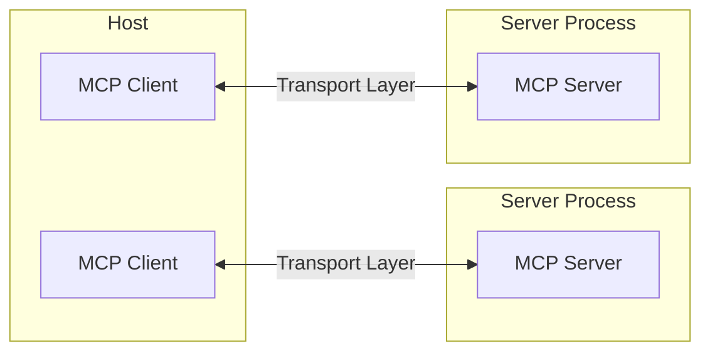
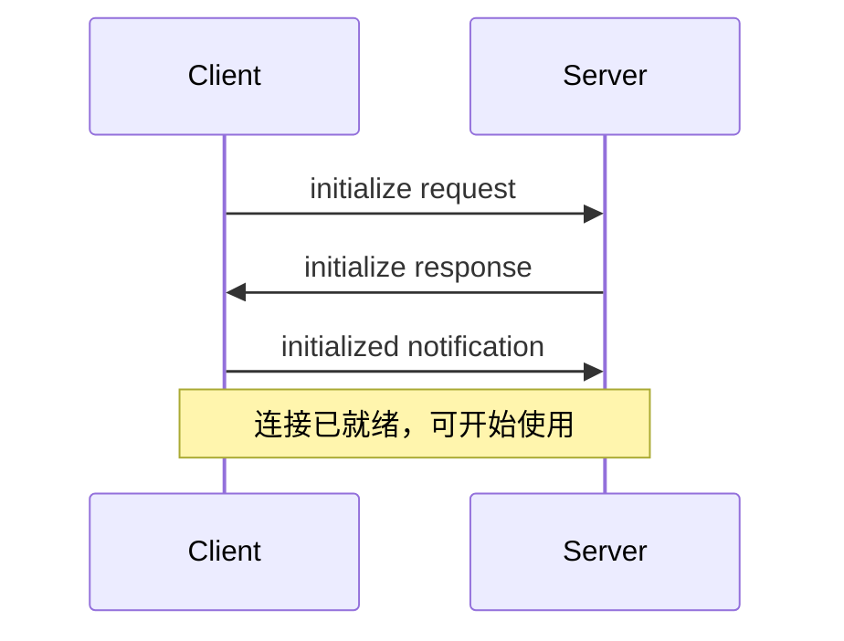

模型上下文协议（MCP）基于灵活、可扩展的架构，支持 LLM 应用与各类集成之间的无缝通信。本文档介绍核心架构组件与关键概念。

<div id="overview">
  ## 概览
</div>

MCP 采用客户端-服务器架构，其中：

* **MCP 主机** 是发起连接的 LLM 应用（如 Claude Desktop 或 IDE）
* **MCP 客户端** 在主机应用内与服务器保持 1:1 连接
* **MCP 服务器** 向客户端提供上下文、工具和提示模板



<div id="core-components">
  ## 核心组件
</div>

<div id="protocol-layer">
  ### 协议层
</div>

协议层负责消息成帧、请求/响应关联，以及高层通信模式。

<CodeGroup>
  ```typescript TypeScript
  class Protocol<Request, Notification, Result> {
    // 处理传入请求
    setRequestHandler<T>(
      schema: T,
      handler: (request: T, extra: RequestHandlerExtra) => Promise<Result>,
    ): void;

    // 处理传入通知
    setNotificationHandler<T>(
      schema: T,
      handler: (notification: T) => Promise<void>,
    ): void;

    // 发送请求并等待响应
    request<T>(request: Request, schema: T, options?: RequestOptions): Promise<T>;

    // 发送单向通知
    notification(notification: Notification): Promise<void>;
  }
  ```

  ```python Python
  class Session(BaseSession[RequestT, NotificationT, ResultT]):
      async def send_request(
          self,
          request: RequestT,
          result_type: type[Result]
      ) -> Result:
          """发送请求并等待响应；若响应包含错误则抛出 McpError。"""
          # 请求处理实现

      async def send_notification(
          self,
          notification: NotificationT
      ) -> None:
          """发送无需响应的单向通知。"""
          # 通知处理实现

      async def _received_request(
          self,
          responder: RequestResponder[ReceiveRequestT, ResultT]
      ) -> None:
          """处理来自对端的请求。"""
          # 请求处理实现

      async def _received_notification(
          self,
          notification: ReceiveNotificationT
      ) -> None:
          """处理来自对端的通知。"""
          # 通知处理实现
  ```
</CodeGroup>

关键类包括：

* `Protocol`
* `Client`
* `Server`

<div id="transport-layer">
  ### 传输层
</div>

传输层负责处理客户端与服务器之间的实际通信。MCP 支持多种传输方式：

1. **STDIO 传输**
   * 使用标准输入/输出进行通信
   * 适用于本地进程

2. **可流式 HTTP 传输**
   * 使用 HTTP，并可选用服务器发送事件（SSE）进行流式传输
   * 客户端到服务器的消息使用 HTTP POST

所有传输方式均使用 [JSON-RPC](https://www.jsonrpc.org/) 2.0 交换消息。详细了解模型上下文协议（MCP）消息格式，请参见[规范](/zh/specification/)。

<div id="message-types">
  ### 消息类型
</div>

MCP 包含以下主要消息类型：

1. **请求（Requests）** 需要对端返回响应：

   ```typescript
   interface Request {
     method: string;
     params?: { ... };
   }
   ```

2. **结果（Results）** 表示对请求的成功响应：

   ```typescript
   interface Result {
     [key: string]: unknown;
   }
   ```

3. **错误（Errors）** 表示请求失败：

   ```typescript
   interface Error {
     code: number;
     message: string;
     data?: unknown;
   }
   ```

4. **通知（Notifications）** 为单向消息，不需要响应：
   ```typescript
   interface Notification {
     method: string;
     params?: { ... };
   }
   ```

<div id="connection-lifecycle">
  ## 连接生命周期
</div>

<div id="1-initialization">
  ### 1. 初始化
</div>



1. Client 发送包含协议版本和能力的 `initialize` 请求
2. Server 返回其协议版本和能力
3. Client 发送 `initialized` 通知以示确认
4. 开始正常的消息交互

<div id="2-message-exchange">
  ### 2. 消息交换
</div>

完成初始化后，支持以下模式：

* **请求—响应**：客户端或服务器发起请求，另一方进行响应
* **通知**：任一方发送单向消息

<div id="3-termination">
  ### 3. 终止
</div>

任一方均可终止连接：

* 通过 `close()` 进行正常关闭
* 传输层断开
* 发生错误条件

<div id="error-handling">
  ## 错误处理
</div>

MCP 定义了以下标准错误码：

```typescript
enum ErrorCode {
  // Standard JSON-RPC error codes
  ParseError = -32700,
  InvalidRequest = -32600,
  MethodNotFound = -32601,
  InvalidParams = -32602,
  InternalError = -32603,
}
```

SDK 和应用可以定义数值高于 -32000 的自定义错误码。

错误通过以下方式传播：

* 请求的错误响应
* 传输方式上的错误事件
* 协议层面的错误处理程序

<div id="implementation-example">
  ## 实现示例
</div>

以下是一个实现 MCP 服务器的基础示例：

<CodeGroup>
  ```typescript TypeScript
  import { Server } from "@modelcontextprotocol/sdk/server/index.js";
  import { StdioServerTransport } from "@modelcontextprotocol/sdk/server/stdio.js";

  const server = new Server(
    {
      name: "example-server",
      version: "1.0.0",
    },
    {
      capabilities: {
        resources: {},
      },
    },
  );

  // 处理请求
  server.setRequestHandler(ListResourcesRequestSchema, async () => {
    return {
      resources: [
        {
          uri: "example://resource",
          name: "Example Resource",
        },
      ],
    };
  });

  // 连接传输层
  const transport = new StdioServerTransport();
  await server.connect(transport);
  ```

  ```python Python
  import asyncio
  import mcp.types as types
  from mcp.server import Server
  from mcp.server.stdio import stdio_server

  app = Server("example-server")

  @app.list_resources()
  async def list_resources() -> list[types.Resource]:
      return [
          types.Resource(
              uri="example://resource",
              name="Example Resource"
          )
      ]

  async def main():
      async with stdio_server() as streams:
          await app.run(
              streams[0],
              streams[1],
              app.create_initialization_options()
          )

  if __name__ == "__main__":
      asyncio.run(main())
  ```
</CodeGroup>

<div id="best-practices">
  ## 最佳实践
</div>

<div id="transport-selection">
  ### 传输方式选择
</div>

1. **本地通信**
   * 本地进程使用 STDIO 传输方式
   * 适用于同一台机器上的高效通信
   * 进程管理更为简单

2. **远程通信**
   * 在需要与 HTTP 兼容的场景中使用 可流式 HTTP
   * 考虑安全性因素，包括身份验证和授权

<div id="message-handling">
  ### 消息处理
</div>

1. **请求处理**
   * 严格验证输入
   * 使用类型安全的架构/模式
   * 优雅地处理错误
   * 实施超时机制

2. **进度报告**
   * 对长耗时操作使用进度令牌
   * 逐步上报进度
   * 在已知时包含总进度

3. **错误管理**
   * 使用合适的错误码
   * 提供有用的错误信息
   * 发生错误时清理资源

<div id="security-considerations">
  ## 安全注意事项
</div>

1. **传输安全**
   * 远程连接使用 TLS
   * 验证连接来源
   * 按需实施身份验证

2. **消息校验**
   * 校验所有入站消息
   * 进行输入净化
   * 检查消息大小上限
   * 验证 JSON-RPC 格式

3. **资源保护**
   * 实施访问控制
   * 校验资源路径
   * 监控资源使用情况
   * 对请求进行限流

4. **错误处理**
   * 避免泄露敏感信息
   * 记录与安全相关的错误
   * 正确执行清理
   * 处理 DoS 情形

<div id="debugging-and-monitoring">
  ## 调试与监控
</div>

1. **日志记录**
   * 记录协议事件
   * 跟踪消息流
   * 监控性能
   * 记录错误

2. **诊断**
   * 实施健康检查
   * 监控连接状态
   * 跟踪资源使用
   * 性能剖析

3. **测试**
   * 测试不同的传输方式
   * 验证错误处理
   * 检查边界情况
   * 对服务器进行压力测试