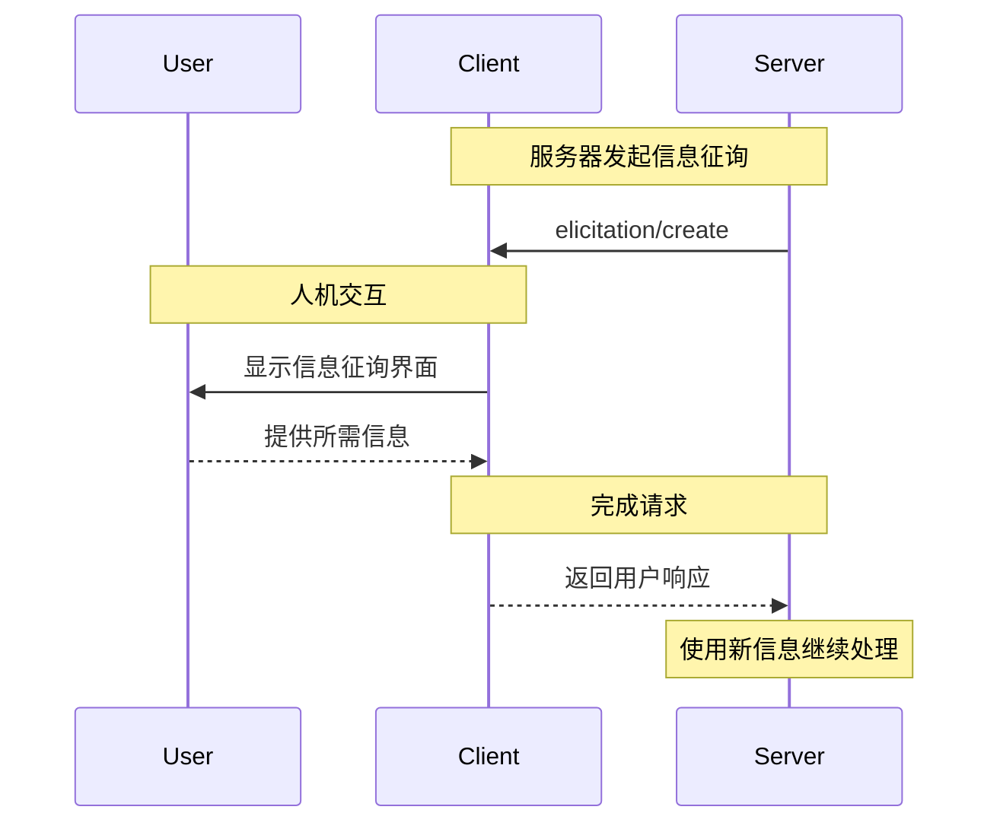

信息征询是 MCP 的一项强大功能，允许服务器在交互过程中向用户请求补充信息。这样，服务器便可在确保用户控制与隐私的前提下，按需收集必要数据，从而实现动态工作流。

<Info>
  信息征询在 MCP 规范的修订版中首次引入 [revision
  2025-06-18](/zh/specification/2025-06-18/client/elicitation)。
</Info>

<div id="what-is-elicitation">
  ## 什么是信息征询？
</div>

信息征询为 MCP 服务器通过客户端向用户请求结构化信息提供了一种标准化方式。服务器无需在一开始就收集全部信息，而是可以在需要时精确地请求特定数据，从而实现更自然、更灵活的交互。

例如，服务器可能会：

* 在连接某个服务时请求用户名
* 在设置过程中询问配置偏好
* 在创建新资源时收集项目详情

<div id="how-elicitation-works">
  ## 信息征询的工作原理
</div>

信息征询流程十分简洁：

1. 服务器发送包含消息和预期数据结构的信息征询请求
2. 客户端通过合适的界面向用户展示该请求
3. 用户接受、拒绝或取消该请求
4. 客户端验证后将响应返回给服务器
5. 服务器基于所提供的信息继续处理

<div id="request-structure">
  ## 请求结构
</div>

信息征询请求包含两个关键要素：

<div id="message">
  ### 消息
</div>

以清晰、通俗的方式说明需要哪些信息以及原因。

<div id="schema">
  ### 架构
</div>

用于定义响应预期结构的 JSON Schema。该架构有意限制为仅包含原始类型的扁平对象，以简化客户端实现。

示例请求：

```json
{
  "message": "Please provide your GitHub username",
  "requestedSchema": {
    "type": "object",
    "properties": {
      "username": {
        "type": "string",
        "title": "GitHub Username",
        "description": "Your GitHub username (e.g., octocat)"
      }
    },
    "required": ["username"]
  }
}
```

<div id="supported-data-types">
  ## 支持的数据类型
</div>

信息征询支持以下基础类型：

<div id="text-input">
  ### 文本输入
</div>

```json
{
  "type": "string",
  "title": "项目名称",
  "description": "新项目的名称",
  "minLength": 3,
  "maxLength": 50,
  "default": "my-project"
}
```

<div id="numbers">
  ### 数值类型
</div>

```json
{
  "type": "number",
  "title": "端口号",
  "description": "运行服务器的端口",
  "minimum": 1024,
  "maximum": 65535,
  "default": 3000
}
```

<div id="boolean-choices">
  ### 布尔选项
</div>

```json
{
  "type": "boolean",
  "title": "启用分析",
  "description": "发送匿名使用统计数据",
  "default": false
}
```

<div id="selection-lists">
  ### 选项列表
</div>

```json
{
  "type": "string",
  "title": "Environment",
  "enum": ["development", "staging", "production"],
  "enumNames": ["Development", "Staging", "Production"],
  "default": "development"
}
```

<div id="user-response-actions">
  ## 用户响应操作
</div>

用户可以通过三种方式响应信息征询请求：

1. **接受**：用户提供所需信息
2. **拒绝**：用户明确表示不提供信息
3. **取消**：用户未作选择即关闭或忽略（例如关闭对话框）

服务器应妥善处理每种响应：

* 接受 → 处理所提供的数据
* 拒绝 → 提供替代方案或调整流程
* 取消 → 考虑稍后重试或使用默认值

<div id="best-practices">
  ## 最佳实践
</div>

在实现信息征询时：

<div id="for-servers">
  ### 适用于服务器
</div>

1. **清晰**：编写具有说明性的消息，解释为何需要这些信息
2. **最小化**：仅请求必要信息
3. **灵活**：为被拒绝或取消的请求准备回退方案
4. **及时**：在确实需要时再请求信息，而非提前预取
5. **尊重**：切勿请求诸如密码或令牌等敏感信息

<div id="for-clients">
  ### 面向客户端
</div>

1. **保持透明**：清晰展示是哪个服务器在请求信息
2. **注重防护**：允许用户审阅并修改响应
3. **严格校验**：依据提供的架构检查响应
4. **增强掌控**：将拒绝与取消选项置于显著位置
5. **合理限流**：实施速率限制以防止垃圾信息

<div id="common-use-cases">
  ## 常见用例
</div>

信息征询在以下场景尤为适用：

* **初始设置**：在首次配置时收集配置信息
* **动态工作流**：按需获取与上下文相关的信息
* **用户偏好**：收集可选的设置与偏好
* **项目详情**：获取正在创建资源的元数据
* **服务集成**：请求外部服务的用户名或 ID

<div id="example-workflow">
  ## 示例工作流
</div>

以下是一个典型的信息征询交互流程：



<div id="security-considerations">
  ## 安全注意事项
</div>

<Warning>
  服务器绝不可使用信息征询来请求密码、API 密钥、令牌或
  其他敏感凭据。请改用正确的身份验证流程。
</Warning>

关键安全指南：

1. 服务器仅应请求非敏感信息
2. 客户端应清楚标明是哪个服务器在请求数据
3. 用户应始终可以选择拒绝
4. 应按照架构（schema）对响应进行验证
5. 应通过速率限制防止请求泛滥

<div id="implementation-example">
  ## 实现示例
</div>

以下展示了服务器如何使用信息征询来收集项目信息：

```typescript
// 服务器请求项目详情
const response = await client.request("elicitation/create", {
  message: "让我们来设置你的新项目",
  requestedSchema: {
    type: "object",
    properties: {
      name: {
        type: "string",
        title: "项目名称",
        description: "为你的项目起一个有描述性的名称",
      },
      framework: {
        type: "string",
        title: "框架",
        enum: ["react", "vue", "angular", "none"],
        enumNames: ["React", "Vue", "Angular", "None"],
      },
      useTypeScript: {
        type: "boolean",
        title: "使用 TypeScript",
        default: true,
      },
      port: {
        type: "number",
        title: "开发端口",
        description: "开发服务器使用的端口号",
        default: 3000,
      },
    },
    required: ["name", "framework"],
  },
});

// 处理响应
if (response.action === "accept") {
  // 使用提供的详情创建项目
  await createProject(response.content);
} else if (response.action === "decline") {
  // 使用默认值或提供备选方案
  await createDefaultProject();
} else {
  // 用户已取消——可以稍后重试
  console.log("Project creation cancelled");
}
```

这种方式在尊重用户控制与隐私的同时，提供了流畅、互动的体验。