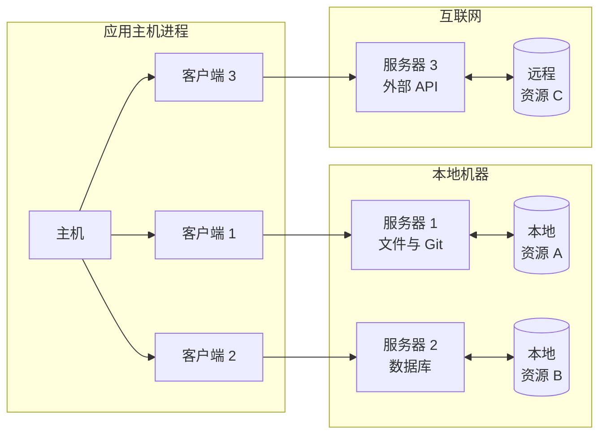
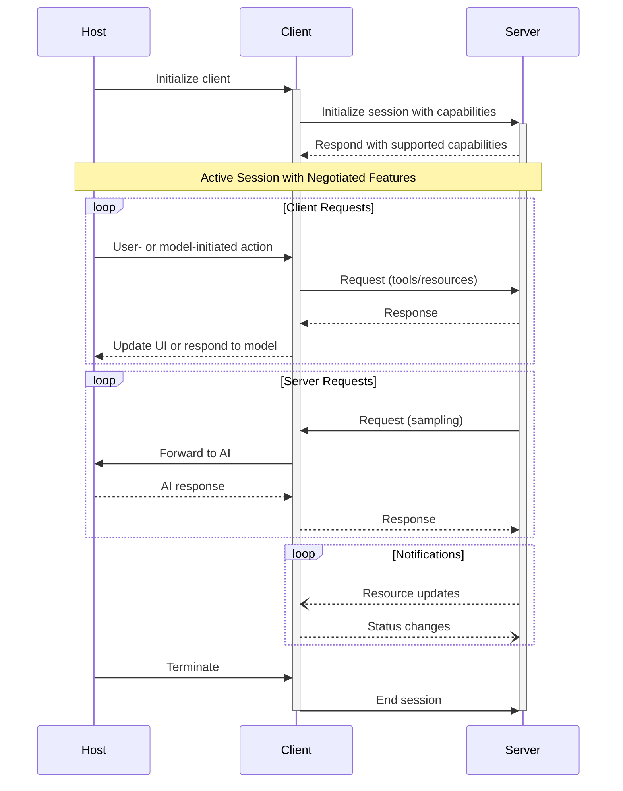

模型上下文协议（MCP）采用客户端—主机—服务器架构，其中每个主机可以运行多个 MCP 客户端实例。该架构使用户能够在各类应用中集成 AI 能力，同时保持清晰的安全边界并实现关注点隔离。基于 JSON-RPC 2.0，MCP 提供一种有状态的会话协议，专注于在客户端与 MCP 服务器之间进行上下文交换与采样协同。

  ## 核心组件

  ### 主机

主机进程充当容器与协调者：

* 创建并管理多个 MCP 客户端实例
* 控制客户端的连接权限与生命周期
* 强制执行安全策略与用户同意要求
* 处理用户授权决策
* 协调 AI/LLM 集成与采样
* 管理跨客户端的上下文聚合

  ### 客户端

每个客户端由主机创建，并维护与服务器的独立连接：

* 为每个服务器建立一个有状态会话
* 处理协议协商与能力交换
* 双向路由协议消息
* 管理订阅与通知
* 在不同服务器之间维护安全边界

主机应用可以创建并管理多个客户端，每个客户端与特定服务器保持 1:1 的对应关系。

  ### 服务器

服务器提供特定的上下文与能力：

* 通过 MCP 原语公开资源、工具和提示模板
* 独立运行，聚焦各自职责
* 通过客户端接口请求采样
* 必须遵守安全约束
* 可以作为本地进程运行，或作为远程服务提供

  ## 设计原则

MCP 基于若干关键设计原则，这些原则指导其架构与实现：

1. **MCP 服务器应当非常易于构建**
   * 主机应用负责处理复杂的编排职责
   * MCP 服务器聚焦于具体且明确定义的能力
   * 简洁的接口将实现开销降至最低
   * 清晰的职责分离有助于代码的可维护性

2. **MCP 服务器应当具有高度可组合性**
   * 每个 MCP 服务器在隔离状态下提供聚焦的功能
   * 可将多个 MCP 服务器无缝组合
   * 共享协议实现互操作性
   * 模块化设计支持扩展性

3. **MCP 服务器不应能够读取整个会话，也不应“窥视”其他服务器**
   * MCP 服务器仅接收必要的上下文信息
   * 完整的会话历史保留在主机侧
   * 每条 MCP 服务器连接保持隔离
   * 跨服务器交互由主机控制
   * 主机进程强制执行安全边界

4. **功能可以逐步添加到 MCP 服务器和 MCP 客户端**
   * 核心协议提供最低限度的必要功能
   * 可按需协商新增能力
   * MCP 服务器与 MCP 客户端可独立演进
   * 协议为未来的可扩展性而设计
   * 保持向后兼容

  ## 消息类型

MCP 基于
[JSON-RPC 2.0](https://www.jsonrpc.org/specification) 定义了三种核心消息类型：

* **请求（Requests）**：包含方法和参数、并期望收到响应的双向消息
* **响应（Responses）**：与特定请求 ID 对应的成功结果或错误
* **通知（Notifications）**：无需响应的单向消息

每种消息类型在结构与传递语义上均遵循 JSON-RPC 2.0 规范。

  ## 能力协商

模型上下文协议（MCP）采用基于能力的协商机制，客户端和服务器会在初始化阶段明确声明其支持的功能。能力决定会话期间可用的协议特性与基础元素。

* 服务器声明诸如资源订阅、工具支持和提示模板等能力
* 客户端声明诸如采样支持和通知处理等能力
* 双方必须在整个会话期间遵循已声明的能力
* 可通过协议扩展协商额外能力

每项能力都会在会话期间解锁特定的协议功能。例如：

* 已实现的[服务器功能](/zh/specification/2024-11-05/server)必须在服务器的能力集中声明
* 发送资源订阅通知要求服务器声明对订阅的支持
* 进行工具调用要求服务器声明工具相关能力
* [采样](/zh/specification/2024-11-05/client)要求客户端在其能力中声明支持

这种能力协商确保在保持协议可扩展性的同时，客户端和服务器对支持的功能有清晰一致的认知。