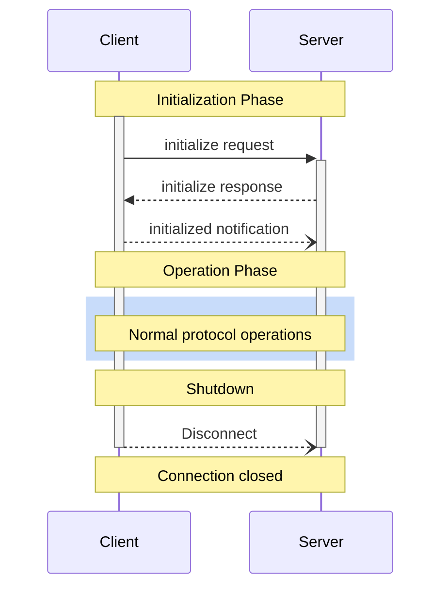

<Info>**协议修订**：2024-11-05</Info>

模型上下文协议（MCP）为客户端与服务器之间的连接定义了严谨的生命周期，以确保能力协商与状态管理的正确进行。

1. **初始化**：进行能力协商并达成协议版本一致
2. **运行**：正常的协议通信
3. **关闭**：正常结束连接



<div id="lifecycle-phases">
  ## 生命周期阶段
</div>

<div id="initialization">
  ### 初始化
</div>

初始化阶段必须是客户端与服务器之间的首次交互。
在此阶段，客户端和服务器将：

* 确立协议版本的兼容性
* 交换并协商能力
* 共享实现细节

客户端必须通过发送一条 `initialize` 请求来启动此阶段，请求中包含：

* 支持的协议版本
* 客户端能力
* 客户端实现信息

```json
{
  "jsonrpc": "2.0",
  "id": 1,
  "method": "initialize",
  "params": {
    "protocolVersion": "2024-11-05",
    "capabilities": {
      "roots": {
        "listChanged": true
      },
      "sampling": {}
    },
    "clientInfo": {
      "name": "ExampleClient",
      "version": "1.0.0"
    }
  }
}
```

服务器必须返回其自身的能力与相关信息：

```json
{
  "jsonrpc": "2.0",
  "id": 1,
  "result": {
    "protocolVersion": "2024-11-05",
    "capabilities": {
      "logging": {},
      "prompts": {
        "listChanged": true
      },
      "resources": {
        "subscribe": true,
        "listChanged": true
      },
      "tools": {
        "listChanged": true
      }
    },
    "serverInfo": {
      "name": "ExampleServer",
      "version": "1.0.0"
    }
  }
}
```

成功完成初始化后，客户端必须发送一条 `initialized` 通知，表示已准备好进入正常运作：

```json
{
  "jsonrpc": "2.0",
  "method": "notifications/initialized"
}
```

* 在服务器对 `initialize` 请求作出响应之前，客户端不应发送除
  [pings](/zh/specification/2024-11-05/basic/utilities/ping) 之外的其他请求。
* 在收到 `initialized` 通知之前，服务器不应发送除
  [pings](/zh/specification/2024-11-05/basic/utilities/ping) 和
  [logging](/zh/specification/2024-11-05/server/utilities/logging) 之外的其他请求。

<div id="version-negotiation">
  #### 版本协商
</div>

在 `initialize` 请求中，客户端**必须**发送其支持的协议版本。
这**应**为客户端支持的_最新_版本。

如果服务器支持所请求的协议版本，则**必须**以相同版本响应。否则，服务器**必须**以其支持的另一协议版本响应。这**应**为服务器支持的_最新_版本。

如果客户端不支持服务器返回的该版本，则**应**断开连接。

<div id="capability-negotiation">
  #### 能力协商
</div>

客户端和服务器的能力用于确定会话期间将提供哪些可选协议功能。

关键能力包括：

| Category | Capability     | Description                                                                         |
| -------- | -------------- | ----------------------------------------------------------------------------------- |
| Client   | `roots`        | 提供文件系统[根路径](/zh/specification/2024-11-05/client/roots)的能力                     |
| Client   | `sampling`     | 支持发起 LLM [采样](/zh/specification/2024-11-05/client/sampling) 请求                    |
| Client   | `experimental` | 描述对非标准实验性功能的支持                                                          |
| Server   | `prompts`      | 提供[提示模板](/zh/specification/2024-11-05/server/prompts)                              |
| Server   | `resources`    | 提供可读取的[资源](/zh/specification/2024-11-05/server/resources)                        |
| Server   | `tools`        | 暴露可调用的[工具](/zh/specification/2024-11-05/server/tools)                            |
| Server   | `logging`      | 发送结构化[日志消息](/zh/specification/2024-11-05/server/utilities/logging)              |
| Server   | `experimental` | 描述对非标准实验性功能的支持                                                          |

能力对象还可以描述如下子能力：

* `listChanged`: 支持列表变更通知（适用于提示模板、资源和工具）
* `subscribe`: 支持订阅单个项的变更（仅资源）

<div id="operation">
  ### 运行
</div>

在运行阶段，客户端与服务器根据已协商的能力交换消息。

双方**应**：

* 遵守协商的协议版本
* 仅使用已成功协商的能力

<div id="shutdown">
  ### 关闭
</div>

在关闭阶段，一方（通常是客户端）会以可控方式终止协议连接。协议未定义特定的关闭消息——应使用底层传输机制来指示连接终止：

<div id="stdio">
  #### stdio
</div>

对于 stdio [传输方式](/zh/specification/2024-11-05/basic/transports)，
客户端**应**按以下步骤发起关闭：

1. 先关闭到子进程（服务器）的输入流
2. 等待服务器退出；若未在合理时间内退出，则发送 `SIGTERM`
3. 若在发送 `SIGTERM` 后的合理时间内仍未退出，则发送 `SIGKILL`

服务器**可**通过关闭到客户端的输出流并退出来自行发起关闭。

<div id="http">
  #### HTTP
</div>

对于 HTTP [传输方式](/zh/specification/2024-11-05/basic/transports)，关闭通过关闭相应的 HTTP 连接来表示。

<div id="error-handling">
  ## 错误处理
</div>

实现方应当（SHOULD）做好准备，处理以下错误情形：

* 协议版本不匹配
* 必需能力协商失败
* 初始化请求超时
* 关闭超时

实现方应当（SHOULD）为所有请求设置适当的超时，以防止连接挂起和资源耗尽。

初始化错误示例：

```json
{
  "jsonrpc": "2.0",
  "id": 1,
  "error": {
    "code": -32602,
    "message": "Unsupported protocol version",
    "data": {
      "supported": ["2024-11-05"],
      "requested": "1.0.0"
    }
  }
}
```